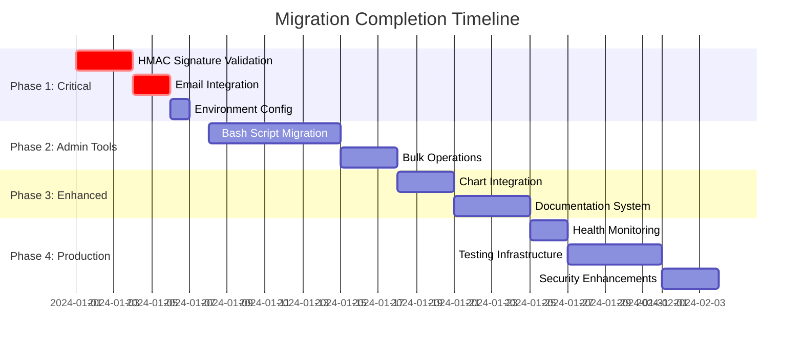

# Migration Completion Plan - Next.js Implementation

*Generated: 2025-09-29*

## Executive Summary

This document provides a comprehensive roadmap for completing the Pete Intercom App migration from Express to Next.js. Based on the detailed analysis, the migration is **75% complete** with critical security, administrative, and integration features remaining.

## Priority Matrix

```mermaid
quadrant-chart
    title Migration Completion Priority Matrix
    x-axis Low Impact --> High Impact
    y-axis Low Effort --> High Effort

    quadrant-1 Quick Wins
    quadrant-2 Major Projects
    quadrant-3 Fill Gaps
    quadrant-4 Strategic Initiatives

    HMAC Signature Validation: [0.9, 0.3]
    Email Integration: [0.6, 0.2]
    Bash Script Migration: [0.8, 0.8]
    Bulk Operations: [0.5, 0.4]
    Documentation System: [0.3, 0.5]
    Chart Utilities: [0.2, 0.3]
    Webhook Generation: [0.4, 0.2]
    Health Monitoring: [0.3, 0.4]
```

## Phase 1: Critical Security & Core Features (Week 1-2)

### 🔥 **PRIORITY 1: HMAC Signature Validation**
*Status: MISSING | Impact: CRITICAL | Effort: LOW*

**Implementation:**
1. Create signature validation middleware for Canvas Kit routes
2. Add crypto utility functions
3. Implement validation in API routes

**Files to Create/Modify:**
```typescript
// src/middleware/signature-validation.ts
import crypto from 'crypto';

export function validateIntercomSignature(
  body: string,
  signature: string,
  secret: string
): boolean {
  const hmac = crypto.createHmac('sha256', secret);
  hmac.update(body, 'utf8');
  const digest = hmac.digest('hex');
  return digest === signature;
}

// src/app/api/initialize/route.ts - Add validation
export async function POST(request: NextRequest) {
  const body = await request.text();
  const signature = request.headers.get('X-Body-Signature');

  if (!validateIntercomSignature(body, signature, process.env.INTERCOM_CLIENT_SECRET!)) {
    return NextResponse.json({ error: 'Invalid signature' }, { status: 401 });
  }
  // ... rest of implementation
}
```

**Testing Required:**
- Unit tests for signature validation
- Integration tests with Intercom webhook simulator
- Error handling for invalid signatures

**Acceptance Criteria:**
- ✅ All Canvas Kit endpoints validate signatures
- ✅ Invalid signatures return 401 errors
- ✅ Valid signatures process normally
- ✅ Comprehensive error logging

### 📧 **PRIORITY 2: Email Integration**
*Status: MISSING | Impact: MEDIUM | Effort: LOW*

**Implementation:**
1. Install and configure nodemailer
2. Create email service for onboarding notifications
3. Integrate with popout form submission

**Dependencies to Add:**
```bash
pnpm add nodemailer @types/nodemailer
```

**Files to Create:**
```typescript
// src/services/email.ts
import nodemailer from 'nodemailer';

export async function sendOnboardingEmail(answers: Record<string, string>) {
  const transporter = nodemailer.createTransporter({
    service: 'gmail',
    auth: {
      user: process.env.EMAIL_USER,
      pass: process.env.EMAIL_PASS
    }
  });

  const mailOptions = {
    from: process.env.EMAIL_USER,
    to: 'mark@peterei.com,jon@peterei.com',
    subject: 'New Onboarding Form Submission (Next.js)',
    text: Object.entries(answers).map(([k, v]) => `${k}: ${v}`).join('\n')
  };

  return await transporter.sendMail(mailOptions);
}

// src/app/api/popout-submit/route.ts - Create endpoint
export async function POST(request: NextRequest) {
  const formData = await request.formData();
  const answers = Object.fromEntries(formData.entries());

  try {
    await sendOnboardingEmail(answers);
    return NextResponse.json({ success: true });
  } catch (error) {
    return NextResponse.json({ error: error.message }, { status: 500 });
  }
}
```

### 🔧 **PRIORITY 3: Environment Configuration**
*Status: PARTIAL | Impact: MEDIUM | Effort: LOW*

**Missing Environment Variables:**
```bash
# Add to .env.local
NODE_ENV=development
PUBLIC_URL=http://localhost:3000
WORKSPACE_ID=your_workspace_id
EMAIL_USER=your_gmail_address
EMAIL_PASS=your_gmail_app_password
```

**Implementation:**
```typescript
// src/lib/env.ts
export const env = {
  NODE_ENV: process.env.NODE_ENV || 'development',
  PUBLIC_URL: process.env.PUBLIC_URL || 'http://localhost:3000',
  WORKSPACE_ID: process.env.WORKSPACE_ID,
  INTERCOM_CLIENT_SECRET: process.env.INTERCOM_CLIENT_SECRET!,
  INTERCOM_ACCESS_TOKEN: process.env.INTERCOM_ACCESS_TOKEN!,
  EMAIL_USER: process.env.EMAIL_USER,
  EMAIL_PASS: process.env.EMAIL_PASS,
} as const;
```

## Phase 2: Administrative Tools (Week 3-4)

### 🛠️ **PRIORITY 4: Bash Script Migration**
*Status: MISSING | Impact: HIGH | Effort: HIGH*

**Strategy:** Convert 15+ bash scripts to TypeScript server actions

**Scripts to Migrate:**
1. `get_admins.sh` → `src/actions/admin-management.ts`
2. `update_user_training_topic.sh` → `src/actions/user-management.ts`
3. `get_contact_id_by_email.sh` → `src/actions/contact-lookup.ts`
4. `bulk_update_training_topic.sh` → `src/actions/bulk-operations.ts`
5. `endpoint_health_check.sh` → `src/actions/health-check.ts`

**Implementation Example:**
```typescript
// src/actions/admin-management.ts
'use server';

export async function getAdminsAction(): Promise<ActionResult<IntercomAdmin[]>> {
  try {
    const response = await fetch(`${INTERCOM_API_BASE}/admins`, {
      headers: getAuthHeaders(ACCESS_TOKEN)
    });

    if (!response.ok) {
      throw new Error(`HTTP error! status: ${response.status}`);
    }

    const data = await response.json();
    logInfo(`Retrieved ${data.admins?.length || 0} admins`);

    return {
      success: true,
      data: data.admins || []
    };
  } catch (error) {
    logError(`Failed to get admins: ${error instanceof Error ? error.message : error}`);
    return {
      success: false,
      error: 'Failed to retrieve admins'
    };
  }
}

// src/app/admin/scripts/page.tsx - Admin interface
export default function AdminScriptsPage() {
  return (
    <div className="space-y-6">
      <h1>Admin Scripts</h1>
      <AdminScriptRunner />
    </div>
  );
}
```

### 🎯 **PRIORITY 5: Bulk Operations**
*Status: MISSING | Impact: MEDIUM | Effort: MEDIUM*

**Implementation:**
```typescript
// src/actions/bulk-operations.ts
'use server';

export async function bulkUpdateTrainingTopic(
  audience: 'admin' | 'user' | 'lead' | 'everyone',
  topic: string
): Promise<ActionResult<{successes: any[], failures: any[]}>> {
  try {
    const userIds = await getUserIdsByAudience(audience);

    const results = await Promise.allSettled(
      userIds.map(userId => updateUserTrainingTopic(userId, topic))
    );

    const successes = results
      .filter(r => r.status === 'fulfilled')
      .map((r, i) => ({ id: userIds[i], topic }));

    const failures = results
      .filter(r => r.status === 'rejected')
      .map((r, i) => ({ id: userIds[i], error: r.reason }));

    return {
      success: true,
      data: { successes, failures }
    };
  } catch (error) {
    return {
      success: false,
      error: error instanceof Error ? error.message : 'Unknown error'
    };
  }
}
```

## Phase 3: Enhanced Features (Week 5-6)

### 📊 **PRIORITY 6: Chart Integration**
*Status: MISSING | Impact: LOW | Effort: MEDIUM*

**Dependencies to Add:**
```bash
pnpm add chart.js react-chartjs-2
```

**Implementation:**
```typescript
// src/components/charts/IntercomChart.tsx
import { Chart as ChartJS, CategoryScale, LinearScale, BarElement, Title, Tooltip, Legend } from 'chart.js';
import { Bar } from 'react-chartjs-2';

ChartJS.register(CategoryScale, LinearScale, BarElement, Title, Tooltip, Legend);

export function ConversationStatsChart({ conversations }: { conversations: IntercomConversation[] }) {
  const data = {
    labels: ['Open', 'Closed', 'Snoozed'],
    datasets: [{
      label: 'Conversations',
      data: [
        conversations.filter(c => c.state === 'open').length,
        conversations.filter(c => c.state === 'closed').length,
        conversations.filter(c => c.state === 'snoozed').length,
      ],
      backgroundColor: ['#ff6384', '#36a2eb', '#ffce56']
    }]
  };

  return <Bar data={data} />;
}
```

### 📖 **PRIORITY 7: Documentation System Enhancement**
*Status: PARTIAL | Impact: LOW | Effort: MEDIUM*

**Missing Features:**
- Mermaid diagram rendering
- Advanced markdown features
- File browsing interface

**Implementation:**
```bash
# Add dependencies
pnpm add mermaid rehype-highlight remark-slug next-mdx-remote
```

```typescript
// src/app/docs/[...slug]/page.tsx
import { MDXRemote } from 'next-mdx-remote/rsc';
import { compileMDX } from 'next-mdx-remote/rsc';
import remarkSlug from 'remark-slug';
import rehypeHighlight from 'rehype-highlight';
import { MermaidRenderer } from '@/components/MermaidRenderer';

const components = {
  code: MermaidRenderer,
  // ... other components
};

export default async function DocsPage({ params }: { params: { slug: string[] } }) {
  const filePath = path.join(process.cwd(), 'DEV_MAN', ...params.slug);
  const content = await fs.readFile(filePath, 'utf8');

  const { content: mdxContent } = await compileMDX({
    source: content,
    options: {
      parseFrontmatter: true,
      mdxOptions: {
        remarkPlugins: [remarkSlug],
        rehypePlugins: [rehypeHighlight],
      },
    },
    components,
  });

  return (
    <div className="prose max-w-none">
      {mdxContent}
    </div>
  );
}
```

## Phase 4: Production Hardening (Week 7-8)

### 🔍 **PRIORITY 8: Health Monitoring**
*Status: PARTIAL | Impact: MEDIUM | Effort: MEDIUM*

**Enhanced Health Check:**
```typescript
// src/app/api/health/route.ts
export async function GET() {
  const health = {
    status: 'ok',
    timestamp: new Date().toISOString(),
    uptime: process.uptime(),
    environment: process.env.NODE_ENV,
    version: require('../../../package.json').version,
    checks: {
      intercom: await checkIntercomConnection(),
      cache: checkCacheHealth(),
      database: await checkDatabaseConnection(), // if applicable
      memory: process.memoryUsage(),
    }
  };

  const allHealthy = Object.values(health.checks).every(check =>
    typeof check === 'object' ? check.status === 'ok' : check
  );

  return NextResponse.json(health, {
    status: allHealthy ? 200 : 503
  });
}
```

### 🧪 **PRIORITY 9: Testing Infrastructure**
*Status: MISSING | Impact: MEDIUM | Effort: HIGH*

**Testing Setup:**
```bash
pnpm add -D vitest @testing-library/react @testing-library/jest-dom jsdom
```

**Test Configuration:**
```typescript
// vitest.config.ts
import { defineConfig } from 'vitest/config';
import react from '@vitejs/plugin-react';

export default defineConfig({
  plugins: [react()],
  test: {
    environment: 'jsdom',
    setupFiles: ['./src/test/setup.ts'],
  },
});

// src/test/setup.ts
import '@testing-library/jest-dom';
```

**Key Test Areas:**
1. Server actions unit tests
2. Canvas Kit integration tests
3. Intercom API mocking
4. Error boundary testing
5. Signature validation tests

### 🔒 **PRIORITY 10: Security Enhancements**
*Status: PARTIAL | Impact: HIGH | Effort: MEDIUM*

**Security Improvements:**
```typescript
// src/middleware/security.ts
import { NextRequest } from 'next/server';
import rateLimit from '@/lib/rate-limit';

export async function securityMiddleware(request: NextRequest) {
  // Rate limiting
  const rateLimitResult = await rateLimit(request);
  if (!rateLimitResult.success) {
    return new Response('Rate limit exceeded', { status: 429 });
  }

  // Origin validation for Canvas Kit endpoints
  if (request.nextUrl.pathname.startsWith('/api/')) {
    const origin = request.headers.get('origin');
    const allowedOrigins = process.env.ALLOWED_ORIGINS?.split(',') || [];

    if (origin && !allowedOrigins.includes(origin)) {
      return new Response('Forbidden', { status: 403 });
    }
  }

  return null; // Continue to next middleware
}
```

## Implementation Timeline



## Effort Estimates

| Phase | Priority Items | Estimated Hours | Risk Level |
|-------|---------------|-----------------|------------|
| **Phase 1** | Security & Core | 40 hours | 🔴 HIGH |
| **Phase 2** | Admin Tools | 60 hours | 🟡 MEDIUM |
| **Phase 3** | Enhanced Features | 30 hours | 🟢 LOW |
| **Phase 4** | Production | 45 hours | 🟡 MEDIUM |
| **Total** | Complete Migration | **175 hours** | |

## Dependencies to Avoid

Based on the analysis, **DO NOT** add these dependencies (Next.js provides better alternatives):

❌ `node-fetch` - Use native fetch
❌ `axios` - Use native fetch
❌ `express` - Use Next.js API routes
❌ `body-parser` - Built into Next.js
❌ `nodemon` - Use Next.js dev server

## Success Criteria

### Phase 1 Success (Critical)
- ✅ All Canvas Kit endpoints validate HMAC signatures
- ✅ Email notifications working for onboarding
- ✅ All environment variables properly configured
- ✅ Security audit passes

### Phase 2 Success (Admin Tools)
- ✅ All 15 bash scripts converted to server actions
- ✅ Admin interface provides equivalent functionality
- ✅ Bulk operations working correctly
- ✅ Performance benchmarks met

### Phase 3 Success (Enhanced)
- ✅ Charts displaying admin dashboard data
- ✅ Markdown documentation with Mermaid rendering
- ✅ File browsing interface working
- ✅ User experience equivalent to Express version

### Phase 4 Success (Production Ready)
- ✅ Comprehensive health monitoring
- ✅ Test coverage > 80%
- ✅ Security hardening complete
- ✅ Performance benchmarks met
- ✅ Production deployment successful

## Risk Mitigation

### High Risk Items
1. **HMAC Signature Validation** - Critical for security
   - *Mitigation:* Implement first, test thoroughly with Intercom sandbox
2. **Bash Script Migration** - Complex administrative logic
   - *Mitigation:* Migrate incrementally, maintain parallel Express version for fallback

### Medium Risk Items
1. **Performance Degradation** - More complex caching system
   - *Mitigation:* Benchmark against Express version, optimize as needed
2. **Type Safety Issues** - Complex Intercom API types
   - *Mitigation:* Comprehensive testing, gradual rollout

### Low Risk Items
1. **UI/UX Changes** - Different component library
   - *Mitigation:* User acceptance testing, iterative improvements

## Post-Migration Monitoring

### Key Metrics to Track
1. **Performance:**
   - Response times vs Express baseline
   - Memory usage patterns
   - Cache hit rates

2. **Functionality:**
   - Canvas Kit success rates
   - Intercom API error rates
   - Email delivery rates

3. **Security:**
   - Failed signature validations
   - Rate limit triggers
   - Error log patterns

4. **User Experience:**
   - Admin dashboard usage
   - Script execution success rates
   - Support ticket volume

## Conclusion

The Next.js migration is **75% complete** with excellent architectural improvements. The remaining **25%** consists primarily of:

- **Critical security features** (HMAC validation)
- **Administrative tooling** (bash script migration)
- **Integration completeness** (email, bulk operations)

With focused effort over **8 weeks (~175 hours)**, the migration can be completed to production-ready status while maintaining all original functionality and gaining significant architectural benefits.

The investment in completing this migration will result in:
- ✅ **Better Developer Experience** - TypeScript, hot reload, modern tooling
- ✅ **Enhanced Performance** - Server-side rendering, optimized bundles
- ✅ **Improved Maintainability** - Service-based architecture, type safety
- ✅ **Advanced Features** - LangGraph AI agent, smart caching
- ✅ **Production Readiness** - Comprehensive monitoring, testing, security

**Recommendation:** Proceed with Phase 1 (Critical) immediately to address security gaps, then continue with remaining phases based on business priorities.