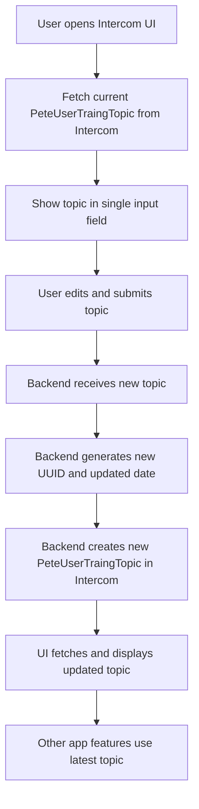

# Pete User Training Series - v0.0.1

## Purpose

- Allow admins to update the current PeteUserTraingTopic via a single input in the Intercom UI.
- When updated, a new custom object is created in Intercom with a new UUID and updated date.
- The latest topic is used across the app (banners, series, etc.).

## Process Map

## Implementation Steps

- [x] Add endpoint to fetch the latest PeteUserTraingTopic from Intercom.
- [x] Update UI to show only the current topic in a single input field.
- [x] On submit, send the new topic to the backend.
- [x] Backend generates new UUID and date, creates new custom object in Intercom.
- [x] UI fetches and displays the updated topic.
- [ ] Expose the latest topic for use in banners, series, etc.

### Detailed Implementation Plan

1. **Backend**
   - [x] Create a GET endpoint `/api/pete-user-training-topic` to fetch the latest topic from Intercom custom objects.
   - [x] Create a POST endpoint `/api/pete-user-training-topic` to accept a new topic, generate a UUID and updated date, and create a new custom object in Intercom.
   - [x] Internal API calls now use the full endpoint (not just the base URL) and respect the `INTERNAL_API_URL` env var.
   - [x] Added console logs for when a topic is being saved and when it is successfully updated.
2. **UI**
   - [x] Display only the current topic in a single input field.
   - [x] On submit, send the new topic to the backend POST endpoint.
   - [x] After update, fetch and display the latest topic (with value shown in the UI).
3. **Integration**
   - [ ] Make the latest topic available for banners, series, and other app features.
   - [x] Add debug logging for all data flow.
   - [ ] Document the endpoints and usage in the README.

## Debugging & Logs

- Look for `[SUBMIT save_training_topic] Saving new topic: ...` and `[SUBMIT save_training_topic] Successfully updated topic to: ...` in your logs.
- If there is an error, check for `[SUBMIT save_training_topic] Failed to update or fetch topic:` and the error details.
- Ensure that the internal API URL is set correctly and that you are POSTing to the full endpoint.

## Data Model

- PeteUserTraingTopic (Intercom Custom Object)
  - id (UUID)
  - topic (string)
  - created_at (date)
  - updated_at (date)

## Notes

- Only the topic is editable in the UI; id and dates are managed by backend.
- The latest topic is always fetched and used across the app.
- This enables dynamic updates for banners, series, and other features.
- Internal API URL bug is fixed; logs are improved for easier debugging.
- UI now shows the updated topic value after each save.

flowchart TD
  A["User opens Intercom UI"] --> B["Fetch current PeteUserTraingTopic from Intercom"]
  B --> C["Show topic in single input field"]
  C --> D["User edits and submits topic"]
  D --> E["Backend receives new topic"]
  E --> F["Backend generates new UUID and updated date"]
  F --> G["Backend creates new PeteUserTraingTopic in Intercom"]
  G --> H["UI fetches and displays updated topic"]
  H --> I["Other app features use latest topic"]