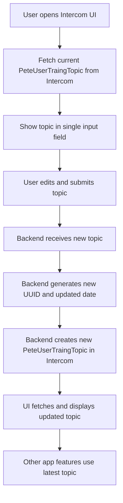

# Pete User Training Series - v0.0.1

## Purpose

- Allow admins to update the current PeteUserTraingTopic via a single input in the Intercom UI.
- When updated, a new custom object is created in Intercom with a new UUID and updated date.
- The latest topic is used across the app (banners, series, etc.).

## Process Map

## Implementation Steps

- [ ] Add endpoint to fetch the latest PeteUserTraingTopic from Intercom.
- [ ] Update UI to show only the current topic in a single input field.
- [ ] On submit, send the new topic to the backend.
- [ ] Backend generates new UUID and date, creates new custom object in Intercom.
- [ ] UI fetches and displays the updated topic.
- [ ] Expose the latest topic for use in banners, series, etc.

### Detailed Implementation Plan

1. **Backend**
   - Create a GET endpoint `/api/pete-user-training-topic` to fetch the latest topic from Intercom custom objects.
   - Create a POST endpoint `/api/pete-user-training-topic` to accept a new topic, generate a UUID and updated date, and create a new custom object in Intercom.
2. **UI**
   - Display only the current topic in a single input field.
   - On submit, send the new topic to the backend POST endpoint.
   - After update, fetch and display the latest topic.
3. **Integration**
   - Make the latest topic available for banners, series, and other app features.
   - Add debug logging for all data flow.
   - Document the endpoints and usage in the README.

## Data Model

- PeteUserTraingTopic (Intercom Custom Object)
  - id (UUID)
  - topic (string)
  - created_at (date)
  - updated_at (date)

## Notes

- Only the topic is editable in the UI; id and dates are managed by backend.
- The latest topic is always fetched and used across the app.
- This enables dynamic updates for banners, series, and other features.
