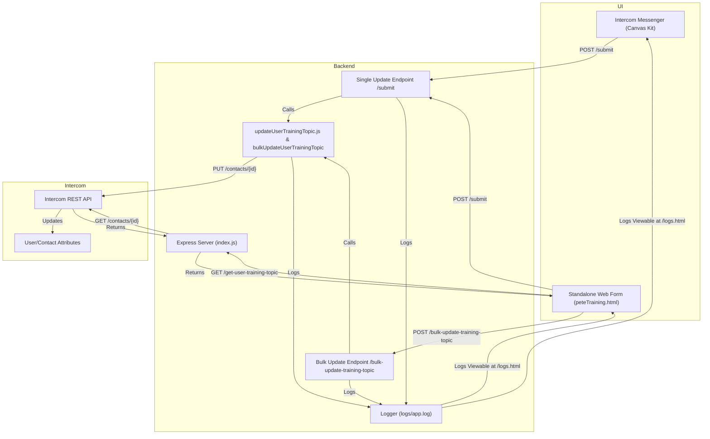
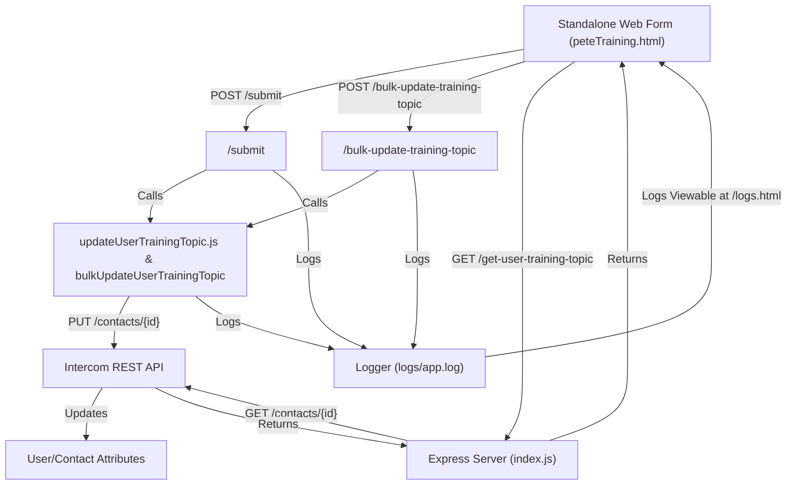

# What's Working (v0.02)

_Last updated: $(date)_

## Overview

This app provides a robust onboarding and training management solution for Intercom using the Canvas Kit UI, REST API, and custom backend logic. It enables:

- Step-by-step onboarding flows and full-form onboarding via Canvas Kit and popout browser forms.
- Admins to update the `user_training_topic` attribute for users directly from the Intercom UI (Canvas Kit app), with changes reflected in Intercom via the REST API.
- Bulk audience-based updates: Admins can update the training topic for all users, admins, leads, or everyone via the UI, with full logging and error reporting.
- Shell scripts and Node.js utilities for updating user/company attributes, looking up IDs, and testing API operations in isolation.

## App Architecture: Full Flow (Canvas Kit + Frontend)



## App Architecture: Frontend-Only Flow



## Function/Endpoint Mapping

- **index.js**: Main Express server. Handles all HTTP endpoints, request validation, and routing.
- **/submit**: Handles both Canvas Kit and frontend single-user training topic updates. Extracts userId, calls updateUserTrainingTopic, logs all actions.
- **/bulk-update-training-topic**: Handles bulk updates for an audience (admin, user, lead, everyone). Calls getUserIdsByAudience, then bulkUpdateUserTrainingTopic, logs all actions and errors.
- **/get-user-training-topic**: Fetches the current training topic for a user (for frontend display).
- **updateUserTrainingTopic.js**: Utility for updating a single user's training topic via Intercom REST API. Handles API errors, logs details.
- **bulkUpdateUserTrainingTopic**: Utility for updating multiple users in sequence, logs each result.
- **Logger (logger.js)**: Writes all info, debug, and error logs to logs/app.log. Logs are viewable at /logs.html.
- **Frontend (peteTraining.html)**: UI for admins to update a single user or bulk audience. Shows results and errors, fetches current topic.
- **Canvas Kit UI**: Intercom Messenger app, uses /submit for single-user updates.

## What's Working (Summary)

- All flows (Canvas Kit and frontend) update user_training_topic via the same backend logic.
- Bulk updates are robust, logged, and errors are visible in the UI and logs.
- Logs are accessible at /logs.html for full traceability.

## Next Steps

- Add company attribute UI.
- Add user-facing error logs and retry logic.
- Add automated tests and role-based permissions.
- Continue to expand documentation and diagrams as the app grows.

---

_This document is now a true reference for the Pete Intercom App's architecture and working state._

## What Works

- **Canvas Kit UI:** Users and admins can interact with onboarding and training flows using approved Intercom Canvas Kit components.
- **REST API Integration:** The backend can update user attributes (e.g., `user_training_topic`) in Intercom using both shell scripts and Node.js utilities.
- **Bulk Audience-Based Updates:** Admins can now update the training topic for an entire audience (Admin, User, Lead, Everyone) via the UI. The backend fetches user IDs using the Intercom Search API and updates each user, with robust error handling and logging for each attempt.
- **Popout Full Form:** The onboarding form can be completed in a browser popout, with results emailed to admins and stored in Intercom.
- **Security:** All incoming requests are validated using HMAC-SHA256 signatures.
- **Testing:** Utilities and scripts allow for isolated, repeatable testing of attribute updates before deploying to production.
- **Logging:** API responses and errors are logged for debugging and are viewable in-app at `/logs.html`.
- **Extensible Utilities:** All update logic is modular and reusable for future workflows or series.

## What Does Not Work / Is Missing

- **Company Attribute UI:** No admin UI for updating company attributes (`petetraining`) from within the Canvas Kit app (only via API or CSV import).
- **Advanced Error Handling:** While errors are logged in detail, there is no user-facing error log or retry logic in the UI.
- **Automated Edge-Case Tests:** Most testing is manual or via isolated scripts/utilities.
- **User/Company Relationship Management:** No UI for linking users to companies or managing custom object relationships.
- **No Role-Based Permissions:** All admins can update training topics; no fine-grained access control.

## How We Can Make It Better

- **Admin UI for Company Attributes:** Extend the Canvas Kit app to allow editing company-level attributes from the UI.
- **Better Error Reporting:** Show more detailed error messages and logs in the UI, and add retry options for failed updates.
- **Automated Testing:** Add automated tests for all scripts/utilities and backend endpoints.
- **Role-Based Access:** Add admin roles/permissions for sensitive actions.
- **Relationship Management UI:** Add UI for linking users to companies and managing custom object relationships.
- **Documentation:** Continue to expand documentation for onboarding, training, and troubleshooting.
- **Performance:** Consider batching or rate-limiting for very large audiences to avoid hitting Intercom API rate limits.

---

_This document will be updated as new features are added and existing ones are improved._

# What's Working: Pete Intercom App (Current State)

## ✅ Unified Attribute Update Flow

- Both the Intercom Canvas Kit UI (in Messenger) and the standalone frontend form (`/training`) now POST to the **same `/submit` endpoint** for single updates, and to `/bulk-update-training-topic` for audience-based updates.
- The `/submit` and `/bulk-update-training-topic` handlers use the `updateUserTrainingTopic` and `bulkUpdateUserTrainingTopic` utilities to update the `user_training_topic` attribute on the Intercom user/contact via the REST API.
- **No custom object logic remains**—all updates are direct attribute changes.

## ✅ Logging & Traceability

- All update attempts (success or error) are logged to `src/logs/app.log` and viewable in-app at `/logs.html`.
- Logs include incoming request payloads, API responses, and error details for full traceability.

## ✅ Scripts & Utilities

- All scripts are retained for future use, but only the attribute update logic is active in the app.
- The backend and utility code for updating the attribute are identical, ensuring consistency.

## ✅ Documentation & UI

- Docs and UI have been updated to clarify that only user attributes are updated (not custom objects).
- The training form and Canvas Kit UI both reflect this model.
- Bulk update results (successes/failures) are shown in the UI, with error details available for review.

---

## 🟢 **Likelihood of Success: HIGH**

- The backend is now simple, robust, and focused solely on updating the user attribute, with both single and bulk update flows.
- Both UI and Canvas Kit flows use the same endpoint and logic, reducing the chance of bugs or mismatches.
- Logging is comprehensive, so any issues will be immediately visible.
- The Intercom API call is well-tested and matches Intercom's requirements for attribute updates.

---

## ⚠️ Remaining Risks / Next Steps

- **User ID:** Ensure the correct user/contact ID is always used (from context or `.env`).
- **Permissions:** The Intercom access token must have permission to update user attributes.
- **Future Workflows:** When adding series/workflows, use the same attribute update pattern for consistency.
- **Testing:** Test both the Canvas Kit UI and the `/training` form to confirm updates appear in Intercom.
- **Performance:** Monitor for API rate limits when updating large audiences; consider batching or exponential backoff if needed.
- **Extensibility:** Next, add company attribute UI, role-based permissions, and automated tests for even greater reliability.

---

## 🚀 **Summary**

- The app is now highly likely to work as intended for updating the `user_training_topic` attribute from both the Intercom UI and the standalone form, for both single users and bulk audiences.
- All actions are logged and traceable.
- The codebase is clean, maintainable, and ready for future workflow integration and extensibility.

```mermaid
flowchart TD
  A1["Intercom Messenger (Canvas Kit)"]
  A2["Standalone Web Form (peteTraining.html)"]
  B1["Express Server (index.js)"]
  B2["Bulk Update Endpoint /bulk-update-training-topic"]
  B3["Single Update Endpoint /submit"]
  B4["Logger (logs/app.log)"]
  B5["updateUserTrainingTopic.js & bulkUpdateUserTrainingTopic"]
  C1["Intercom REST API"]
  C2["User/Contact Attributes"]
  A1 --|"POST /submit"| B3
  A2 --|"POST /submit"| B3
  A2 --|"POST /bulk-update-training-topic"| B2
  B3 --|"Calls"| B5
  B2 --|"Calls"| B5
  B5 --|"PUT /contacts/{id}"| C1
  C1 --|"Updates"| C2
  B3 --|"Logs"| B4
  B2 --|"Logs"| B4
  B5 --|"Logs"| B4
  A2 --|"GET /get-user-training-topic"| B1
  B1 --|"GET /contacts/{id}"| C1
  C1 --|"Returns"| B1
  B1 --|"Returns"| A2
  B4 --|"Logs Viewable at /logs.html"| A2
  B4 --|"Logs Viewable at /logs.html"| A1
```
