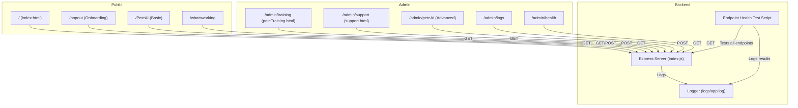

# Health Checks, Automated Testing, and CI Plan (In Progress)

## Overview

This plan covers the addition of health/status endpoints, automated endpoint tests, CI integration, and migration from .html static endpoints to clean routes for the Pete Intercom App. The goal is to ensure all major features are monitored, testable, and their status is visible to developers and users.

## Completed Steps

- Added `/health`, `/api/intercom/cache/status`, and `/api/intercom/contacts/test` endpoints.
- Implemented `/api/endpoints` for machine-readable route listing.
- Built a modern `/health.html` dashboard that checks all endpoints and shows their status, type, and methods.
- Wrote an automated shell script (`src/scripts/endpoint_health_check.sh`) to check endpoint health for CI/local use.
- Created and enforced Cursor rules for endpoint health and dashboard best practices.

## In Progress / Next Steps

1. **CI Integration**
   - Add a GitHub Actions workflow to run the endpoint health script on every commit/PR.
   - Optionally update a badge or summary in docs.
2. **Migrate .html Endpoints to Clean Routes**
   - For every static `.html` endpoint (e.g., `/logs.html`), create a clean route (e.g., `/logs`) that serves the same content.
   - Update the dashboard and docs to reflect the new routes.
   - Remove `.html` as a primary route once migration is complete.

## Status

- In Progress

## References

- `.cursor/rules/endpoint-health-best-practices.mdc` (endpoint health/dashboard rule)
- `.cursor/rules/cursor-agent-protocol.mdc` (AI code change protocol)
- `.cursor/rules/github-best-practices.mdc` (GitHub/CI best practices)
- `plan.intercom-api-integration.completed.001.md` (completed API plan)

---

_Status: In Progress_

---

## Test-Driven System & Endpoint Health (July 2025 Update)

A new Cursor rule (`test-driven-system.mdc`) now enforces:

- Automated tests for every endpoint and feature
- CI health checks before merge/deploy
- Logging of all test results
- Failing the build/PR if any endpoint is broken or untested
- Documentation and plan updates for all new/changed endpoints and tests

### Modularized, Test-Driven System Architecture

### Next Steps: Endpoint Test Coverage & Backlog

1. **Write/Update Automated Endpoint Tests**
   - Ensure every route (public/admin) is covered by a test.
   - Use a Node.js script to check all endpoints for 200 OK and log results.
2. **Integrate with CI**
   - Add a GitHub Actions workflow to run the endpoint health script on every push/PR.
   - Fail the build if any endpoint is broken.
3. **Backlog for <90% Coverage**
   - If test coverage is below 90%, create GitHub issues for each missing/broken endpoint or feature.
   - Prioritize backlog fixes before moving to `/Pending` plans.
4. **Update Documentation**
   - Reflect new endpoints, tests, and admin/public split in `/DEV_MAN/whatworkin.md` and related docs.

---

_Status: In Progress — Test-driven system and endpoint health enforcement now required for all future work._
