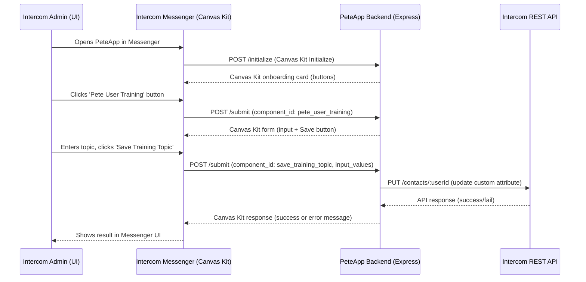

# Pete Intercom Canvas Kit App: Architecture Overview

## 1. High-Level Overview

The Pete Intercom Canvas Kit app enables Intercom admins to update a "Pete User Training Topic" for users directly from the Intercom Messenger UI. The app consists of:

- **Frontend:** Intercom Messenger (Canvas Kit UI)
- **Backend:** Node.js/Express server (PeteApp)
- **Intercom REST API:** For updating user custom attributes

## 2. User Interaction Sequence

1. **Admin opens PeteApp in Intercom Messenger.**
2. **Intercom sends POST /initialize** to PeteApp backend.
3. **Backend responds with Canvas Kit onboarding card** (buttons for actions).
4. **Admin clicks 'Pete User Training'.**
5. **Intercom sends POST /submit** (component_id: pete_user_training).
6. **Backend responds with Canvas Kit form** (input + save button).
7. **Admin enters topic and clicks 'Save Training Topic'.**
8. **Intercom sends POST /submit** (component_id: save_training_topic, input_values).
9. **Backend attempts to update the user's custom attribute** via Intercom REST API.
10. **Backend returns Canvas Kit response** (success or error message).
11. **Intercom displays result in Messenger UI.**

(See Mermaid sequence diagram in chat for a visual flow.)

## 3. Canvas Kit Request/Response Model

- **All endpoints accept POST and respond with valid Canvas Kit JSON.**
- **/initialize:** Returns onboarding card with action buttons.
- **/submit:** Handles all user actions (form display, save, error/success feedback).
- **Canvas Kit responses** always include a `canvas` object with a `content` array of components (text, input, button, etc.).
- **No custom scripts or external libraries** in Canvas Kit responses.

## 4. Backend Endpoints & Responsibilities

- **/initialize:** Handles Canvas Kit initialization, returns main card.
- **/submit:** Handles all user actions (button clicks, form submissions). Branches logic by `component_id`:
  - `pete_user_training`: Shows the training topic input form.
  - `save_training_topic`: Attempts to update the user's training topic via Intercom API.
- **/api/pete-user-training-topic:** (REST) Fetches or creates PeteUserTrainingTopic custom objects (for debugging/persistence).
- **/popout, /popout-submit:** Serve and process a full onboarding form (outside Canvas Kit flow).

## 5. Environment & Configuration

- **.env file:** Stores sensitive config (INTERCOM_ACCESS_TOKEN, INTERCOM_CLIENT_SECRET, UserId, etc.).
- **process.env usage:** All secrets and fallback user IDs are read from environment variables.

## 6. Error Handling & Logging

- **Backend logs all incoming /submit requests** (see debug log at top of handler).
- **All error branches log details** and return a Canvas Kit error message to the UI.
- **API errors from Intercom are logged and surfaced to the admin as a generic error message.**

## 7. Security

- **X-Body-Signature validation** on all Canvas Kit requests using INTERCOM_CLIENT_SECRET (HMAC-SHA256).
- **No sensitive data stored beyond what is required.**

## 8. Data Flow: Updating User Training Topic

- **UserId** is taken from the request context if present, otherwise from `.env` (UserId).
- **updateUserTrainingTopic.js** utility handles the Intercom API call to update the user's custom attribute.
- **On success:** Backend returns a Canvas Kit success message.
- **On failure:** Backend logs the error and returns a Canvas Kit error message.

## 9. Codebase Structure

- **src/index.js:** Main Express app, all endpoint logic.
- **src/utils/updateUserTrainingTopic.js:** Utility for updating user attributes via Intercom API.
- **src/intercom/canvasKit.js:** Canvas Kit component builders and helpers.
- **src/intercomRescources/:** Docs and setup guides.
- **DEV_MAN/:** Developer manuals, learning guides, and architecture docs.

## 10. Diagram References

- **See chat for Mermaid sequence diagram** outlining the full user-to-backend-to-Intercom flow.

## 11. Known Issues / Debugging Notes

- **Current issue:** UI shows "Failed to update Pete User Training Topic" but no backend errors are logged. Possible causes:
  - The userId being used does not match a valid Intercom contact (see logs for which userId is used).
  - The Intercom API call is failing silently (check for 400/404/401 responses in logs).
  - Canvas Kit request/response model is correct, but the backend may not be surfacing all error details.
- **Next steps:**
  - Confirm the userId being used for the update matches a real Intercom contact.
  - Add more granular error logging if needed.
  - Review Intercom API permissions for the access token.

## 12. Reference Docs

- **See DEV_MAN/** for detailed developer manuals, learning guides, and troubleshooting steps.
- **See src/intercomRescources/** for Intercom API and Canvas Kit setup guides.

## 13. Sequence Diagram

Below is a Mermaid sequence diagram visualizing the end-to-end flow from Intercom Messenger UI, through the PeteApp backend, to the Intercom REST API, and back:

