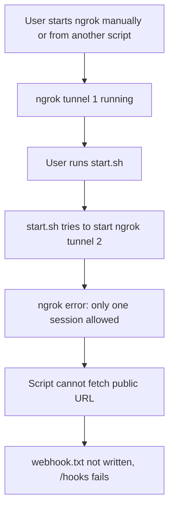

# Pete Intercom App: Robust Startup & Webhook Endpoint Plan

## Purpose

This plan explains the order of operations and error prevention strategies that ensure the app reliably displays the correct webhook endpoints on the index page, and avoids the 'Cannot GET /hooks' error.

---

## 1. Order of Operations

1. **Kill Existing Processes:**
   - The script kills all running ngrok and Node.js processes to prevent port conflicts and ngrok session errors.
2. **Install Dependencies (Local Only):**
   - Runs `pnpm install` only in local development to ensure all dependencies are present.
3. **Start Node.js App:**
   - Starts the app in the background and checks that it is running and responding on the correct port.
4. **Start ngrok (Local Only):**
   - Starts ngrok only if not in production/cloud.
   - Waits for the tunnel to be available, retrying up to 30 seconds.
5. **Write Webhook Endpoints:**
   - Writes the correct URLs to `webhook.txt` and prints them to the terminal.
   - In production/cloud, uses the `PUBLIC_URL` environment variable or defaults to localhost.
6. **/hooks Endpoint:**
   - Always available, reads `webhook.txt` and displays the endpoints in a simple HTML page.
7. **index.html:**
   - Fetches `/hooks` and displays the current webhook endpoints on the root page for easy access.

---

## 2. Error Prevention & Robustness

- **No Multiple Processes:**
  - The script kills all old ngrok and Node.js processes before starting new ones, preventing conflicts.
- **Waits for Services:**
  - The script waits for both the Node.js app and ngrok to be fully up before proceeding.
- **Retry Logic:**
  - The script retries fetching the ngrok URL for up to 30 seconds, handling slow startups.
- **Environment Detection:**
  - The script detects local vs. production/cloud and adjusts behavior accordingly.
- **Always Writes webhook.txt:**
  - The script always writes `webhook.txt` with the correct URLs, so `/hooks` and the index page can display them.
- **/hooks Route Always Registered:**
  - The `/hooks` route is always present in `index.js` before `app.listen`, so it is always available when the server is running.
- **index.html Always Fetches /hooks:**
  - The index page dynamically fetches and displays the endpoints, so you always see the latest URLs.

---

## 3. Why Multiple ngrok Tunnels Cause Errors (and How to Fix)

### Problem

If you start ngrok manually or from another script, and then run `start.sh`, the script tries to start a new ngrok tunnel. **Free ngrok accounts only allow one tunnel/session at a time.** This leads to authentication/session errors and the script cannot fetch the public URL.

### Mermaid Diagram: Error Scenario

### Solution

- **Always kill all existing ngrok processes before starting a new one in the script.**
- **Never start ngrok manually when using the script.**
- **Add extra checks in the script to ensure only one ngrok process is running.**
- **If ngrok fails to start, print a clear error and exit.**

---

## 4. Why This Will Work

- **No more 'Cannot GET /hooks':**
  - The `/hooks` route is always registered and available as long as the server is running the latest code.
- **No more missing endpoints:**
  - The script ensures `webhook.txt` is always written with the correct URLs, and the index page always fetches them.
- **No more ngrok session errors:**
  - The script always kills old ngrok processes before starting a new one, so only one tunnel is ever active.
- **Works Locally and in the Cloud:**
  - The script and app are robust to both local development (with ngrok) and production/cloud deployment (with a public URL).
- **Easy Debugging:**
  - Verbose logging at every step makes it easy to see what is happening and where any issues occur.

---

## 5. Summary

- The improved process ensures a clean environment, waits for all services, and always provides the correct webhook endpoints.
- The `/hooks` endpoint and index page are always in sync with the latest URLs.
- This setup is robust, portable, and easy to use for both local and cloud development.
