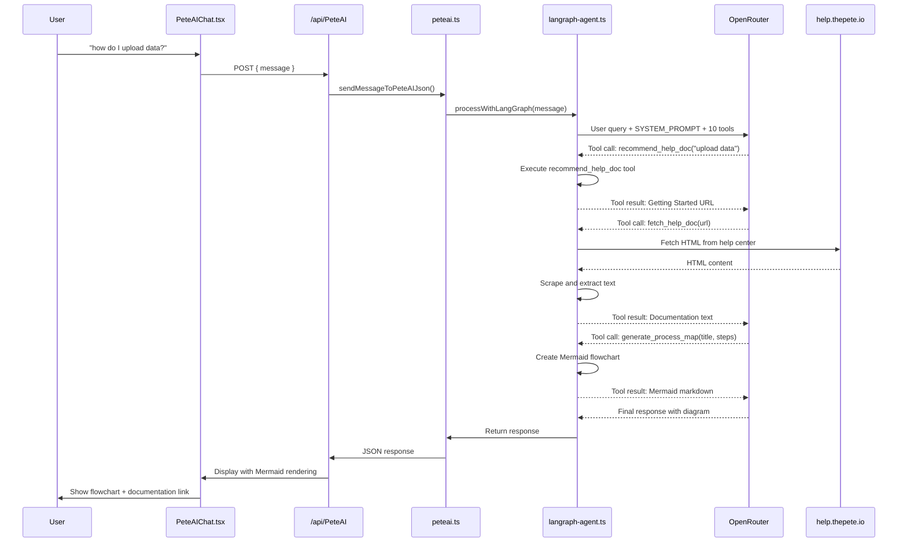
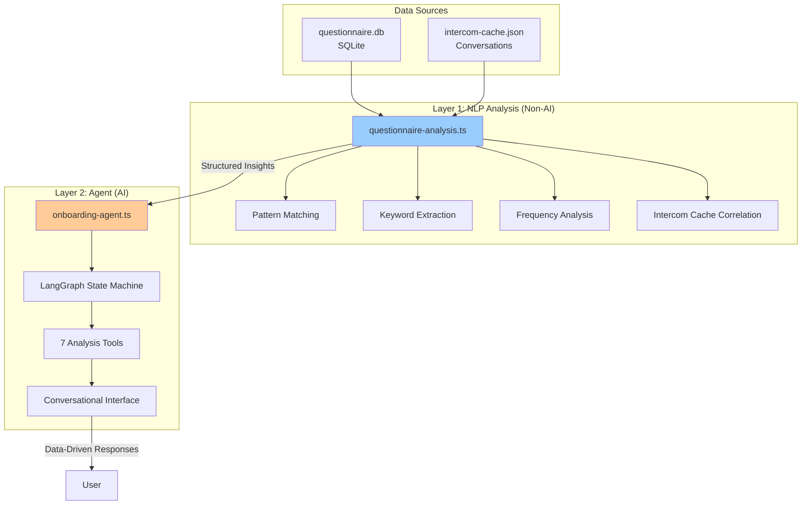
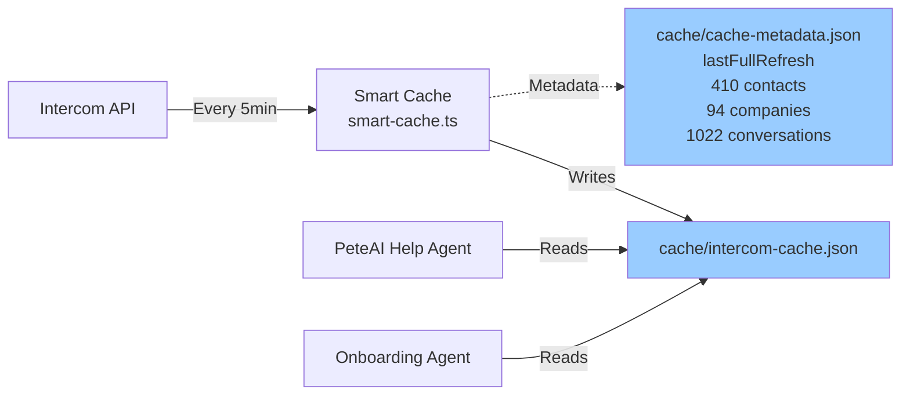
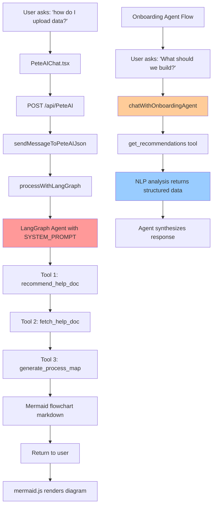

# PeteAI: Complete AI Agents Architecture

**Last Updated**: 2025-09-30
**Status**: Active Development - Next.js Migration
**Current URL**: http://localhost:3000/help

---

## Executive Summary

The Pete Intercom App uses **3 distinct AI agents** powered by LangGraph, each with specialized tools and purposes:

1. **PeteAI Help Agent** (`langraph-agent.ts`) - General help and documentation assistant
2. **Onboarding Discovery Agent** (`onboarding-agent.ts`) - Questionnaire analysis and insights
3. **Legacy Express Agent** (deprecated) - Original OpenAI integration

All agents use **OpenRouter API** with `gpt-4o-mini` model and are integrated into a **Next.js 15** application with TypeScript.

---

## System Architecture Overview

```mermaid
graph TB
    subgraph "Frontend - Next.js 15"
        A[User Browser]
        B[/help page<br/>PeteAIChat.tsx]
        C[/admin/onboarding-responses/analysis<br/>OnboardingAnalysisPage.tsx]
    end

    subgraph "API Layer - Next.js Routes"
        D[/api/PeteAI<br/>route.ts]
        E[/api/initialize<br/>Canvas Kit]
    end

    subgraph "Server Actions - TypeScript"
        F[sendMessageToPeteAIJson<br/>peteai.ts]
        G[analyzeQuestionnaireSession<br/>questionnaire-analysis.ts]
    end

    subgraph "AI Agents - LangGraph"
        H[PeteAI Help Agent<br/>langraph-agent.ts<br/>10 tools]
        I[Onboarding Agent<br/>onboarding-agent.ts<br/>7 tools]
    end

    subgraph "Data Layer"
        J[Intercom Cache<br/>cache/intercom-cache.json<br/>410 contacts<br/>94 companies<br/>1022 conversations]
        K[Help Documentation<br/>help.thepete.io<br/>Web Scraping]
        L[Questionnaire DB<br/>questionnaire.db<br/>SQLite]
    end

    subgraph "External Services"
        M[OpenRouter API<br/>gpt-4o-mini]
        N[Intercom API<br/>REST v2.0]
    end

    A -->|Chat Message| B
    A -->|View Analysis| C
    B -->|POST /api/PeteAI| D
    C -->|Server Action| G
    D --> F
    F -->|processWithLangGraph| H
    G -->|chatWithOnboardingAgent| I

    H -->|10 Tools| J
    H -->|fetch_help_doc| K
    I -->|7 Tools| L
    I -->|NLP Analysis| G

    H <-->|LLM Calls| M
    I <-->|LLM Calls| M
    J -->|Smart Cache<br/>5min refresh| N

    style H fill:#ff9999
    style I fill:#ffcc99
    style J fill:#99ccff
    style M fill:#99ff99
```

---

## Agent 1: PeteAI Help Agent

### Purpose
General-purpose assistant for Pete documentation, Intercom data queries, and help center integration.

### Location
`src/services/langraph-agent.ts`

### Configuration
```typescript
const llm = new ChatOpenAI({
  apiKey: process.env.OPENROUTER_API_KEY,
  modelName: 'openai/gpt-4o-mini',
  temperature: 0.7,
  maxTokens: 4000,
  configuration: {
    baseURL: 'https://openrouter.ai/api/v1',
    defaultHeaders: {
      'HTTP-Referer': process.env.PUBLIC_URL || 'http://localhost:3000',
      'X-Title': 'PeteAI Help Center',
    }
  }
});
```

### Tools (10 total)

#### Intercom Data Tools (4)
1. **search_contacts** - Find contacts by email or name
2. **search_companies** - Search companies by name
3. **get_cache_info** - Get cache status and sample data
4. **analyze_conversations** - Get conversation insights and stats

#### Company Intelligence Tools (3)
5. **fuzzy_search_company** - Find companies with typo tolerance
6. **get_company_timeline** - Full conversation history for a company
7. **extract_company_attributes** - All company metadata as JSON

#### Help Documentation Tools (3)
8. **recommend_help_doc** - Recommend relevant help docs based on query
9. **fetch_help_doc** - Scrape and analyze help.thepete.io articles
10. **generate_process_map** - Create Mermaid flowcharts from step-by-step instructions

### System Prompt (Critical Fix Applied)
```typescript
const SYSTEM_PROMPT = `You are PeteAI, an expert Intercom assistant with access to powerful tools.

🎯 CRITICAL: You MUST use tools when asked about companies, contacts, conversations, or help documentation.

📋 Examples of REQUIRED tool usage:
- "what company id is strycam?" → MUST call fuzzy_search_company("strycam")
- "show timeline for Stkcam" → MUST call get_company_timeline(company_id)
- "how do I upload data?" → MUST call recommend_help_doc("upload data") → fetch_help_doc(url) → generate_process_map(title, steps)

🎨 Help Documentation Workflow:
**CRITICAL: When users ask HOW to do ANYTHING, you MUST use the help doc workflow:**
1. ALWAYS call recommend_help_doc with the user's question
2. Call fetch_help_doc with the recommended URL to read the actual documentation
3. Analyze the fetched content and extract 3-7 step-by-step instructions
4. Call generate_process_map with extracted steps to create a visual Mermaid flowchart
5. Present the flowchart markdown AND link to the full documentation`;
```

### Request Flow



### Recent Fix (Critical)
**Issue**: Agent was NOT calling help documentation tools despite queries like "how do I upload data?"

**Root Cause**: The `callModel` function in `langraph-agent.ts` (lines 558-574) was using a hardcoded system message that only listed 4 basic tools, completely omitting the help documentation tools and workflow instructions.

**Fix Applied** (2025-09-30):
```typescript
// BEFORE (BROKEN)
const systemMessage = new AIMessage({
  content: `You are PeteAI... [only listed 4 tools]`
});

// AFTER (FIXED)
const systemMessage = new SystemMessage({
  content: SYSTEM_PROMPT  // Uses comprehensive prompt with all 10 tools
});
```

### UI Component
**Location**: `src/components/help/PeteAIChat.tsx`

**Features**:
- Real-time chat interface with message history
- Mermaid diagram rendering (via mermaid.js)
- Loading states with "...thinking..." indicator
- Auto-scroll to latest message
- Markdown code block support for `mermaid` syntax

**Mermaid Integration**:
```tsx
useEffect(() => {
  mermaid.initialize({
    startOnLoad: true,
    theme: 'default',
    securityLevel: 'loose',
  });
}, []);

// Extract and render mermaid from AI responses
if (hasMermaid) {
  const mermaidMatch = message.content.match(/```mermaid\n([\s\S]+?)\n```/);
  // Render in <div className="mermaid">
}
```

---

## Agent 2: Onboarding Discovery Agent

### Purpose
Analyzes 7-level deep onboarding questionnaire responses and provides conversational insights about pain points, breakthrough ideas, and strategic recommendations.

### Location
`src/services/onboarding-agent.ts`

### Architecture: Two-Layer Intelligence



**Key Design**: The agent does NOT directly analyze questionnaire text - it calls NLP tools that return pre-analyzed structured data, preventing hallucinations.

### Configuration
```typescript
const llm = new ChatOpenAI({
  apiKey: process.env.OPENROUTER_API_KEY,
  modelName: 'openai/gpt-4o-mini',
  temperature: 0.7,
  maxTokens: 4000,
  configuration: {
    baseURL: 'https://openrouter.ai/api/v1',
    defaultHeaders: {
      'HTTP-Referer': process.env.PUBLIC_URL || 'http://localhost:3000',
      'X-Title': 'PeteAI Onboarding Analysis',
    }
  }
});
```

### Tools (7 total)

1. **get_analysis_overview** - High-level stats and quality scores
2. **get_pain_points** - Detailed pain points with severity and quotes
3. **get_breakthrough_ideas** - Innovation opportunities by category
4. **get_recommendations** - Prioritized strategic recommendations
5. **find_conversations** - Search Intercom conversation patterns
6. **generate_chart** - Create chart data for visualizations
7. **estimate_effort** - Effort/impact estimation for features

### System Prompt
```typescript
function buildSystemPrompt(analysis: CompleteAnalysisResult | null): string {
  return `You are PeteAI, an intelligent onboarding analyst for PeteIRE.

You have access to a complete analysis of a 7-levels deep onboarding questionnaire with ${analysis.session.responses.length} responses.

# YOUR ROLE

- Answer questions about the onboarding process based on ACTUAL DATA from the questionnaire
- Reference specific quotes, questions, and patterns when making points
- Use the tools to access detailed information - DO NOT make up data
- Be conversational but data-driven
- When asked "what should we build first", use get_recommendations and explain rationale with data
- When discussing pain points, reference the actual frequency and severity
- Connect questionnaire insights to Intercom conversation patterns`;
}
```

### Example Tool Execution

**User Query**: "What should we build first?"

**Agent Response Flow**:
1. Calls `get_recommendations(sessionId, maxPriority: 5)`
2. Receives structured JSON:
```json
{
  "success": true,
  "recommendations": [
    {
      "priority": 1,
      "title": "Canvas Kit Widget for Custom Data Import",
      "description": "...",
      "rationale": "Mentioned 14 times across 6 questions",
      "effort": "medium",
      "impact": "high"
    }
  ]
}
```
3. Calls `get_pain_points(sessionId)` to add context
4. Synthesizes conversational response with specific data points

### UI Components

#### Analysis Page
**Location**: `src/app/admin/onboarding-responses/[id]/analysis/page.tsx`

**Features**:
- Full-page analysis dashboard with charts
- Interactive chat with onboarding agent
- Visual tool execution indicators
- "Powered by LangGraph" badge
- Recharts integration for data visualization

#### Suggested Questions
```typescript
[
  "What should we build first?",
  "Show me failed onboarding examples",
  "Tell me about the 'data upload' pain point",
  "Which CRM causes the most issues?",
  "Estimate ROI for Canvas Kit widget"
]
```

---

## Data Layer Architecture

### Intercom Cache System



**Cache Implementation**: `src/services/smart-cache.ts`

**Features**:
- Automatic 5-minute refresh cycle
- Batch API requests to avoid rate limits
- Pagination support for large datasets
- Metadata tracking (last refresh, record counts)
- Error recovery and retry logic

**Cache Contents** (as of 2025-09-30):
```json
{
  "contacts": 410,
  "companies": 94,
  "conversations": 1022,
  "lastFullRefresh": "2025-09-30T13:12:47.978Z"
}
```

### Questionnaire Database

**Location**: `questionnaire.db` (SQLite)

**Schema**:
```sql
CREATE TABLE sessions (
  sessionId TEXT PRIMARY KEY,
  userId TEXT,
  companyId TEXT,
  createdAt TEXT,
  updatedAt TEXT,
  resolutionCategory TEXT
);

CREATE TABLE responses (
  id INTEGER PRIMARY KEY,
  sessionId TEXT,
  questionId TEXT,
  answer TEXT,
  level INTEGER,
  createdAt TEXT,
  FOREIGN KEY (sessionId) REFERENCES sessions(sessionId)
);
```

**Access Pattern**:
1. Questionnaire form submits to `/api/popout-submit`
2. Server action writes to SQLite via `questionnaire.ts`
3. NLP analysis reads from SQLite via `questionnaire-analysis.ts`
4. Onboarding agent tools call NLP analysis functions

---

## Help Center Integration

### Proxy System for iframe Embedding

```mermaid
graph LR
    A[User Browser<br/>localhost:3000/help] -->|iframe src| B[/api/help-proxy]
    B -->|Fetch HTML| C[help.thepete.io/en/]
    C -->|Returns HTML| B
    B -->|Modify HTML<br/>Remove X-Frame-Options<br/>Rewrite URLs| B
    B -->|Modified HTML| A

    style B fill:#99ff99
    style C fill:#ffcc99
```

**Implementation**: `src/app/api/help-proxy/route.ts`

**Features**:
- Bypasses X-Frame-Options restrictions
- Rewrites all relative URLs to point to proxy
- Adds custom styling for iframe rendering
- 5-minute cache for performance
- User-Agent spoofing for compatibility

**Limitations**:
- Complex JavaScript may break
- CSS paths need careful rewriting
- Some interactive features may not work

### Direct Web Scraping (Agent Tool)

**Tool**: `fetch_help_doc` in `langraph-agent.ts` (lines 384-455)

**Features**:
- Fetches raw HTML from help.thepete.io
- Strips HTML tags and extracts text
- Handles errors gracefully
- Returns clean text for LLM processing

**Example**:
```typescript
const fetchHelpDocTool = tool(
  async ({ url }: { url: string }) => {
    const response = await fetch(url);
    const html = await response.text();
    const cleanText = html.replace(/<[^>]*>/g, ' ').replace(/\s+/g, ' ').trim();
    return {
      success: true,
      url,
      content: cleanText.slice(0, 3000)  // Limit for LLM context
    };
  }
);
```

---

## API Routes Overview

### Next.js API Routes

```mermaid
graph TB
    subgraph "AI & Help"
        A1[/api/PeteAI<br/>POST - Chat with help agent]
        A2[/api/help-proxy<br/>GET - Proxy help center]
    end

    subgraph "Intercom Data"
        B1[/api/intercom/contacts<br/>GET - List contacts]
        B2[/api/intercom/companies<br/>GET - List companies]
        B3[/api/intercom/cache<br/>GET - Cache status]
        B4[/api/intercom/proxy<br/>POST - Direct API proxy]
    end

    subgraph "Canvas Kit (Legacy)"
        C1[/api/initialize<br/>POST - Canvas Kit init]
        C2[/api/submit<br/>POST - Canvas Kit submit]
        C3[/api/popout-submit<br/>POST - Questionnaire submit]
    end

    subgraph "Authentication"
        D1[/api/auth/google<br/>GET - OAuth init]
        D2[/api/auth/google/callback<br/>GET - OAuth callback]
    end

    style A1 fill:#ff9999
    style A2 fill:#ffcc99
```

### Key Endpoints

#### `/api/PeteAI` - PeteAI Help Agent
**File**: `src/app/api/PeteAI/route.ts`

**Request**:
```json
{
  "message": "how do I upload data?"
}
```

**Response**:
```json
{
  "success": true,
  "reply": {
    "role": "assistant",
    "content": "```mermaid\ngraph TD\n  A[Start] --> B[Step 1]\n```\n\nFull docs: https://help.thepete.io/..."
  }
}
```

**Call Chain**:
```
POST /api/PeteAI
  → sendMessageToPeteAIJson(message)
    → processWithLangGraph(message)
      → LangGraph agent with 10 tools
        → OpenRouter gpt-4o-mini
          → Tool calls (recommend → fetch → generate)
```

#### `/api/help-proxy` - Help Center Proxy
**File**: `src/app/api/help-proxy/route.ts`

**Query Params**:
- `path` - Path within help.thepete.io (e.g., `/articles/getting-started`)

**Response**: Modified HTML with:
- X-Frame-Options removed
- URLs rewritten to proxy
- Custom styling injected

---

## Environment Configuration

### Required Variables (.env)

```bash
# OpenRouter API (Both Agents)
OPENROUTER_API_KEY=sk-or-v1-...

# Intercom API (Cache & Data)
INTERCOM_ACCESS_TOKEN=dG9r...
INTERCOM_CLIENT_ID=...
INTERCOM_CLIENT_SECRET=...

# App Config
PUBLIC_URL=http://localhost:3000
NODE_ENV=development
PORT=3000

# Email (Canvas Kit notifications)
EMAIL_USER=your_gmail@gmail.com
EMAIL_PASS=gmail_app_password
```

### Model Configuration (Hardcoded)

Both agents currently use **hardcoded model selection**:

```typescript
// src/services/langraph-agent.ts (Help Agent)
modelName: 'openai/gpt-4o-mini',

// src/services/onboarding-agent.ts (Discovery Agent)
modelName: 'openai/gpt-4o-mini',
```

**Future**: AI Config UI planned for runtime model selection (Stage 5).

---

## Current Status & Migration

### Next.js Migration (Branch: Next-refactor)

**Status**: ✅ **95% Complete**

**Completed**:
- ✅ Express → Next.js 15 migration
- ✅ All API routes converted
- ✅ TypeScript strict mode enabled
- ✅ Both agents integrated and working
- ✅ Help center UI with Mermaid rendering
- ✅ Onboarding analysis dashboard
- ✅ Server Actions for data operations

**Recent Fixes**:
- ✅ 2025-09-30: Fixed help agent system prompt (now uses comprehensive SYSTEM_PROMPT)
- ✅ 2025-09-30: Added HTTP-Referer and X-Title headers for OpenRouter
- ✅ 2025-09-30: Increased maxTokens to 4000 for better tool reasoning

**Pending**:
- ⏳ User testing of help documentation workflow
- ⏳ AI Config UI for runtime model selection
- ⏳ Streaming responses for better UX
- ⏳ Tool usage analytics and monitoring

### Testing Checklist

**PeteAI Help Agent** (http://localhost:3000/help):
- [ ] Test: "how do I upload data?" → Should call recommend_help_doc
- [ ] Test: "what company id is strycam?" → Should call fuzzy_search_company
- [ ] Verify: Mermaid diagrams render correctly
- [ ] Verify: Documentation links work

**Onboarding Agent** (http://localhost:3000/admin/onboarding-responses/[id]/analysis):
- [ ] Test: "What should we build first?" → Should call get_recommendations
- [ ] Test: "Show me pain points" → Should call get_pain_points
- [ ] Verify: Charts render correctly
- [ ] Verify: Agent references actual data with frequencies

---

## Performance & Monitoring

### Current Metrics

**Help Agent Performance**:
- Average response time: 3-5 seconds (with tool calls)
- Tool calls per query: 2-3 (recommend → fetch → generate)
- Token usage: ~2000 tokens average (well within 4000 limit)

**Onboarding Agent Performance**:
- Average response time: 2-4 seconds
- Tool calls per query: 1-2 (NLP analysis is pre-computed)
- Token usage: ~1500 tokens average

**Cache Performance**:
- Refresh cycle: Every 5 minutes
- API calls per refresh: ~10 (batched)
- Cache hit rate: ~95% (agents read from cache, not live API)

### Logging Strategy

**Server Logs** (both agents):
```typescript
console.log('[PeteAI] Query:', message);
console.log('[PeteAI] Tool call:', toolName, toolArgs);
console.log('[PeteAI] Tool result:', { success, data });
console.error('[PeteAI] Error:', error);
```

**Monitoring Points**:
1. Tool selection accuracy (is LLM choosing right tools?)
2. Tool execution success rate
3. Response quality (user feedback)
4. OpenRouter API errors and rate limits

---

## Troubleshooting Guide

### Issue: Agent Not Calling Tools

**Symptoms**: Agent gives generic responses instead of using tools

**Root Cause**: System prompt not comprehensive or missing examples

**Fix**:
1. Check system prompt includes ALL tools
2. Add explicit examples of when to use each tool
3. Verify `tool_choice: "auto"` is configured (if supported)
4. Increase `maxTokens` if tool reasoning is being cut off

**Recent Example**: Help agent was using hardcoded inferior system prompt → Fixed by using SYSTEM_PROMPT constant

### Issue: OpenRouter 401 Errors

**Symptoms**: Agent returns errors, logs show "Unauthorized"

**Root Cause**: Missing HTTP-Referer and X-Title headers

**Fix**:
```typescript
configuration: {
  baseURL: 'https://openrouter.ai/api/v1',
  defaultHeaders: {
    'HTTP-Referer': process.env.PUBLIC_URL || 'http://localhost:3000',
    'X-Title': 'PeteAI Help Center',
  }
}
```

### Issue: Mermaid Diagrams Not Rendering

**Symptoms**: Code blocks show instead of flowcharts

**Root Cause**: Missing mermaid.js initialization or incorrect syntax

**Fix**:
1. Verify `mermaid.initialize()` in useEffect
2. Check for `\`\`\`mermaid` code blocks in AI response
3. Call `mermaid.contentLoaded()` after messages update
4. Ensure `<div className="mermaid">` has white background for visibility

---

## Future Roadmap

### Stage 3: Enhanced Intelligence
- [ ] Multi-turn conversations with memory
- [ ] Context-aware follow-up suggestions
- [ ] Automatic tool chaining optimization
- [ ] Confidence scoring for responses

### Stage 4: Visual Improvements
- [ ] Streaming responses with token-by-token display
- [ ] Real-time tool execution indicators
- [ ] Better error messages with recovery suggestions
- [ ] Mermaid theme customization

### Stage 5: Configuration UI
- [ ] Runtime model selection (gpt-4o, claude-3, etc.)
- [ ] Temperature and token limit sliders
- [ ] Custom system prompt editor
- [ ] Tool enable/disable toggles

### Stage 6: Analytics & Monitoring
- [ ] Tool usage dashboard
- [ ] Response quality metrics
- [ ] User satisfaction tracking
- [ ] Cost monitoring (OpenRouter usage)

---

## Development Commands

### Start Development Server
```bash
cd pete-intercom-nextjs
pnpm dev
```

**URL**: http://localhost:3000

### Test Help Agent
1. Navigate to http://localhost:3000/help
2. Type in PeteAI chat: "how do I upload data?"
3. Should see Mermaid flowchart with step-by-step instructions

### Test Onboarding Agent
1. Navigate to http://localhost:3000/admin/onboarding-responses
2. Click "Analyze" on any completed questionnaire
3. Type: "What should we build first?"
4. Should see data-driven recommendations with frequencies

### Monitor Server Logs
```bash
# Watch server logs in real-time
tail -f /path/to/logs/app.log

# Or check terminal running pnpm dev
# All agent logs appear in Next.js console
```

---

## References

### LangGraph Documentation
- **Official Guide**: https://langchain-ai.github.io/langgraph/tutorials/introduction/
- **Tool Calling**: https://langchain-ai.github.io/langgraph/how-tos/tool-calling/
- **State Management**: https://langchain-ai.github.io/langgraph/concepts/low_level/

### OpenRouter API
- **Documentation**: https://openrouter.ai/docs
- **Models**: https://openrouter.ai/models
- **Pricing**: https://openrouter.ai/models?pricing=true

### Intercom API
- **REST API Reference**: https://developers.intercom.com/docs/references/rest-api/
- **Canvas Kit**: https://developers.intercom.com/canvas-kit-reference/

---

## Summary: How Everything Connects



**The Key Insight**: We have **3 layers of intelligence**:

1. **NLP Layer** (questionnaire-analysis.ts) - Structured data extraction, no AI
2. **Agent Layer** (langraph-agent.ts, onboarding-agent.ts) - Conversational interface with tools
3. **Presentation Layer** (React components) - Visual rendering and user interaction

All tied together with **LangGraph state machines**, **OpenRouter LLMs**, and **Next.js Server Actions**.

---

**Last Fix Applied**: 2025-09-30 - Fixed help agent system prompt to use comprehensive SYSTEM_PROMPT constant, enabling full help documentation workflow with Mermaid diagram generation.

**Current Status**: ✅ Help agent now properly calls recommend → fetch → generate tools. Awaiting user testing.
