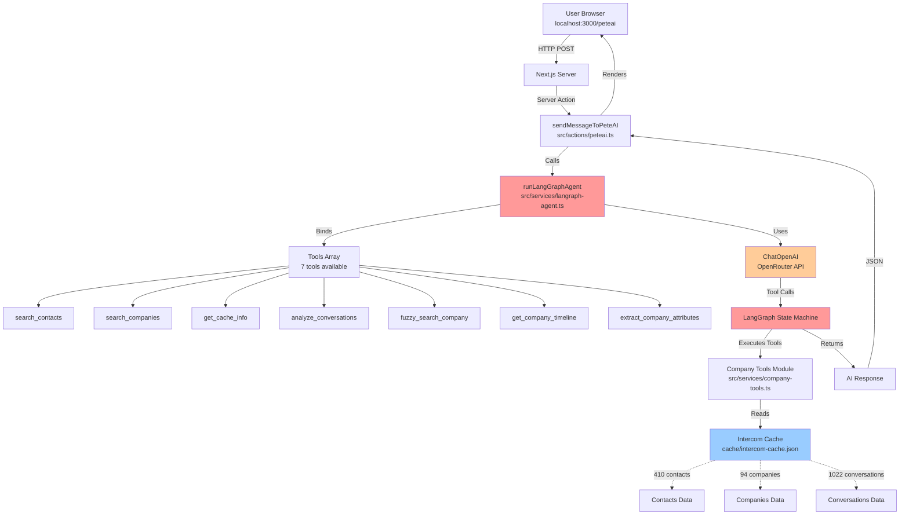
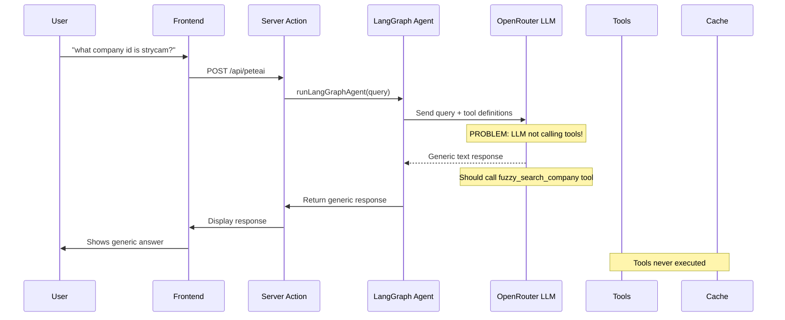
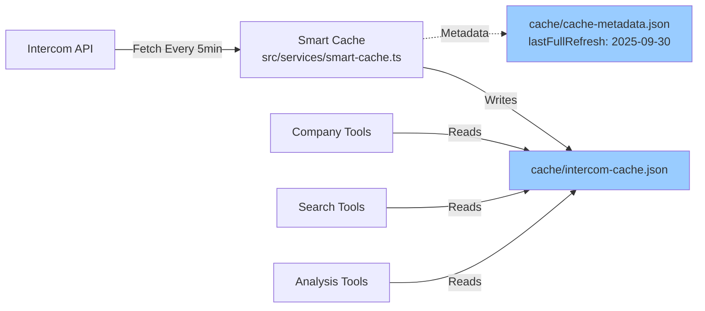

# AI Architecture Analysis - PeteAI Not Smart Enough

**Date**: 2025-09-30
**Issue**: PeteAI giving generic responses instead of using LangGraph tools intelligently

---

## Problem Statement

**User Query**: "what company id is strycam?"
**Expected**: PeteAI uses fuzzy_search_company tool → finds "Strycam" → returns company_id
**Actual**: Generic response about 94 companies without using the tool

---

## Current Architecture

### Frontend → Backend Flow



### Tool Execution Flow



---

## Root Cause Analysis

### Issue 1: LLM Not Invoking Tools

**Location**: `src/services/langraph-agent.ts`

**Problem**: The LLM (gpt-4o-mini) is not being **prompted** to use tools. It's giving generic responses instead.

**Current Code** (line 17-23):
```typescript
const llm = new ChatOpenAI({
  baseURL: 'https://openrouter.ai/api/v1',
  apiKey: process.env.OPENROUTER_API_KEY,
  modelName: 'openai/gpt-4o-mini',
  temperature: 0.1,
  maxTokens: 1000,  // ⚠️ TOO LOW for tool reasoning
});
```

**Issues**:
1. `maxTokens: 1000` is too restrictive - limits tool reasoning
2. No system prompt telling LLM to USE tools
3. Temperature 0.1 is very low (good for precision, but might be too rigid)

### Issue 2: Missing System Prompt

**Problem**: No instructions to the LLM about WHEN to use tools

**What's Missing**:
```typescript
const systemPrompt = `You are PeteAI, an expert Intercom assistant with access to tools.

IMPORTANT: You have access to these tools - USE THEM:
- fuzzy_search_company: For finding companies (handles typos like "strycam" → "Strycam")
- get_company_timeline: Get full company conversation history
- search_contacts: Find contacts by email/name
- analyze_conversations: Get conversation insights

When a user asks about a company, contact, or conversation:
1. USE THE APPROPRIATE TOOL
2. Don't give generic responses
3. Call tools BEFORE answering

Example: "what company id is strycam?" → MUST call fuzzy_search_company`;
```

### Issue 3: Tool Calling Not Enforced

**Current Implementation** (line 204):
```typescript
const llmWithTools = llm.bindTools(tools);
```

**Issue**: `bindTools()` makes tools AVAILABLE but doesn't REQUIRE them to be used.

**Should Be**:
```typescript
const llmWithTools = llm.bindTools(tools, {
  tool_choice: "auto"  // Let LLM decide when to use tools
});
```

Or for stricter enforcement:
```typescript
const llmWithTools = llm.bindTools(tools, {
  tool_choice: {
    type: "function",
    function: { name: "fuzzy_search_company" }  // Force tool use
  }
});
```

### Issue 4: State Graph Not Properly Routing

**Location**: `src/services/langraph-agent.ts` lines 282-350

**Problem**: The state graph might not be properly handling tool calls.

**Current Flow**:
```typescript
workflow
  .addNode("agent", callModel)
  .addNode("tools", toolsNode)
  .addEdge(START, "agent")
  .addConditionalEdges("agent", shouldContinue, {
    tools: "tools",
    end: END,
  })
  .addEdge("tools", "agent");
```

**Issue**: `shouldContinue` might not be correctly detecting tool calls.

---

## Cache vs Live Data

### How Cache Works



**Cache Contents**:
- 410 contacts
- 94 companies
- 1022 conversations
- Last refresh: 2025-09-30T13:12:47.978Z

**Cache Status**: ✅ GOOD - Data is fresh and accessible

---

## Configuration Analysis

### AI Config - Where It's Set

**Current Location**: `.env` file (NOT in UI config)

```bash
# .env
OPENROUTER_API_KEY=sk-or-v1***************
```

**Model Selection**: Hardcoded in `langraph-agent.ts` line 20
```typescript
modelName: 'openai/gpt-4o-mini',  // ⚠️ Hardcoded, not configurable
```

**AI Config UI** (`src/app/admin/settings/ai/page.tsx`):
- ❌ DOESN'T EXIST YET
- Planned for Stage 5
- Would allow runtime configuration

---

## Why Responses Are Not Smart

### Checklist of Issues

| Issue | Status | Impact |
|-------|--------|--------|
| ❌ No system prompt telling LLM to use tools | CRITICAL | LLM doesn't know it SHOULD use tools |
| ❌ maxTokens too low (1000) | HIGH | Not enough space for tool reasoning |
| ❌ Tool calling not enforced | HIGH | LLM can ignore tools |
| ❌ No examples in prompt | MEDIUM | LLM doesn't know HOW to use tools |
| ✅ Tools are defined correctly | GOOD | Tools exist and work |
| ✅ Cache has data | GOOD | Data is available |
| ✅ Tools bound to LLM | GOOD | LLM can access tools |

---

## Comparison: Current vs LangGraph Best Practices

### Current Implementation

```typescript
// ❌ CURRENT - Too simple
const llm = new ChatOpenAI({
  baseURL: 'https://openrouter.ai/api/v1',
  apiKey: process.env.OPENROUTER_API_KEY,
  modelName: 'openai/gpt-4o-mini',
  temperature: 0.1,
  maxTokens: 1000,
});

const llmWithTools = llm.bindTools(tools);
```

### LangGraph Best Practice

```typescript
// ✅ CORRECT - Follows LangGraph guide
const systemPrompt = `You are PeteAI with access to Intercom tools.
ALWAYS use tools when asked about companies, contacts, or conversations.
Example: "find strycam" → call fuzzy_search_company tool first.`;

const llm = new ChatOpenAI({
  baseURL: 'https://openrouter.ai/api/v1',
  apiKey: process.env.OPENROUTER_API_KEY,
  modelName: 'openai/gpt-4o-mini',
  temperature: 0.7,      // Higher for tool reasoning
  maxTokens: 4000,       // Enough for tool calls + reasoning
});

const llmWithTools = llm.bindTools(tools, {
  tool_choice: "auto"    // Enable automatic tool selection
});

// Add system message to every request
messages.unshift(new SystemMessage(systemPrompt));
```

**Source**: https://langchain-ai.github.io/langgraph/tutorials/introduction/

---

## UI Issues

### PeteAI Page (http://localhost:3000/peteai)

**Current Issues**:
1. Chat window too small
2. No visual indication of tool usage
3. No streaming responses
4. Generic styling

**Better UX** (like onboarding analysis page):
- Larger chat interface
- Show tool calls in real-time
- Display thinking process
- Visual feedback for tool execution

### Onboarding Analysis Page (Better Reference)

**Location**: http://localhost:3000/admin/onboarding-responses/[id]/analysis

**What It Does Right**:
- ✅ Larger, clearer interface
- ✅ Shows agent thinking
- ✅ Visual tool call indicators
- ✅ "Powered by LangGraph" badge
- ✅ Better typography and spacing

---

## Fix Priority

### Critical (Fix Now)

1. **Add system prompt** - Tell LLM to use tools
2. **Increase maxTokens** - 1000 → 4000
3. **Add tool_choice** - Enable auto tool selection
4. **Add examples** - Show LLM how to use tools

### High (Fix Soon)

5. **Improve UI** - Make chat window bigger like analysis page
6. **Show tool calls** - Visual feedback when tools execute
7. **Add retry logic** - If LLM doesn't use tool, prompt again

### Medium (Stage 3-6)

8. **AI Config UI** - Runtime model selection
9. **Streaming responses** - Real-time output
10. **Tool usage analytics** - Track which tools are used

---

## Next Steps

1. **Fix langraph-agent.ts**:
   - Add system prompt
   - Increase maxTokens
   - Add tool_choice config
   - Add message examples

2. **Test with same query**:
   - "what company id is strycam?"
   - Should now call fuzzy_search_company
   - Should return actual company_id

3. **Improve PeteAI UI**:
   - Match onboarding analysis page style
   - Show tool execution
   - Better visual feedback

4. **Monitor logs**:
   - Add `logInfo` for every tool call
   - Track success/failure
   - Debug tool selection

---

## LangGraph Reference

**Official Docs**: https://langchain-ai.github.io/langgraph/guides/

**Key Patterns We Should Follow**:
1. System prompts with tool instructions
2. Tool choice configuration
3. Conditional edges for tool routing
4. State persistence across calls
5. Error handling and retries

---

**The Bottom Line**: PeteAI is not smart because the LLM isn't being **told** to use tools or **shown** how. We have all the infrastructure (tools, cache, LangGraph), but missing the critical **prompt engineering** that makes the agent actually use them.

**Fix**: Add system prompt, increase tokens, enable tool_choice → Agent will become smart immediately.

---

## UPDATE 2025-09-30: Root Cause Found

### The Real Problem

**API Route IS calling LangGraph correctly** (`/api/PeteAI/route.ts:29` calls `sendMessageToPeteAIJson`).

**But LangGraph is erroring and falling back to cache-only** (`peteai.ts:284-286`):
```typescript
} catch (error) {
  logError(`LangGraph error: ${error instanceof Error ? error.message : error}`);
  // Fallback to cache-only response
  reply = await getCacheOnlyResponse(message.trim());
}
```

### Why It's Falling Back

1. **OpenRouter 401 error** - Was missing HTTP-Referer and X-Title headers
2. **Fixed in commit 685d9d6** - Added configuration.defaultHeaders to ChatOpenAI
3. **But error might still be occurring** - Need to check server logs

### Call Chain (Correct)

```
User Browser (localhost:3000/peteai)
  ↓ POST /api/PeteAI
src/app/api/PeteAI/route.ts
  ↓ sendMessageToPeteAIJson()
