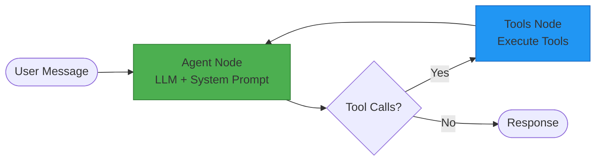
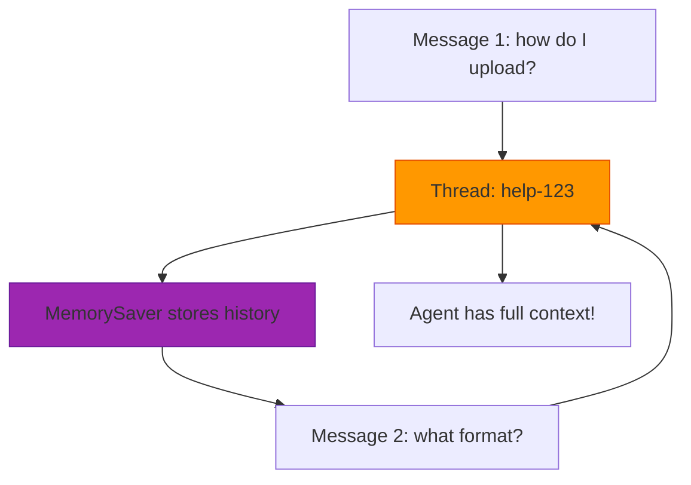

# AI Architecture Overview - Pete Intercom App

**Last Updated:** 2025-10-08
**Status:** ✅ Production Active (with conversation history)

---

## Executive Summary

Pete uses a multi-agent LangGraph architecture with **three specialized AI agents** working together to provide intelligent assistance across different domains. All agents share common infrastructure (LangGraph, OpenRouter, session management) but are optimized for specific use cases.

**Key Achievement:** As of 2025-10-08, all agents support **conversation history** via LangGraph MemorySaver checkpointing.

---

## Table of Contents

1. [Agent Comparison Matrix](#agent-comparison-matrix)
2. [Core Similarities](#core-similarities)
3. [Key Differences](#key-differences)
4. [Detailed Agent Profiles](#detailed-agent-profiles)
5. [Architecture Patterns](#architecture-patterns)
6. [Session Management](#session-management)
7. [Integration Points](#integration-points)
8. [Best Practices](#best-practices)

---

## Agent Comparison Matrix

| Feature | LangGraph Agent | Conversation Agent | Onboarding Agent |
|---------|----------------|-------------------|------------------|
| **Primary Use Case** | General help & data queries | Conversation analysis | Questionnaire discovery |
| **File** | `langraph-agent.ts` | `conversation-agent.ts` | `onboarding-agent.ts` |
| **Model** | gpt-4o-mini | gpt-4o-mini | gpt-4o-mini |
| **Temperature** | 0.7 | 0.7 | 0.7 |
| **Max Tokens** | 4000 | 4000 | 4000 |
| **Tool Count** | 15+ tools | 8 tools | 7 tools |
| **Data Source** | Intercom API + Help Docs | Intercom Conversations | Questionnaire + Conversations |
| **Conversation History** | ✅ Yes (MemorySaver) | ❌ No (stateless) | ❌ No (stateless) |
| **Mermaid Diagrams** | ✅ Yes (process maps) | ✅ Yes (flow charts) | ⚠️ Limited (chart data) |
| **Session Support** | ✅ threadId tracking | ❌ Stateless per request | ⚠️ sessionId but no history |
| **Real-time Data** | ✅ Live Intercom API | ✅ Cached conversations | ✅ Cached + live |
| **Frontend Integration** | Help center + multiple | Admin conversation insights | Admin onboarding insights |

---

## Core Similarities

All three agents share these foundational elements:

### 1. LangGraph Framework
```typescript
import { StateGraph, END, START } from "@langchain/langgraph";
```
- All use LangGraph for agent orchestration
- State machine with agent → tools → agent loop
- Conditional edges based on tool calls

### 2. OpenRouter + gpt-4o-mini
```typescript
const llm = new ChatOpenAI({
  apiKey: process.env.OPENROUTER_API_KEY,
  modelName: 'openai/gpt-4o-mini',
  temperature: 0.7,
  maxTokens: 4000,
  configuration: {
    baseURL: 'https://openrouter.ai/api/v1',
    defaultHeaders: {
      'HTTP-Referer': process.env.PUBLIC_URL || 'http://localhost:3000',
      'X-Title': 'PeteAI <Agent Name>',
    }
  }
});
```
- Same LLM provider and model
- Same temperature (0.7) for balanced creativity/accuracy
- Same token limit (4000)
- Same configuration pattern

### 3. Tool-Based Architecture
```typescript
const tools = [tool1, tool2, tool3];
const llmWithTools = llm.bindTools(tools, { tool_choice: "auto" });
```
- All use LangChain tools with Zod schemas
- Auto tool selection by LLM
- Structured tool responses

### 4. Error Handling Pattern
```typescript
try {
  const result = await tool.invoke(args);
  return { success: true, data: result };
} catch (error) {
  return {
    success: false,
    error: error instanceof Error ? error.message : 'Unknown error'
  };
}
```
- Consistent error handling across all agents
- Always return `{ success, data?, error? }`
- Graceful degradation

### 5. State Management Structure
```typescript
interface AgentState {
  messages: BaseMessage[];  // Conversation history
  next: string;             // Routing state
  // ... agent-specific fields
}
```
- All use `messages` array for LangChain message history
- All have `next` field for routing
- Custom fields per agent

---

## Key Differences

### 1. **Conversation History Support**

**LangGraph Agent (PRIMARY):**
```typescript
// ✅ ONLY agent with conversation history
const checkpointer = new MemorySaver();
const app = workflow.compile({ checkpointer });

await app.invoke(
  { messages: [new HumanMessage({ content: message })] },
  { configurable: { thread_id: sessionId } }  // Tracks history!
);
```

**Other Agents:**
```typescript
// ❌ No checkpointing - stateless
const agentApp = workflow.compile();  // No checkpointer

await agentApp.invoke({
  messages: [new HumanMessage({ content: message })]
  // No thread_id - each request is independent
});
```

**Impact:**
- LangGraph Agent: "What's the upload process?" → "What format?" (remembers context)
- Other Agents: Each question processed independently

---

### 2. **Tool Specialization**

**LangGraph Agent (15+ tools):**
- `search_contacts` - Fuzzy search contacts
- `search_companies` - Fuzzy search companies
- `get_contact_details` - Full contact data
- `get_company_timeline` - Conversation history
- `recommend_help_doc` - AI doc recommendations
- `fetch_help_doc` - Read actual help articles
- `map_pete_app_route` - Generate Pete app URLs
- `generate_process_map` - Mermaid diagram generation
- **Focus:** Breadth - covers help docs, contacts, companies, conversations

**Conversation Agent (8 tools):**
- `analyze_all_conversations` - Comprehensive analysis
- `get_success_patterns` - What works well
- `get_failure_patterns` - What fails
- `get_escalation_triggers` - Escalation causes
- `get_common_issues` - Recurring problems
- `get_process_gaps` - Workflow weaknesses
- `get_resolution_strategies` - Effective approaches
- `generate_flow_diagram` - Mermaid visualizations
- **Focus:** Depth - deep conversation pattern analysis

**Onboarding Agent (7 tools):**
- `get_analysis_overview` - High-level stats
- `get_pain_points` - Detailed pain points
- `get_breakthrough_ideas` - Innovation opportunities
- `get_recommendations` - Prioritized actions
- `find_conversations` - Search patterns
- `generate_chart` - Chart data
- `estimate_effort` - Effort/impact estimation
- **Focus:** Discovery - questionnaire insights + business strategy

---

### 3. **System Prompt Philosophy**

**LangGraph Agent:**
```
"You are PeteAI, your intelligent help assistant for Pete (Intercom automation platform)."
- General-purpose conversational tone
- Help doc workflow emphasis
- Step-by-step instructions with Mermaid diagrams
```

**Conversation Agent:**
```
"You are PeteAI Conversation Analyst, an expert at analyzing Intercom support conversations."
- Data-driven analyst persona
- Metrics and patterns focus
- Actionable insights
```

**Onboarding Agent:**
```
"You are PeteAI, an intelligent onboarding analyst for PeteIRE."
- Expert consultant persona
- Strategic recommendations
- Business impact focus
```

---

### 4. **Data Sources**

| Agent | Primary Data | Secondary Data | Cache Strategy |
|-------|-------------|----------------|----------------|
| **LangGraph** | Live Intercom API | Help docs (fetch) | Smart cache (contacts/companies) |
| **Conversation** | Cached conversations | Tag analysis | Pre-loaded at startup |
| **Onboarding** | Questionnaire responses | Cached conversations | Session-based (file storage) |

---

### 5. **Frontend Integration**

**LangGraph Agent:**
- `/help` - Help center (primary)
- `/peteai` - General chat page
- `/admin/*` - Various admin locations
- **Usage:** User-facing + admin

**Conversation Agent:**
- `/admin/conversations/insights` - Conversation analysis dashboard
- **Usage:** Admin-only analytics

**Onboarding Agent:**
- `/admin/onboarding-insights` - Onboarding analysis
- `/admin/onboarding-questionnaire` - Discovery chat
- **Usage:** Admin-only strategic planning

---

## Detailed Agent Profiles

### 🎯 1. LangGraph Agent (General Purpose)

**File:** `src/services/langraph-agent.ts`
**Lines:** 1,075

**Purpose:** Primary user-facing AI for help documentation, Intercom data queries, and general assistance.

**Unique Features:**
- ✅ **Conversation history** (MemorySaver checkpointing)
- ✅ **Help doc workflow** - Automatic doc fetching and process map generation
- ✅ **Pete app routing** - Generates clickable URLs to Pete app pages
- ✅ **Mermaid process maps** - Visual step-by-step instructions
- ✅ **Real-time Intercom API** - Live contact/company data

**Tool Categories:**
1. **Search Tools** (4) - Contact/company fuzzy search
2. **Detail Tools** (4) - Full data retrieval
3. **Help Doc Tools** (3) - Doc recommendation, fetching, routing
4. **Visualization Tools** (1) - Mermaid diagram generation
5. **Utility Tools** (3+) - Cache status, timeline, etc.

**When to Use:**
- User asks "how do I...?" → Fetch help docs + generate process map
- User asks about contacts/companies → Search and display
- Multi-turn conversations → Maintains context

**Example Flow:**
```
User: "how do i upload properties?"
  ↓
recommend_help_doc("upload properties")
  ↓
fetch_help_doc("/help/properties/import")
  ↓
map_pete_app_route("properties import page")
  ↓
generate_process_map(steps, stepUrls)
  ↓
Response with Mermaid diagram + clickable navigation
```

---

### 📊 2. Conversation Agent (Pattern Analysis)

**File:** `src/services/conversation-agent.ts`
**Lines:** 551

**Purpose:** Specialized agent for analyzing support conversation patterns to improve workflows.

**Unique Features:**
- ✅ **Pattern recognition** - Success/failure patterns
- ✅ **Escalation analysis** - What triggers escalations
- ✅ **Gap identification** - Process weaknesses
- ✅ **Resolution strategies** - What works with success rates
- ✅ **Mermaid flow diagrams** - Resolution paths, escalations, journeys

**Tool Categories:**
1. **Analysis Tools** (7) - Comprehensive + specific pattern tools
2. **Visualization Tools** (1) - Flow diagram generation (4 types)

**When to Use:**
- Admin asks "what causes escalations?"
- Admin asks "show me success patterns"
- Admin wants to visualize resolution paths

**Example Flow:**
```
Admin: "What's causing escalations?"
  ↓
get_escalation_triggers()
  ↓
Response: "23 escalations related to CRM import issues"
  ↓
generate_flow_diagram(type='escalation')
  ↓
Mermaid escalation flowchart
```

---

### 🚀 3. Onboarding Agent (Strategic Discovery)

**File:** `src/services/onboarding-agent.ts`
**Lines:** 697

**Purpose:** Analyzes 7-levels deep questionnaire responses to provide strategic recommendations.

**Unique Features:**
- ✅ **NLP analysis layer** - Pre-processes questionnaire data
- ✅ **Pain point extraction** - With severity and quotes
- ✅ **Breakthrough ideas** - Innovation opportunities by category
- ✅ **Strategic recommendations** - Prioritized with effort/impact
- ✅ **Chart data generation** - For dashboard visualizations
- ✅ **Effort estimation** - ROI calculation for features

**Tool Categories:**
1. **Discovery Tools** (3) - Overview, pain points, ideas
2. **Strategy Tools** (2) - Recommendations, effort estimation
3. **Search Tools** (1) - Find conversation patterns
4. **Visualization Tools** (1) - Chart data (6 types)

**When to Use:**
- Admin completes 7-levels questionnaire
- Admin asks "what should we build first?"
- Admin wants to understand root causes

**Example Flow:**
```
Admin: "What should we build first?"
  ↓
get_recommendations(maxPriority=3)
  ↓
Response: "Priority 1: Canvas Kit widget (3 week effort, high impact)"
  ↓
estimate_effort("Canvas Kit widget")
  ↓
Detailed ROI breakdown with dependencies
```

---

## Architecture Patterns

### Pattern 1: Agent → Tools → Agent Loop

All agents follow this pattern:



### Pattern 2: Conversation History (LangGraph Agent Only)



### Pattern 3: Tool Response Structure

```typescript
// Standard tool response format (all agents)
{
  success: boolean;
  data?: any;              // Tool-specific data
  error?: string;          // Error message if failed
  mermaidCode?: string;    // For diagram-generating tools
  message?: string;        // For tool-specific messages
}
```

---

## Session Management

### LangGraph Agent (WITH History)

```typescript
// Component generates session ID
const [sessionId] = useState(() => `help-${Date.now()}-${random()}`);

// Sent to API
body: JSON.stringify({ message, sessionId })

// Agent uses for threading
await app.invoke(
  { messages: [...] },
  { configurable: { thread_id: sessionId } }
);

// MemorySaver preserves history for this thread
```

**Result:** Multi-turn conversations work correctly

### Other Agents (WITHOUT History)

```typescript
// No session tracking
await agentApp.invoke({
  messages: [new HumanMessage({ content: message })]
});

// Each request is independent
// No conversation history preserved
```

**Result:** Each message processed in isolation

---

## Integration Points

### 1. API Routes

**Primary Endpoint:** `/api/PeteAI`
- Routes to `sendMessageToPeteAIJson()`
- Uses LangGraph Agent (general purpose)
- Supports sessionId for history

**Specialized Endpoints:**
- No dedicated endpoints for Conversation/Onboarding agents
- Called via server actions directly

### 2. Server Actions

```typescript
// src/actions/peteai.ts
export async function sendMessageToPeteAIJson(
  request: { message: string; sessionId?: string }
): Promise<ActionResult<PeteAIResponse>>

// Calls langraph-agent.ts processWithLangGraph()
```

### 3. Frontend Components

**LangGraph Agent:**
- `src/components/help/PeteAIChat.tsx` (help center)
- `src/components/PeteAIChat.tsx` (general use)
- `src/app/peteai/page.tsx` (standalone page)

**Conversation Agent:**
- `src/components/conversations/ConversationInsightsChat.tsx`
- Admin-only access

**Onboarding Agent:**
- `src/app/(admin)/onboarding-insights/page.tsx`
- Admin questionnaire interface

---

## Best Practices

### 1. When to Create a New Agent

Create a new specialized agent when:
- ✅ **Domain-specific tools** - Need 5+ tools for one domain
- ✅ **Different system prompt** - Requires unique persona/instructions
- ✅ **Separate data source** - Uses distinct data from other agents
- ✅ **Different user** - Admin vs user-facing needs

Don't create new agent when:
- ❌ **Few tools** - 1-3 tools, add to LangGraph agent
- ❌ **Same domain** - Fits existing agent's scope
- ❌ **Simple query** - Can be direct API call without LLM

### 2. Adding Conversation History to Existing Agents

To add MemorySaver to Conversation/Onboarding agents:

```typescript
// 1. Import MemorySaver
import { StateGraph, END, START, MemorySaver } from "@langchain/langgraph";

// 2. Create checkpointer
const checkpointer = new MemorySaver();

// 3. Compile with checkpointer
const app = workflow.compile({ checkpointer });

// 4. Add threadId parameter
export async function chatWithAgent(
  message: string,
  threadId: string = `default-${Date.now()}`
): Promise<string>

// 5. Pass thread_id on invoke
await app.invoke(
  { messages: [...] },
  { configurable: { thread_id: threadId } }
);
```

### 3. Tool Design Guidelines

**Good Tool:**
```typescript
const tool = tool(
  async ({ contactId }: { contactId: string }) => {
    try {
      const data = await fetchData(contactId);
      return { success: true, data };
    } catch (error) {
      return { success: false, error: error.message };
    }
  },
  {
    name: "get_contact",
    description: "Fetch full contact details by ID",
    schema: z.object({
      contactId: z.string().describe("Intercom contact ID")
    })
  }
);
```

**Best Practices:**
- ✅ Clear, descriptive name
- ✅ Specific description for LLM
- ✅ Zod schema with field descriptions
- ✅ Structured error handling
- ✅ Consistent response format

### 4. Error Handling Best Practices

**At Tool Level:**
```typescript
try {
  const result = await operation();
  return { success: true, data: result };
} catch (error) {
  logError(`[ToolName] Error: ${error}`);
  return { success: false, error: 'User-friendly message' };
}
```

**At Agent Level:**
```typescript
try {
  const response = await agentApp.invoke(...);
  return { success: true, message: response };
} catch (error) {
  logError(`[AgentName] Error: ${error}`);
  return {
    success: false,
    error: 'AI service temporarily unavailable'
  };
}
```

**At API Level:**
```typescript
if (!result.success) {
  console.error('[API] Error:', result.error);
  return NextResponse.json(
    { error: 'Generic user message' },
    { status: 500 }
  );
}
```

**At Frontend Level:**
```typescript
if (!response.ok || data.error) {
  console.error('[Frontend] Error:', { error: data.error, sessionId });
  // Show generic message to user
  setMessage('Sorry, I\'m having trouble right now.');
}
```

---

## Future Improvements

### 1. Add Conversation History to All Agents
- **Effort:** 1-2 hours per agent
- **Impact:** High - enables multi-turn conversations
- **Priority:** High for Conversation Agent (admin workflows)

### 2. Unified Session Management
- **Effort:** 3-4 hours
- **Impact:** Medium - consistent session tracking
- **Priority:** Medium

### 3. Persistent Checkpointing (SQLite/Postgres)
- **Effort:** 4-6 hours
- **Impact:** High - sessions persist across server restarts
- **Priority:** Medium (current MemorySaver works for MVP)

### 4. Agent Performance Monitoring
- **Effort:** 2-3 hours
- **Impact:** Medium - track token usage, latency, errors
- **Priority:** Low (working well currently)

---

## Related Documentation

- [LangGraph Checkpointing Docs](https://langchain-ai.github.io/langgraph/how-tos/persistence/)
- [Issue #39](https://github.com/Mark0025/peterei_intercom/issues/39) - Conversation history implementation
- [Issue #38](https://github.com/Mark0025/peterei_intercom/issues/38) - Agent fallback debugging

---

## Questions?

For AI architecture questions:
- Email: mark@peterei.com
- GitHub Issues: Tag with `ai-architecture` label

---

**Last Updated:** 2025-10-08
**Next Review:** 2025-11-08
