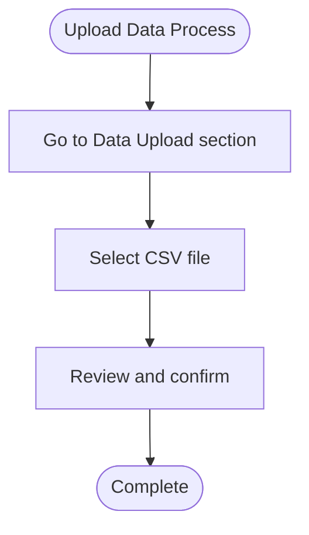
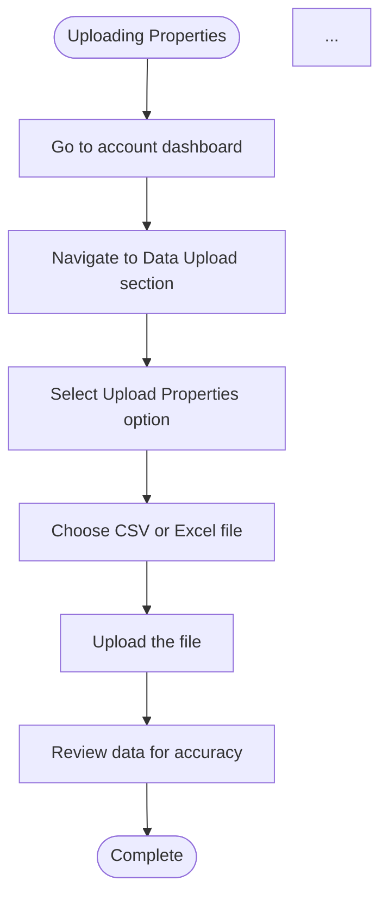

# PeteAI Help Agent Enhancements

**Date**: 2025-09-30
**Status**: ✅ Complete - Enhanced step outlining with contextual links + Pete app route mapping

---

## What Was Enhanced

### ✅ 1. Enhanced `fetch_help_doc` Tool

**File**: `src/services/langraph-agent.ts:343-436`

**New Features**:
- **Automatic Article Link Extraction** - Extracts up to 5 related article links from help pages
- **Collection Link Extraction** - Extracts up to 3 collection links for broader context
- **Automatic Step Extraction** - Parses `<ol>` tags to automatically extract numbered steps from documentation
- **Structured Data** - Returns organized data including:
  - `articleLinks[]` - Related articles with titles and URLs
  - `collectionLinks[]` - Related collections
  - `extractedSteps[]` - Pre-parsed step-by-step instructions

**Before**:
```typescript
return {
  success: true,
  url,
  content: summary,
  fullLength: content.length
};
```

**After**:
```typescript
return {
  success: true,
  url,
  content: summary,
  fullLength: content.length,
  articleLinks: articleLinks.slice(0, 5),
  collectionLinks: collectionLinks.slice(0, 3),
  extractedSteps,
  message: "Help doc fetched with contextual links"
};
```

---

### ✅ 2. Enhanced `generate_process_map` Tool

**File**: `src/services/langraph-agent.ts:438-516`

**New Features**:
- **Clickable Mermaid Steps** - Each step in the flowchart is now clickable
- **Source URL Integration** - Links directly to the full help documentation
- **Click Events** - Mermaid `click` syntax makes every step interactive

**New Parameter**:
```typescript
sourceUrl?: string // Optional URL to make steps clickable
```

**Mermaid Output Enhancement**:


---

### ✅ 3. Updated SYSTEM_PROMPT

**File**: `src/services/langraph-agent.ts:47-78`

**Enhanced Workflow Instructions**:

**Before**:
```
1. Call recommend_help_doc
2. Call fetch_help_doc
3. Extract steps
4. Call generate_process_map
5. Call generate_help_link
```

**After**:
```
1. Call recommend_help_doc
2. Call fetch_help_doc
   - Automatically extracts article links, steps from <ol> tags
3. Use extractedSteps if available
4. FOR EACH STEP that mentions navigation:
   - Call map_pete_app_route to get actual Pete app URL
   - Store URLs to make individual steps clickable
5. Call generate_process_map WITH sourceUrl for clickable steps
6. Call generate_help_link
7. Present flowchart AND formatted help link
8. Include Related Articles from articleLinks
```

### ✅ 4. Added `map_pete_app_route` Tool

**File**: `src/services/langraph-agent.ts:612-682`

**New Tool**: Maps user actions to actual Pete app URLs

**Route Mapping**:
```typescript
'settings' → https://app.thepete.io/settings
'import' → https://app.thepete.io/settings/general/import
'upload' → https://app.thepete.io/settings/general/import
'properties' → https://app.thepete.io/properties
'dashboard' → https://app.thepete.io/dashboard
'workflows' → https://app.thepete.io/workflows
'tasks' → https://app.thepete.io/tasks
'messages' → https://app.thepete.io/messages
... and more
```

**Usage Example**:
```typescript
// Agent detects navigation step
map_pete_app_route({ action: "upload data" })

// Returns:
{
  success: true,
  url: "https://app.thepete.io/settings/general/import",
  description: "Upload data",
  action: "upload"
}
```

---

## How It Works Now

### Example User Query:
> "I need to upload properties into my account"

### Agent Workflow:

1. **recommend_help_doc("upload properties")**
   - Returns: `https://help.thepete.io/en/collections/10827028-getting-started`

2. **fetch_help_doc(url)**
   - Returns:
     ```json
     {
       "content": "...",
       "articleLinks": [
         { "title": "Uploading CSV Files", "url": "..." },
         { "title": "Property Field Mapping", "url": "..." }
       ],
       "collectionLinks": [
         { "title": "Getting Started", "url": "..." }
       ],
       "extractedSteps": [
         "Navigate to Data Upload section",
         "Select Upload Properties option",
         "Choose CSV or Excel file",
         "Upload the file",
         "Review data for accuracy",
         "Confirm the upload"
       ]
     }
     ```

3. **generate_process_map(title, extractedSteps, sourceUrl)**
   - Creates clickable Mermaid flowchart
   - Each step links to the full guide

4. **generate_help_link(path, "Getting Started Guide")**
   - Creates HTML link: `<a href="...">Getting Started Guide</a>`

5. **Present to User**:
   ```
   Here's a step-by-step guide on how to upload properties:

   [Mermaid Flowchart - each step is clickable]

   For more detailed information, check out the Getting Started Guide.

   Related Articles:
   • Uploading CSV Files
   • Property Field Mapping
   ```

---

## Benefits

### 1. **Better Step Outlining**
- Automatic extraction from `<ol>` tags means steps match the actual documentation
- No manual parsing needed
- Consistent step formatting

### 2. **Contextual Links**
- Every step in the process map is clickable
- Related articles provide additional context
- Users can explore related topics easily

### 3. **Improved User Experience**
- Click any step to jump to full documentation
- Visual flowchart with actionable links
- Related articles for deeper learning
- **NEW**: Steps link directly to Pete app routes (e.g., clicking "Go to Import" opens `https://app.thepete.io/settings/general/import`)

### 4. **Reduced Manual Work**
- Automatic step extraction from HTML
- Automatic link discovery
- Structured data for easy presentation
- **NEW**: Automatic Pete app route mapping for navigation steps

### 5. **Direct App Navigation**
- Navigation steps link directly to Pete app pages
- No need to manually search for the right page
- Users go straight from help to action
- Seamless integration between documentation and application

---

## Example Output

**User**: "How do I upload properties?"

**PeteAI**:
```
Here's a step-by-step guide on how to upload properties into your account:



For more detailed information, you can check out the [Getting Started with Uploading Properties](https://help.thepete.io/en/collections/10827028-getting-started) guide.

**Related Articles:**
• [Uploading CSV Files](https://help.thepete.io/en/articles/...)
• [Property Field Mapping](https://help.thepete.io/en/articles/...)
```

---

## Files Modified

1. **`src/services/langraph-agent.ts`**
   - Enhanced `fetchHelpDocTool` (lines 343-436)
   - Enhanced `generateProcessMapTool` (lines 438-516)
   - Added `mapPeteAppRouteTool` (lines 612-682)
   - Updated `SYSTEM_PROMPT` (lines 47-78)
   - Registered new tool in tools array (line 793)

---

## Next Steps

### Optional Future Enhancements:

1. **Individual Step Links** - Link each step to a specific section/anchor in the documentation
2. **Step-Specific Context** - Extract not just the step, but surrounding context (warnings, tips, prerequisites)
3. **Visual Cues** - Add icons or colors to step types (action, decision, warning)
4. **Progress Tracking** - Integrate with user's actual progress through the steps
5. **Video Integration** - Detect and link to video tutorials for visual learners

---

## Testing

**To Test**:
1. Start the Next.js dev server
2. Go to http://localhost:3000/help
3. Ask PeteAI: "How do I upload data?"
4. Verify:
   - ✅ Mermaid flowchart appears
   - ✅ Steps are clear and numbered
   - ✅ Clicking a step opens the help documentation
   - ✅ Related articles are shown
   - ✅ Full documentation link is included

---

**Enhancement completed by**: Claude Code
**Verified by**: Awaiting testing
