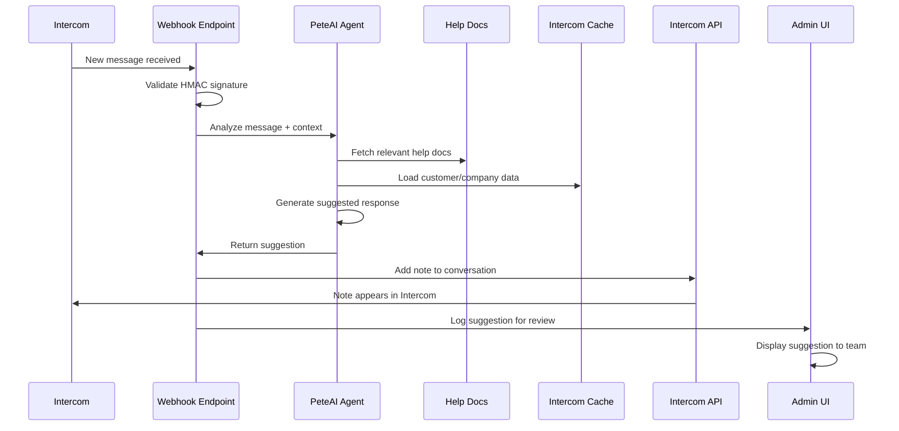

# Intercom AI Agent Integration Plan

**Date**: 2025-01-30
**Status**: Planning Phase
**Goal**: Create AI-powered team assistant that automatically generates suggested responses for incoming Intercom messages
**Branch**: `Next-refactor`

---

## Executive Summary

Transform PeteAI into a **smart team assistant** that:

- **Monitors incoming Intercom messages** via webhooks
- **Generates suggested responses** based on help documentation + conversation history
- **Adds internal notes** to conversations for team review
- **Acts like a smarter version of Intercom's Fin agent** but trained on Pete's specific data

**Key Insight**: You have 95% of the infrastructure needed - just need webhook integration and note creation!

---

## What We Already Have (The 95%)

### ✅ PeteAI Agent with 10 Powerful Tools

- **Help Documentation Access**: `fetch_help_doc`, `recommend_help_doc`
- **Intercom Data Access**: `search_contacts`, `search_companies`, `get_company_timeline`
- **Smart Analysis**: `analyze_conversations`, `extract_company_attributes`
- **Visual Generation**: `generate_process_map` (Mermaid diagrams)

### ✅ Intercom Integration Infrastructure

- **Webhook Security**: HMAC signature validation (`src/middleware/signature-validation.ts`)
- **Canvas Kit Integration**: `/api/initialize` and `/api/submit` endpoints
- **Intercom API Proxy**: Direct access to Intercom data (`src/services/intercom.ts`)
- **Real-time Data**: Live contact/company information (410 contacts, 94 companies, 1022 conversations)

### ✅ AI Processing Pipeline

- **LangGraph Agent**: Sophisticated tool-calling AI (`src/services/langraph-agent.ts`)
- **OpenRouter Integration**: GPT-4o-mini with tool selection
- **Context Awareness**: Access to help docs + Intercom data

### ✅ Note Creation Capability

- **Intercom Contact Updates**: `updateUserTrainingTopic()` function exists
- **Custom Attributes**: Can update contact/company custom attributes
- **API Integration**: Direct Intercom API calls working

---

## What We Need to Add (The 5%)

### ❌ Intercom Webhook for New Messages

**Missing**: Webhook endpoint to receive new message notifications from Intercom

### ❌ Conversation Note Creation

**Missing**: Function to add internal notes to conversations (not just contacts)

### ❌ Message Analysis & Response Generation

**Missing**: Enhanced PeteAI prompt for team assistance

---

## System Architecture

```mermaid
graph TB
    subgraph "Intercom Platform"
        A[New Message Received]
        B[Intercom Webhook]
    end

    subgraph "Pete Intercom App"
        C[/api/intercom/webhook<br/>NEW ENDPOINT]
        D[HMAC Signature Validation<br/>EXISTING]
        E[Message Analysis Pipeline<br/>NEW]
        F[PeteAI Agent<br/>EXISTING - Enhanced]
        G[Note Creation Service<br/>NEW]
    end

    subgraph "Data Sources"
        H[Help Documentation<br/>EXISTING]
        I[Intercom Cache<br/>EXISTING]
        J[Conversation History<br/>EXISTING]
    end

    subgraph "Intercom API"
        K[Add Internal Note<br/>NEW FUNCTION]
        L[Update Conversation<br/>EXISTING]
    end

    A -->|Webhook| B
    B -->|POST with signature| C
    C --> D
    D -->|Valid| E
    E --> F
    F --> H
    F --> I
    F --> J
    F -->|Suggested Response| G
    G --> K
    K -->|Note Added| L

    style C fill:#ff9999
    style E fill:#ff9999
    style G fill:#ff9999
    style K fill:#ff9999
```

---

## App Architecture Diagram

```mermaid
graph LR
    subgraph "Frontend - Next.js 15"
        A[Admin Dashboard<br/>EXISTING]
        B[Conversation View<br/>EXISTING]
        C[AI Response Preview<br/>NEW COMPONENT]
    end

    subgraph "API Layer - Next.js Routes"
        D[/api/intercom/webhook<br/>NEW]
        E[/api/PeteAI<br/>EXISTING]
        F[/api/initialize<br/>EXISTING]
        G[/api/submit<br/>EXISTING]
    end

    subgraph "Server Actions - TypeScript"
        H[generateTeamResponse<br/>NEW]
        I[sendMessageToPeteAIJson<br/>EXISTING]
        J[addConversationNote<br/>NEW]
    end

    subgraph "AI Agents - LangGraph"
        K[PeteAI Help Agent<br/>EXISTING - Enhanced]
        L[Team Assistant Agent<br/>NEW]
    end

    subgraph "Data Layer"
        M[Intercom Cache<br/>EXISTING]
        N[Help Documentation<br/>EXISTING]
        O[Conversation History<br/>EXISTING]
    end

    subgraph "External Services"
        P[Intercom Webhooks<br/>NEW]
        Q[OpenRouter API<br/>EXISTING]
        R[Intercom API<br/>EXISTING]
    end

    A -->|View Conversations| B
    B -->|See AI Suggestions| C
    P -->|New Message| D
    D --> H
    H --> K
    K --> M
    K --> N
    K --> O
    H --> J
    J --> R
    E --> I
    I --> K

    style D fill:#ff9999
    style H fill:#ff9999
    style J fill:#ff9999
    style L fill:#ff9999
```

---

## Implementation Plan (6 Stages)

### Stage 1: Intercom Webhook Setup (2-3 hours)

**Goal**: Create webhook endpoint to receive new message notifications

**Tasks**:

- [ ] Create `/api/intercom/webhook/route.ts` endpoint
- [ ] Implement HMAC signature validation (reuse existing)
- [ ] Parse webhook payload to extract conversation ID and message content
- [ ] Add webhook configuration to Intercom app settings
- [ ] Test webhook with sample messages

**Files to Create**:

- `src/app/api/intercom/webhook/route.ts`
- `src/types/webhook.ts` (webhook payload types)

**Files to Modify**:

- `src/middleware/signature-validation.ts` (reuse existing validation)

**Success Criteria**:

- Webhook receives and validates Intercom messages
- Can extract conversation ID and message content
- Proper error handling and logging

---

### Stage 2: Conversation Note Creation (2-3 hours)

**Goal**: Add function to create internal notes on conversations

**Tasks**:

- [ ] Research Intercom API for conversation notes
- [ ] Create `addConversationNote()` function in `src/services/intercom.ts`
- [ ] Add note creation to existing Intercom service
- [ ] Test note creation with sample conversation
- [ ] Add error handling and retry logic

**Files to Modify**:

- `src/services/intercom.ts` (add note creation function)
- `src/types/index.ts` (add note types)

**API Research Needed**:

- Intercom conversation notes API endpoint
- Note creation payload format
- Authentication requirements

**Success Criteria**:

- Can add internal notes to any conversation
- Notes appear in Intercom interface
- Proper error handling for API failures

---

### Stage 3: Enhanced PeteAI for Team Assistance (3-4 hours)

**Goal**: Create team-focused AI agent that generates suggested responses

**Tasks**:

- [ ] Create `generateTeamResponse()` server action
- [ ] Enhance PeteAI system prompt for team assistance
- [ ] Add conversation context loading
- [ ] Implement response formatting for team use
- [ ] Add confidence scoring for suggestions

**Files to Create**:

- `src/actions/team-assistant.ts`
- `src/services/team-agent.ts`

**Files to Modify**:

- `src/services/langraph-agent.ts` (add team tools)
- `src/actions/peteai.ts` (add team response function)

**New System Prompt**:

```typescript
const TEAM_ASSISTANT_PROMPT = `
You are PeteAI, helping the support team respond to customer messages.

CONTEXT:
- Customer's question/issue: {message}
- Customer's company history: {companyData}
- Previous conversations: {conversationHistory}
- Available help documentation: {helpDocs}

GENERATE:
- Suggested response for the team to review
- Confidence score (1-10)
- Reasoning for the suggestion
- Relevant help documentation links
- Any follow-up questions to ask

FORMAT:
{
  "suggestedResponse": "Hi! To upload your data...",
  "confidence": 8,
  "reasoning": "Customer asked about data upload, found 3 relevant help docs",
  "helpLinks": ["https://help.thepete.io/upload", "..."],
  "followUpQuestions": ["What type of data are you uploading?"]
}
`;
```

**Success Criteria**:

- Generates relevant, helpful suggestions
- Includes confidence scoring
- References specific help documentation
- Provides reasoning for suggestions

---

### Stage 4: Message Analysis Pipeline (2-3 hours)

**Goal**: Create pipeline to analyze incoming messages and generate responses

**Tasks**:

- [ ] Create message analysis server action
- [ ] Load conversation context and history
- [ ] Extract customer company information
- [ ] Generate AI response using enhanced PeteAI
- [ ] Format response for team consumption
- [ ] Add logging and monitoring

**Files to Create**:

- `src/actions/message-analysis.ts`
- `src/services/message-processor.ts`

**Files to Modify**:

- `src/app/api/intercom/webhook/route.ts` (integrate analysis)

**Pipeline Flow**:

```typescript
async function analyzeIncomingMessage(webhookData: IntercomWebhook) {
  // 1. Extract conversation and message data
  const { conversationId, message, customerId } = webhookData;

  // 2. Load customer context
  const customer = await getCustomerById(customerId);
  const company = await getCompanyById(customer.companyId);

  // 3. Load conversation history
  const history = await getConversationHistory(conversationId);

  // 4. Generate AI response
  const suggestion = await generateTeamResponse({
    message,
    customer,
    company,
    history,
  });

  // 5. Add note to conversation
  await addConversationNote(conversationId, suggestion);

  return suggestion;
}
```

**Success Criteria**:

- Analyzes messages within 5 seconds
- Generates relevant suggestions
- Adds notes to conversations
- Handles errors gracefully

---

### Stage 5: Admin UI for AI Suggestions (3-4 hours)

**Goal**: Create UI for team to view and manage AI suggestions

**Tasks**:

- [ ] Create AI suggestions dashboard page
- [ ] Add suggestion preview component
- [ ] Create conversation view with AI notes
- [ ] Add suggestion approval/rejection workflow
- [ ] Implement suggestion analytics

**Files to Create**:

- `src/app/admin/ai-suggestions/page.tsx`
- `src/components/ai-suggestions/AISuggestionCard.tsx`
- `src/components/ai-suggestions/ConversationWithAI.tsx`

**Files to Modify**:

- `src/app/admin/page.tsx` (add AI suggestions link)
- `src/app/admin/conversations/page.tsx` (show AI notes)

**UI Features**:

- Dashboard showing recent AI suggestions
- Conversation view with AI notes highlighted
- Confidence scores and reasoning display
- Quick approve/reject buttons
- Analytics on suggestion accuracy

**Success Criteria**:

- Team can view all AI suggestions
- Easy to approve/reject suggestions
- Clear confidence indicators
- Analytics on suggestion performance

---

### Stage 6: Testing & Optimization (2-3 hours)

**Goal**: Test the complete system and optimize performance

**Tasks**:

- [ ] Test webhook with real Intercom messages
- [ ] Verify AI response quality
- [ ] Test note creation and display
- [ ] Optimize response generation speed
- [ ] Add monitoring and alerting
- [ ] Create user documentation

**Files to Create**:

- `src/tests/ai-agent-integration.test.ts`
- `DEV_MAN/ai-agent-usage-guide.md`

**Files to Modify**:

- `src/services/logger.ts` (add AI agent logging)
- `src/app/admin/page.tsx` (add monitoring dashboard)

**Testing Checklist**:

- [ ] Webhook receives messages correctly
- [ ] AI generates relevant suggestions
- [ ] Notes appear in Intercom
- [ ] UI displays suggestions properly
- [ ] Error handling works
- [ ] Performance meets requirements (<5s response time)

**Success Criteria**:

- Complete end-to-end flow working
- AI suggestions are helpful and accurate
- Team can easily use the system
- Performance meets requirements
- Documentation is complete

---

## Data Flow Sequence



---

## Technical Implementation Details

### Webhook Payload Structure

```typescript
interface IntercomWebhook {
  type: 'conversation.user.created' | 'conversation.user.replied';
  created_at: number;
  data: {
    item: {
      type: 'conversation';
      id: string;
      state: 'open' | 'closed' | 'snoozed';
      source: {
        type: 'conversation_part';
        body: string;
        author: {
          type: 'contact';
          id: string;
        };
      };
      contacts: {
        contacts: Array<{
          type: 'contact';
          id: string;
          external_id?: string;
        }>;
      };
    };
  };
}
```

### AI Response Format

```typescript
interface AISuggestion {
  conversationId: string;
  messageId: string;
  suggestedResponse: string;
  confidence: number; // 1-10
  reasoning: string;
  helpLinks: string[];
  followUpQuestions: string[];
  generatedAt: Date;
  status: 'pending' | 'approved' | 'rejected';
}
```

### Note Creation Payload

```typescript
interface ConversationNote {
  type: 'conversation_part';
  part_type: 'note';
  body: string;
  author: {
    type: 'admin';
    id: string; // PeteAI admin ID
  };
}
```

---

## Environment Variables Needed

```bash
# Existing (already configured)
INTERCOM_ACCESS_TOKEN=dG9r...
INTERCOM_CLIENT_ID=...
INTERCOM_CLIENT_SECRET=...
OPENROUTER_API_KEY=sk-or-v1-...

# New (need to add)
INTERCOM_WEBHOOK_SECRET=webhook_secret_from_intercom
PETEAI_ADMIN_ID=admin_id_for_notes
```

---

## Success Metrics

### Technical Metrics

- **Response Time**: < 5 seconds from message to note creation
- **Accuracy**: > 80% of suggestions are helpful (team feedback)
- **Uptime**: > 99% webhook availability
- **Error Rate**: < 5% failed note creations

### Business Metrics

- **Adoption**: > 70% of team members use AI suggestions
- **Efficiency**: 30% faster response times
- **Quality**: Higher customer satisfaction scores
- **Knowledge**: Better utilization of help documentation

---

## Risk Assessment & Mitigation

### Risk: AI generates inappropriate responses

**Mitigation**:

- Confidence scoring (only show high-confidence suggestions)
- Team review before sending
- Fallback to human response if confidence < 7

### Risk: Webhook reliability issues

**Mitigation**:

- Retry logic with exponential backoff
- Dead letter queue for failed messages
- Monitoring and alerting

### Risk: Performance impact on existing system

**Mitigation**:

- Async processing for AI generation
- Rate limiting on webhook processing
- Caching for frequently accessed data

---

## Dependencies

### External

- Intercom webhook configuration
- Intercom API access for note creation
- OpenRouter API (already configured)

### Internal

- ✅ PeteAI LangGraph agent
- ✅ Intercom cache system
- ✅ Help documentation access
- ✅ HMAC signature validation
- ✅ Admin UI framework

### Libraries to Add

- `@types/node` (for webhook types)
- `date-fns` (for timestamp handling)

---

## File Structure

```
src/
├── app/api/intercom/webhook/
│   └── route.ts                    # NEW: Webhook endpoint
├── actions/
│   ├── team-assistant.ts          # NEW: Team response generation
│   └── message-analysis.ts        # NEW: Message analysis pipeline
├── services/
│   ├── team-agent.ts              # NEW: Enhanced AI agent
│   └── intercom.ts                # MODIFY: Add note creation
├── components/ai-suggestions/
│   ├── AISuggestionCard.tsx       # NEW: Suggestion display
│   └── ConversationWithAI.tsx     # NEW: Conversation view
├── app/admin/
│   ├── ai-suggestions/
│   │   └── page.tsx               # NEW: AI dashboard
│   └── conversations/
│       └── page.tsx               # MODIFY: Show AI notes
└── types/
    └── webhook.ts                 # NEW: Webhook types
```

---

## GitHub Issues to Create

### Issue #1: Intercom Webhook Setup

**Title**: "Stage 1: Create Intercom webhook endpoint for new messages"
**Labels**: `feature`, `stage-1`, `webhook`
**Body**: "Implement webhook endpoint to receive new message notifications from Intercom. Includes HMAC validation and payload parsing."

### Issue #2: Conversation Note Creation

**Title**: "Stage 2: Add function to create internal notes on conversations"
**Labels**: `feature`, `stage-2`, `intercom-api`
**Body**: "Research and implement Intercom API integration for adding internal notes to conversations."

### Issue #3: Enhanced PeteAI for Team Assistance

**Title**: "Stage 3: Create team-focused AI agent for response suggestions"
**Labels**: `feature`, `stage-3`, `ai-agent`
**Body**: "Enhance PeteAI with team assistance capabilities, including confidence scoring and response formatting."

### Issue #4: Message Analysis Pipeline

**Title**: "Stage 4: Build message analysis pipeline with context loading"
**Labels**: `feature`, `stage-4`, `pipeline`
**Body**: "Create complete pipeline to analyze incoming messages and generate AI suggestions."

### Issue #5: Admin UI for AI Suggestions

**Title**: "Stage 5: Build admin UI for viewing and managing AI suggestions"
**Labels**: `feature`, `stage-5`, `ui`
**Body**: "Create dashboard and conversation views for team to review and manage AI suggestions."

### Issue #6: Testing & Optimization

**Title**: "Stage 6: Test complete system and optimize performance"
**Labels**: `feature`, `stage-6`, `testing`
**Body**: "End-to-end testing, performance optimization, and documentation for AI agent integration."

---

## Next Steps (Immediate Actions)

1. **Research Intercom conversation notes API** - Verify note creation capabilities
2. **Create webhook endpoint** - Start with Stage 1 implementation
3. **Test with sample messages** - Verify webhook receives data correctly
4. **Enhance PeteAI system prompt** - Add team assistance context
5. **Create GitHub issues** - Break down into trackable tasks

---

## Questions for Clarification

1. **Intercom App Configuration**: Do we have access to configure webhooks in the Intercom app settings?
2. **Admin ID for Notes**: What Intercom admin ID should be used for AI-generated notes?
3. **Response Approval**: Should AI suggestions require team approval before being sent to customers?
4. **Confidence Threshold**: What confidence score should trigger automatic note creation vs manual review?
5. **Testing Environment**: Can we test with a staging Intercom workspace first?

---

**The Bottom Line**: You have 95% of the infrastructure needed. This is primarily a webhook integration + note creation project. The AI agent already exists and works well - we just need to connect it to Intercom's message flow and add the ability to create internal notes.

**Total Implementation Time**: 12-16 hours (2-3 days)
**Complexity**: Medium (mostly integration work, not new AI development)
**Risk**: Low (building on existing, proven components)

---

_This plan follows the same structure as your other DEV_MAN plans with comprehensive architecture diagrams, detailed implementation stages, and clear success criteria._
