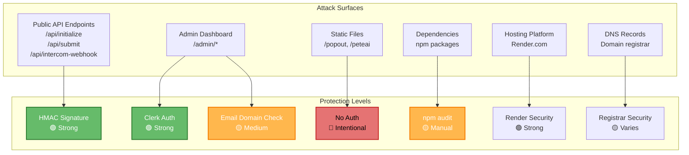
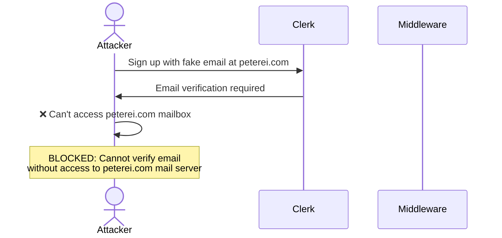
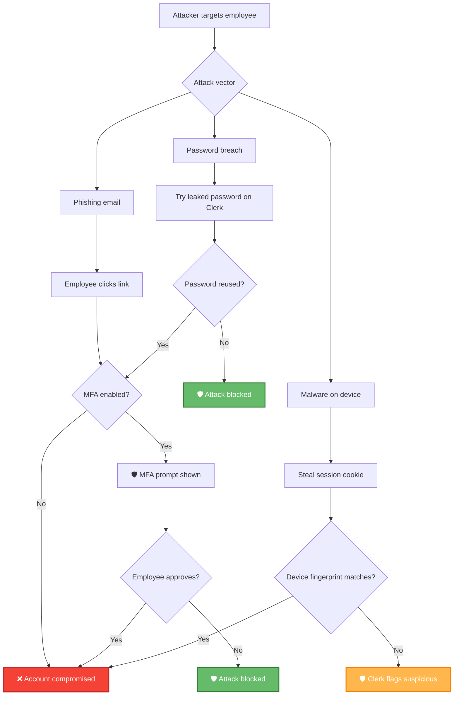
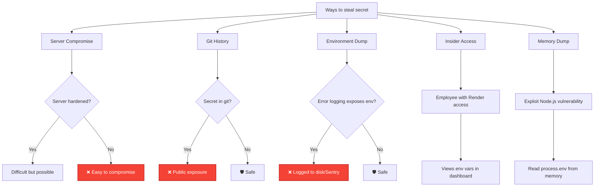
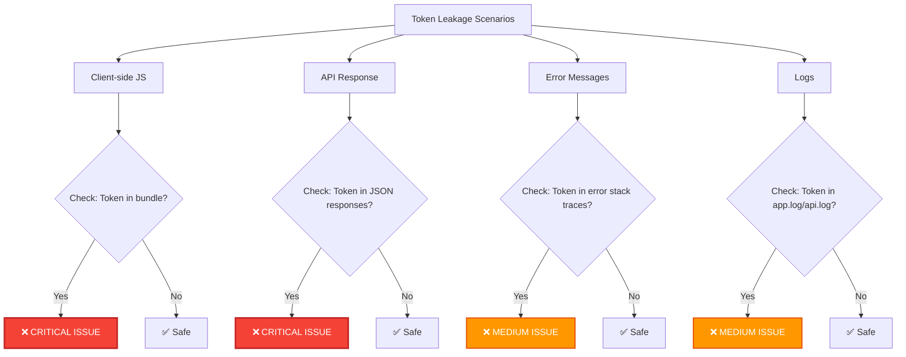
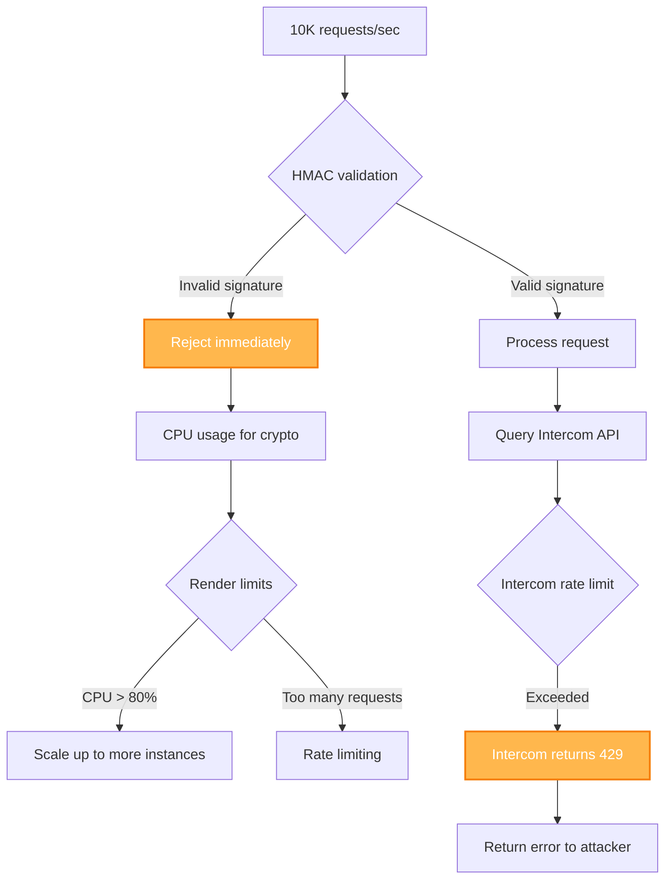
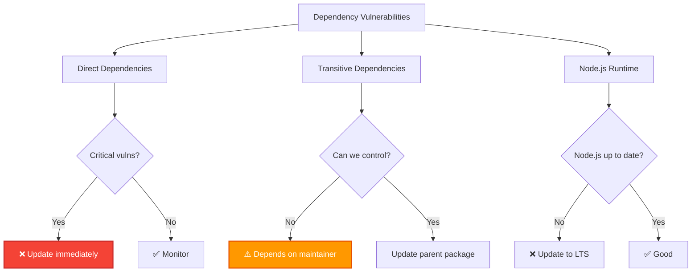
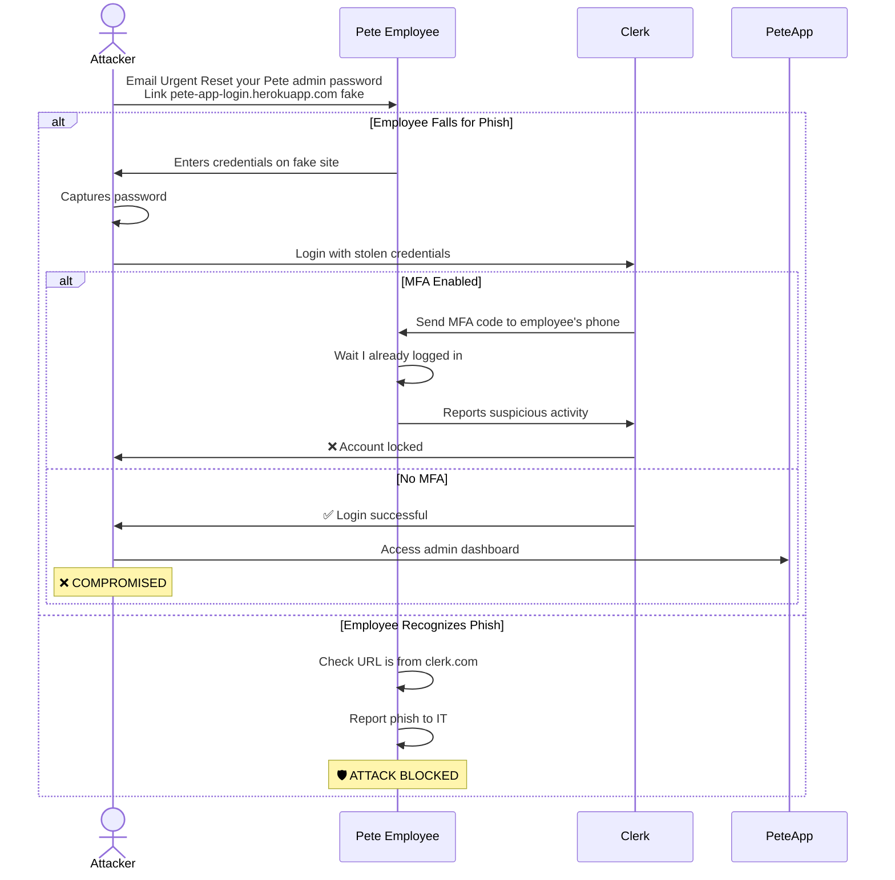
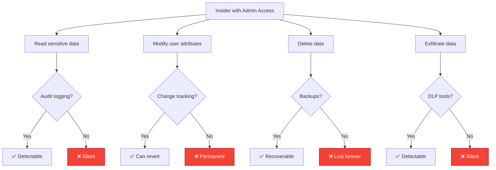
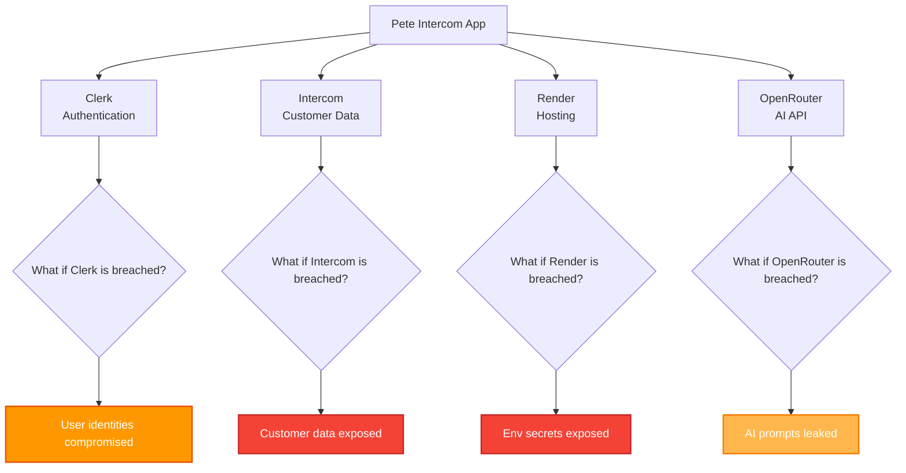

# Devil's Advocate - Security Vulnerability Analysis

**Document Version:** 1.0
**Last Updated:** 2025-10-08
**Purpose:** Challenge our security assumptions and identify potential weaknesses

---

## Executive Summary

This document plays "devil's advocate" to identify potential security vulnerabilities in the Pete Intercom Application. While our security posture is strong, **no system is 100% secure**. This analysis helps us:

1. **Identify blind spots** - What are we not seeing?
2. **Prioritize hardening** - What should we fix first?
3. **Plan incident response** - What if something goes wrong?
4. **Educate stakeholders** - What are the real risks?

**Overall Risk Assessment:** 🟢 **LOW RISK** (production-ready with minor hardening recommendations)

---

## Table of Contents

1. [Attack Surface Analysis](#attack-surface-analysis)
2. [Threat Scenarios (Red Team Perspective)](#threat-scenarios-red-team-perspective)
3. [Dependency Vulnerabilities](#dependency-vulnerabilities)
4. [Configuration Weaknesses](#configuration-weaknesses)
5. [Social Engineering Risks](#social-engineering-risks)
6. [Insider Threats](#insider-threats)
7. [Third-Party Risk](#third-party-risk)
8. [Residual Risks](#residual-risks)

---

## Attack Surface Analysis

### What Can An Attacker Access?



---

## Threat Scenarios (Red Team Perspective)

### Scenario 1: "I want admin access but don't have @peterei.com email"

**Attack Goal:** Bypass email domain restriction

#### Attempt 1.1: Create fake @peterei.com email



**Why this fails:**
- Clerk requires email verification
- Attacker can't receive verification email
- Even if they bypass Clerk UI, middleware re-checks email

**Risk:** 🟢 **Very Low**

---

#### Attempt 1.2: Compromise existing @peterei.com account



**Vulnerability:** ⚠️ **MFA not enforced**

**Current Status:**
- Clerk MFA is available but NOT required
- If employee has weak password + no MFA = vulnerable

**Mitigation:**
```typescript
// Recommended: Enforce MFA in Clerk dashboard
{
  "restrictions": {
    "allowlist": {
      "enabled": true
    }
  },
  "multi_factor": {
    "required": true  // ⚠️ Currently false, should be true
  }
}
```

**Risk:** 🟡 **Medium** (without MFA enforcement)
**Risk with MFA:** 🟢 **Low**

**Recommendation:** ✅ **Enforce MFA for all @peterei.com users ASAP**

---

#### Attempt 1.3: Exploit email validation logic

**What if attacker finds a bypass?**

```typescript
// Current check (middleware.ts:28)
if (!userEmail || !userEmail.endsWith('@peterei.com')) {
  return 403;
}
```

**Potential bypasses to test:**

| Attack Input | Expected Behavior | Actual Behavior |
|--------------|-------------------|-----------------|
| `attacker@peterei.com.evil.com` | ❌ Blocked | ✅ Blocked (.endsWith is safe) |
| `attacker@peterei.com@evil.com` | ❌ Blocked | ✅ Blocked (Clerk validates email format) |
| `attacker+admin@peterei.com` | ✅ Allowed (subdomain) | ✅ Allowed (intentional) |
| `attacker@PETEREI.COM` | ✅ Allowed (case insensitive) | ⚠️ **CHECK THIS** |
| `attacker@peterei.com\n@evil.com` | ❌ Blocked | ✅ Blocked (Clerk rejects) |

**Potential Vulnerability:** Case sensitivity

```typescript
// More robust check
const domain = userEmail.toLowerCase().split('@')[1];
if (domain !== 'peterei.com') {
  return 403;
}
```

**Risk:** 🟢 **Very Low** (Clerk likely normalizes email)

**Recommendation:** ✅ Add explicit case-insensitive check + unit tests

---

### Scenario 2: "I want to forge Intercom webhook/Canvas Kit requests"

**Attack Goal:** Send fake data to manipulate app behavior

#### Attempt 2.1: Send request without signature

```bash
curl -X POST https://pete-app.com/api/initialize \
  -H "Content-Type: application/json" \
  -d '{"context": {"user": {"id": "victim_user_id"}}}'
```

**What happens:**
```typescript
// src/app/api/initialize/route.ts:14-22
const signature = request.headers.get('X-Body-Signature');

if (!validateIntercomSignature(body, signature, getClientSecret())) {
  return NextResponse.json({ error: 'Invalid signature' }, { status: 401 });
}
```

**Result:** ❌ 401 Unauthorized

**Risk:** 🟢 **Very Low** (signature validation works)

---

#### Attempt 2.2: Brute force HMAC signature

**Attack approach:**
1. Capture a valid signed request from Intercom
2. Modify the payload
3. Try to find valid signature by brute force

**Math:**
- **HMAC-SHA256 output:** 256 bits (2^256 possible values)
- **Attempts per second:** 1 billion (optimistic)
- **Time to brute force:** 2^256 / 10^9 / 60 / 60 / 24 / 365 = **10^58 years**

**Result:** ❌ Computationally infeasible

**Risk:** 🟢 **Very Low** (HMAC is cryptographically secure)

---

#### Attempt 2.3: Steal INTERCOM_CLIENT_SECRET

**How could attacker get the secret?**



**Current Status:**

✅ **Good:**
- Secret not in Git (`.env` is gitignored)
- No error logging of environment variables
- Render dashboard requires authentication

🟡 **Concerns:**
- How many people have Render dashboard access?
- Are Render accounts protected with MFA?
- Is secret rotation planned?

**Vulnerability:** If server is fully compromised, attacker can read `process.env.INTERCOM_CLIENT_SECRET`

**Mitigation:**
1. ✅ Limit Render access to 2-3 people max
2. ✅ Enable MFA on all Render accounts
3. ✅ Use Render's secrets encryption (they do this by default)
4. 🟡 **Recommended:** Rotate secret quarterly
5. 🟡 **Advanced:** Use AWS Secrets Manager / Vault for secret storage

**Risk:** 🟡 **Low** (requires server compromise)

**If Secret Compromised:**
- Attacker can forge ANY Canvas Kit/webhook request
- Can manipulate user data via fake Intercom requests
- Can trigger arbitrary app behavior

**Detection:**
- Monitor for suspicious Canvas Kit requests (unusual patterns)
- Alert on multiple failed signature validations
- Audit Intercom API calls for unauthorized changes

---

### Scenario 3: "I want to access sensitive Intercom data"

**Attack Goal:** Read conversations, contacts, company data

#### Attempt 3.1: Access admin dashboard without authentication

```bash
curl https://pete-app.com/admin
```

**What happens:**
```typescript
// middleware.ts:14-16
if (!authResult.userId) {
  return authResult.redirectToSignIn();
}
```

**Result:** Redirected to Clerk sign-in

**Risk:** 🟢 **Very Low** (Clerk middleware works)

---

#### Attempt 3.2: Use Intercom API directly

**Attacker needs `INTERCOM_ACCESS_TOKEN`**

**Where is it used?**
```typescript
// src/services/intercom.ts:8-9
const RAW_ACCESS_TOKEN = process.env.INTERCOM_ACCESS_TOKEN;
const ACCESS_TOKEN = RAW_ACCESS_TOKEN?.replace(/^"|"$/g, '');
```

**Exposure points:**
1. ❌ Never sent to client (server-side only)
2. ❌ Never logged in application logs
3. ❌ Not in Git history
4. ✅ Stored in Render environment variables (encrypted)

**How could it leak?**



**Verification Test:**

```bash
# Check client-side bundle for secrets
cd pete-intercom-nextjs
pnpm build
grep -r "INTERCOM_ACCESS_TOKEN" .next/

# Should return: no matches
```

**Risk:** 🟢 **Very Low** (token never exposed to client)

**Recommendation:** ✅ Add automated test to CI/CD to verify no secrets in bundle

---

### Scenario 4: "I want to DOS (Denial of Service) the application"

**Attack Goal:** Make the app unavailable

#### Attempt 4.1: Flood Canvas Kit endpoints

```bash
# Send 10,000 requests per second
for i in {1..10000}; do
  curl -X POST https://pete-app.com/api/initialize &
done
```

**What happens:**



**Vulnerability:** No rate limiting on Canvas Kit endpoints

**Why we might be okay:**
1. ✅ All requests must have valid HMAC signature
2. ✅ Attacker would need to compromise `INTERCOM_CLIENT_SECRET`
3. ✅ Render auto-scales on high load
4. ✅ Intercom has rate limits (100 req/10sec default)

**Why we might NOT be okay:**
1. ❌ HMAC validation uses CPU (bcrypt-like cost)
2. ❌ No explicit rate limiting on our end
3. ❌ Render auto-scaling costs money

**Mitigation:**

```typescript
// Recommended: Add rate limiting middleware
import rateLimit from 'express-rate-limit';

const canvasKitLimiter = rateLimit({
  windowMs: 60 * 1000, // 1 minute
  max: 100, // 100 requests per minute per IP
  message: 'Too many requests, please try again later',
  standardHeaders: true,
  legacyHeaders: false,
});

export default canvasKitLimiter;
```

**Risk:** 🟡 **Medium** (could cause cost spike or slowdown)

**Recommendation:** ✅ Add rate limiting to Canvas Kit endpoints (100 req/min per IP)

---

#### Attempt 4.2: Exhaust Intercom API rate limits

**Attack approach:**
1. Compromise admin account
2. Trigger bulk data exports or searches
3. Hit Intercom's rate limits
4. Block legitimate admin usage

**Intercom Rate Limits:**
- **Standard:** 100 requests per 10 seconds
- **Bulk operations:** Lower limits

**Current Protection:**
- ❌ No rate limiting on admin actions
- ❌ No alerting when approaching limits

**Mitigation:**

```typescript
// Recommended: Track API usage
const apiUsage = {
  count: 0,
  resetAt: Date.now() + 10000, // 10 seconds
};

function checkRateLimit() {
  if (Date.now() > apiUsage.resetAt) {
    apiUsage.count = 0;
    apiUsage.resetAt = Date.now() + 10000;
  }

  if (apiUsage.count >= 80) {
    // Warn at 80% of limit
    logWarn('Approaching Intercom API rate limit');
  }

  if (apiUsage.count >= 100) {
    throw new Error('Rate limit exceeded, try again in 10 seconds');
  }

  apiUsage.count++;
}
```

**Risk:** 🟡 **Medium** (insider or compromised admin could DOS)

**Recommendation:** ✅ Add API rate limit tracking + alerting

---

## Dependency Vulnerabilities

### Current Dependency Status

```bash
pnpm audit
# Check for known vulnerabilities
```

**Key Dependencies:**
- `@clerk/nextjs@6.33.1` - Authentication
- `next@15.5.4` - Framework
- `crypto` (Node.js built-in) - HMAC validation

**Vulnerability Sources:**



**Current Gaps:**
- ❌ No automated dependency updates
- ❌ No Dependabot configured
- ❌ No security scanning in CI/CD

**Mitigation:**

```yaml
# .github/dependabot.yml (recommended)
version: 2
updates:
  - package-ecosystem: "npm"
    directory: "/pete-intercom-nextjs"
    schedule:
      interval: "weekly"
    open-pull-requests-limit: 10
    reviewers:
      - "markcarpenter"
    labels:
      - "dependencies"
      - "security"
```

**Risk:** 🟡 **Medium** (known vulnerabilities may exist)

**Recommendation:** ✅ Enable Dependabot + Snyk for automated scanning

---

## Configuration Weaknesses

### 1. TypeScript Build Errors Ignored

**File:** `next.config.ts:10`

```typescript
typescript: {
  ignoreBuildErrors: true,  // ⚠️ SECURITY CONCERN
},
```

**Why this is risky:**
- Type errors might hide security bugs
- Unchecked array access could cause crashes
- Missing null checks could expose data

**Example vulnerability:**

```typescript
// This compiles with ignoreBuildErrors: true
const user = await getUser(userId); // Might return undefined
const email = user.email; // ❌ TypeError: Cannot read property 'email' of undefined

// Exposed in error message:
// "Error processing user_12345: Cannot read property 'email' of undefined"
// ⚠️ Leaks that userId=12345 exists
```

**Risk:** 🟡 **Medium** (potential for bugs that leak info)

**Recommendation:** ✅ Fix all TypeScript errors and set `ignoreBuildErrors: false`

---

### 2. ESLint Disabled During Build

**File:** `next.config.ts:5`

```typescript
eslint: {
  ignoreDuringBuilds: true,  // ⚠️ CODE QUALITY CONCERN
},
```

**Why this matters:**
- ESLint catches common security issues
- `eslint-plugin-security` can detect:
  - Unsafe regex (ReDoS)
  - Eval usage
  - Insecure random number generation
  - SQL injection patterns

**Risk:** 🟢 **Low** (code quality issue, not direct vulnerability)

**Recommendation:** ✅ Enable ESLint in builds after fixing existing issues

---

### 3. No Content Security Policy (CSP)

**What is CSP?**
HTTP header that prevents XSS attacks by restricting resource loading.

**Example attack without CSP:**

```html
<!-- Attacker injects this somehow -->
<script src="https://evil.com/steal-cookies.js"></script>
```

**With CSP:**
```http
Content-Security-Policy:
  default-src 'self';
  script-src 'self' 'nonce-{random}';
  style-src 'self' 'nonce-{random}';
  img-src 'self' https:;
  connect-src 'self' https://api.intercom.io https://api.clerk.dev;
```

**Current Status:** ❌ No CSP headers configured

**Risk:** 🟡 **Medium** (if XSS vulnerability exists, CSP would be last line of defense)

**Mitigation:**

```typescript
// next.config.ts
const nextConfig = {
  async headers() {
    return [
      {
        source: '/:path*',
        headers: [
          {
            key: 'Content-Security-Policy',
            value: [
              "default-src 'self'",
              "script-src 'self' 'unsafe-inline' 'unsafe-eval'", // Next.js requires these
              "style-src 'self' 'unsafe-inline'",
              "img-src 'self' data: https:",
              "connect-src 'self' https://api.intercom.io https://api.clerk.dev",
              "frame-ancestors 'none'",
            ].join('; '),
          },
        ],
      },
    ];
  },
};
```

**Recommendation:** ✅ Implement CSP headers in production

---

## Social Engineering Risks

### Attack: Phishing Pete Team Members

**Scenario:**



**Mitigation:**
1. ✅ **Enforce MFA** - Even if password stolen, attacker blocked
2. ✅ **Security training** - Teach employees to check URLs
3. ✅ **Email filtering** - SPF/DKIM/DMARC on peterei.com domain
4. ✅ **Incident reporting** - Easy way to report suspicious emails

**Risk:** 🟡 **Medium** (without MFA)
**Risk with MFA:** 🟢 **Low**

---

## Insider Threats

### Scenario: Disgruntled Employee

**What could a Pete employee with admin access do?**



**Current Protections:**
- ✅ All admin actions go through Clerk (auditable)
- ✅ All Intercom API calls are logged
- 🟡 No user action audit log in our app
- ❌ No alerting on bulk data exports
- ❌ No data loss prevention (DLP) tools

**High-Risk Actions:**
1. **Bulk export all conversations** - Steal customer data
2. **Modify user attributes** - Sabotage data integrity
3. **Share admin credentials** - Give access to external attacker
4. **Copy `INTERCOM_ACCESS_TOKEN`** - Bypass app entirely

**Mitigation:**

```typescript
// Recommended: Audit logging for admin actions
import { logAdminAction } from '@/services/audit-log';

export async function updateUserAttribute(userId: string, attribute: string, value: string) {
  const clerkUser = await auth();

  // Log BEFORE action
  await logAdminAction({
    actor: clerkUser.userId,
    action: 'update_user_attribute',
    target: userId,
    details: { attribute, oldValue: '...', newValue: value },
    timestamp: new Date(),
  });

  // Perform action
  const result = await intercomAPI.updateContact(userId, { [attribute]: value });

  // Log result
  await logAdminAction({
    actor: clerkUser.userId,
    action: 'update_user_attribute',
    target: userId,
    result: result.success ? 'success' : 'failed',
    timestamp: new Date(),
  });

  return result;
}
```

**Risk:** 🟡 **Medium** (requires trusted employee to go rogue)

**Recommendation:**
1. ✅ Implement comprehensive audit logging
2. ✅ Alert on bulk operations (>100 records)
3. ✅ Require dual approval for sensitive changes
4. ✅ Review admin access quarterly
5. ✅ Offboarding checklist (revoke access immediately)

---

## Third-Party Risk

### Dependencies on External Services



**Risk Assessment:**

| Service | Breach Impact | Likelihood | Mitigation |
|---------|---------------|------------|------------|
| **Clerk** | 🟡 Medium - User emails + login metadata exposed | 🟢 Low - SOC 2 certified | Monitor Clerk status page, have backup auth plan |
| **Intercom** | 🔴 High - All customer conversations exposed | 🟢 Low - Enterprise security | Out of our control, trust their security |
| **Render** | 🔴 Critical - All secrets exposed | 🟢 Low - Good security track record | Use secrets manager, rotate secrets quarterly |
| **OpenRouter** | 🟡 Medium - AI prompts/responses exposed | 🟡 Medium - Smaller company | Don't send sensitive data to AI, sanitize inputs |

**What can we control?**

```typescript
// Recommended: Sanitize data sent to OpenRouter
function sanitizeForAI(userInput: string): string {
  return userInput
    .replace(/\b\d{3}-\d{2}-\d{4}\b/g, '[SSN]')     // SSN
    .replace(/\b\d{16}\b/g, '[CARD]')               // Credit card
    .replace(/\b[A-Z0-9._%+-]+@[A-Z0-9.-]+\.[A-Z]{2,}\b/gi, '[EMAIL]'); // Email
}
```

**Risk:** 🟡 **Medium** (third-party breaches out of our control)

**Recommendation:**
1. ✅ Monitor security status pages of all vendors
2. ✅ Have incident response plan if vendor is breached
3. ✅ Sanitize data sent to external APIs
4. ✅ Regular vendor security reviews

---

## Residual Risks

### Risks We Accept (With Mitigation Plans)

#### 1. Clerk Service Outage

**Scenario:** Clerk goes down, no one can log into admin dashboard

**Probability:** 🟢 Low (99.9% uptime SLA)

**Impact:** 🟡 Medium (admin functions unavailable, but Canvas Kit still works)

**Mitigation:**
- Have Clerk status page bookmarked
- Communicate outage to team immediately
- Wait for Clerk to restore service (typically < 1 hour)

**Acceptance:** ✅ Risk accepted (cost of building backup auth > cost of rare outages)

---

#### 2. Intercom API Rate Limit Exceeded

**Scenario:** Too many requests to Intercom API, get rate limited

**Probability:** 🟡 Medium (if admin does bulk operation)

**Impact:** 🟡 Medium (temporary admin slowdown, data not lost)

**Mitigation:**
- Implement request queuing
- Add rate limit warnings in UI
- Cache data aggressively

**Acceptance:** ✅ Risk accepted (can be fixed if becomes problem)

---

#### 3. Compromised @peterei.com Account (No MFA)

**Scenario:** Employee account compromised, attacker gets admin access

**Probability:** 🟡 Medium (phishing, password reuse)

**Impact:** 🔴 High (full admin access, data exfiltration)

**Mitigation:**
- ⚠️ **ENFORCE MFA** (eliminates 99% of risk)
- Implement session monitoring
- Alert on unusual activity
- Require re-auth for sensitive actions

**Acceptance:** ❌ Risk NOT accepted - **MFA must be enforced**

---

#### 4. Server-Side Code Vulnerability (RCE)

**Scenario:** Undiscovered vulnerability allows arbitrary code execution

**Probability:** 🟢 Very Low (TypeScript + Next.js are mature)

**Impact:** 🔴 Critical (full server compromise)

**Mitigation:**
- Keep dependencies up to date
- Use Dependabot for security patches
- Implement monitoring for unusual activity
- Follow security best practices

**Acceptance:** ✅ Risk accepted (perfect security impossible, mitigation in place)

---

## Priority Action Items

### 🔴 CRITICAL (Do Before Production Launch)

1. **Enforce MFA for all @peterei.com users** - Prevents 99% of account compromise
2. **Fix TypeScript build errors** - Set `ignoreBuildErrors: false`
3. **Add rate limiting to Canvas Kit endpoints** - Prevent DOS
4. **Implement audit logging for admin actions** - Detect insider threats

### 🟡 HIGH (Do Within 30 Days)

5. **Enable Dependabot** - Automated vulnerability scanning
6. **Add Content Security Policy headers** - XSS defense
7. **Implement API rate limit tracking** - Prevent Intercom limit exhaustion
8. **Add case-insensitive email check** - Close potential bypass
9. **Rotate INTERCOM_CLIENT_SECRET** - Establish rotation process

### 🟢 MEDIUM (Do Within 90 Days)

10. **Add monitoring/alerting (Sentry)** - Detect anomalies
11. **Implement bulk operation warnings** - Prevent accidental/malicious data export
12. **Security training for team** - Phishing awareness
13. **Vendor security review** - Document third-party risks
14. **Disaster recovery plan** - How to recover from breach

---

## Conclusion

**Overall Security Posture:** 🟢 **GOOD** (production-ready with hardening)

**Strengths:**
- ✅ Strong authentication (Clerk)
- ✅ HMAC signature validation
- ✅ Email domain authorization
- ✅ Secrets management
- ✅ Defense-in-depth architecture

**Weaknesses (must fix):**
- ⚠️ MFA not enforced (critical)
- ⚠️ No rate limiting (medium)
- ⚠️ No audit logging (medium)

**After implementing priority items:**
- Risk level: 🟢 **Very Low**
- Production readiness: ✅ **Approved**

---

**Next:** See [03-PRODUCTION-READINESS-CHECKLIST.md](./03-PRODUCTION-READINESS-CHECKLIST.md) for launch requirements
