```mermaid
sequenceDiagram
    actor Responder
    participant Clerk
    participant Render
    participant Logs

    Responder->>Clerk: 1. Suspend compromised user<br/>Clerk Dashboard → Users → Suspend
    Note over Clerk: User immediately logged out<br/>Cannot log back in

    Responder->>Clerk: 2. Review session logs<br/>Check login times, IPs, devices
    Clerk->>Responder: Return session history

    Responder->>Logs: 3. Review app logs<br/>Check what admin accessed
    Logs->>Responder: Return admin action history

    Responder->>Render: 4. Review Render access logs<br/>Check if env vars accessed
    Render->>Responder: Return dashboard activity

    Note over Responder: Document all findings
```

# Security Incident Response Plan

**Document Version:** 1.0
**Last Updated:** 2025-10-08
**Purpose:** Step-by-step procedures for responding to security incidents

---

## Executive Summary

This document provides **actionable procedures** for responding to security incidents affecting the Pete Intercom Application. Use this guide when:

- A security breach is discovered or suspected
- Unauthorized access is detected
- Sensitive data is exposed
- A third-party service is compromised
- A vulnerability is reported

**Golden Rule:** 🚨 **Stop, Think, Document, Act**

Don't panic. Follow the procedures below systematically.

---

## Table of Contents

1. [Incident Classification](#incident-classification)
2. [Incident Response Team](#incident-response-team)
3. [Response Procedures by Incident Type](#response-procedures-by-incident-type)
4. [Communication Templates](#communication-templates)
5. [Post-Incident Review](#post-incident-review)

---

## Incident Classification

### Severity Levels

```mermaid
graph TD
    A[Security Incident Detected] --> B{Classify Severity}

    B --> C[P0: CRITICAL<br/>Immediate action required]
    B --> D[P1: HIGH<br/>Action within 2 hours]
    B --> E[P2: MEDIUM<br/>Action within 24 hours]
    B --> F[P3: LOW<br/>Action within 7 days]

    C --> C1[• Data breach in progress<br/>• Admin accounts compromised<br/>• Secrets leaked publicly<br/>• Service fully down]

    D --> D1[• Suspicious admin activity<br/>• Failed attack attempts<br/>• Vulnerability discovered<br/>• Third-party breach]

    E --> E1[• Audit anomaly<br/>• Minor config issue<br/>• Dependency vulnerability<br/>• Phishing attempt blocked]

    F --> F1[• Security enhancement<br/>• Documentation update<br/>• Low-risk vulnerability]

    style C fill:#F44336,stroke:#C62828,stroke-width:3px,color:#fff
    style D fill:#FF9800,stroke:#E65100,stroke-width:2px,color:#fff
    style E fill:#FFB74D,stroke:#F57C00,stroke-width:2px,color:#000
    style F fill:#90CAF9,stroke:#1565C0,stroke-width:2px,color:#000
```



### Response Time SLAs

| Severity | Acknowledgment | Initial Response | Resolution Target |
|----------|----------------|------------------|-------------------|
| **P0 - Critical** | 15 minutes | 30 minutes | 4 hours |
| **P1 - High** | 1 hour | 2 hours | 24 hours |
| **P2 - Medium** | 4 hours | 24 hours | 7 days |
| **P3 - Low** | 24 hours | 7 days | 30 days |

---

## Incident Response Team

### Roles & Responsibilities

| Role | Name | Contact | Responsibilities |
|------|------|---------|------------------|
| **Incident Commander** | Mark Carpenter | mark@peterei.com | Overall incident coordination, decisions |
| **Technical Lead** | [TBD] | | Investigation, remediation, technical decisions |
| **Communications Lead** | [TBD] | | Stakeholder communication, customer notifications |
| **Legal Contact** | [TBD] | | GDPR compliance, breach notification requirements |

### Escalation Path


---

## Response Procedures by Incident Type

### Incident Type 1: Compromised Admin Account

**Scenario:** Unauthorized person has access to admin dashboard

#### Immediate Actions (P0 - Within 15 minutes)



**Step-by-Step:**

1. **Suspend user account in Clerk**
   ```
   1. Go to https://dashboard.clerk.com
   2. Navigate to Users
   3. Find compromised user
   4. Click "..." → "Suspend user"
   5. Confirm suspension
   ```
   ✅ **Result:** User immediately logged out, cannot access admin dashboard

2. **Review Clerk session logs**
   ```
   1. In Clerk dashboard, click on suspended user
   2. Go to "Sessions" tab
   3. Document:
      - Login times
      - IP addresses
      - Device fingerprints
      - Geolocation
   4. Screenshot for evidence
   ```

3. **Review application logs**
   ```bash
   # SSH into Render instance or download logs
   cd /path/to/logs
   grep "user_[compromised_id]" app.log api.log

   # Look for:
   # - What pages accessed
   # - What API calls made
   # - What data exported
   # - Any bulk operations
   ```

4. **Review Render dashboard access**
   ```
   1. Go to Render dashboard → Account → Audit Log
   2. Check if compromised account accessed:
      - Environment variables
      - Deploy logs
      - SSH access
   3. Document any suspicious activity
   ```

5. **Assess data exposure**
   ```
   Based on logs, determine:
   [ ] Did attacker view customer conversations?
   [ ] Did attacker export contact data?
   [ ] Did attacker modify user attributes?
   [ ] Did attacker access environment variables?
   [ ] Did attacker access Intercom API directly?
   ```

6. **Contain the breach**
   ```
   If environment variables accessed:
   [ ] Rotate INTERCOM_CLIENT_SECRET (see procedure below)
   [ ] Rotate INTERCOM_ACCESS_TOKEN (see procedure below)
   [ ] Rotate CLERK_SECRET_KEY (see procedure below)

   If customer data accessed:
   [ ] Notify affected customers (via Communications Lead)
   [ ] File GDPR breach notification (if EU customers affected)
   ```

7. **Reset user account**
   ```
   1. Force password reset for compromised user
   2. Enable MFA (if not already enabled)
   3. Review and revoke all active sessions
   4. Unsuspend account only after user confirms device is secure
   ```

#### Communication

**Internal (immediate):**
```
Subject: SECURITY INCIDENT - Admin Account Compromised

Team,

We have detected unauthorized access to admin account [email].

Status: CONTAINED
- Account suspended
- Active sessions revoked
- Investigation in progress

Actions:
- [Technical Lead] is investigating extent of access
- [Incident Commander] is coordinating response
- DO NOT discuss externally until we have full picture

Next update: [time]

- Incident Commander
```

**Customer (if data accessed):**
```
Subject: Security Notification - Pete Training System

Dear [Customer],

We are writing to inform you of a security incident affecting the Pete Training System.

What happened:
On [date], we detected unauthorized access to our administrative dashboard.
The unauthorized party may have viewed [specific data types].

What we're doing:
- We immediately suspended the compromised account
- We rotated all security credentials
- We are conducting a full investigation
- We have enhanced our monitoring

What you should do:
- No action is required on your part
- Your Intercom credentials were not affected
- If you have any questions, contact [email]

We take security seriously and apologize for this incident.

- Pete Team
```

---

### Incident Type 2: INTERCOM_ACCESS_TOKEN Leaked

**Scenario:** Intercom API token is exposed (e.g., committed to GitHub, in logs, sent to client)

#### Immediate Actions (P0 - Within 15 minutes)


**Step-by-Step:**

1. **Revoke old token immediately**
   ```
   1. Go to https://app.intercom.com/a/apps/_/developer-hub
   2. Find "Access Tokens"
   3. Locate current token (check last 4 chars match .env)
   4. Click "Revoke"
   5. Confirm revocation
   ```
   ⏱️ **Time:** 2 minutes
   ✅ **Result:** Old token no longer works

2. **Generate new token**
   ```
   1. In same Intercom page, click "New access token"
   2. Name: "Pete App Production - 2025-10-08"
   3. Permissions: Read + Write (same as before)
   4. Copy new token (store securely, don't share)
   ```
   ⏱️ **Time:** 1 minute

3. **Update Render environment**
   ```
   1. Go to Render dashboard → Pete App → Environment
   2. Find INTERCOM_ACCESS_TOKEN
   3. Click "Edit"
   4. Paste new token
   5. Click "Save"
   6. Render will auto-redeploy
   ```
   ⏱️ **Time:** 2 minutes
   ⚠️ **Note:** App will restart, ~30 seconds downtime

4. **Verify application works**
   ```
   1. Wait for deployment to complete (~2 minutes)
   2. Go to https://pete-app.com/admin
   3. Try to view contacts
   4. Try to view conversations
   5. Confirm no "401 Unauthorized" errors
   ```
   ⏱️ **Time:** 3 minutes

5. **Audit Intercom API usage**
   ```
   1. Go to Intercom dashboard → Settings → Security
   2. Review API logs for past 24 hours
   3. Look for:
      - Unusual spike in requests
      - Requests from unknown IPs
      - Bulk data exports
      - Admin/contact modifications
   4. Document any suspicious activity
   ```
   ⏱️ **Time:** 10 minutes

6. **Check where token was leaked**
   ```
   # If committed to Git:
   git log -p | grep "INTERCOM_ACCESS_TOKEN"
   # If found: Contact GitHub to purge from history

   # If in logs:
   grep "INTERCOM_ACCESS_TOKEN" logs/*.log
   # If found: Delete logs, update logging code to redact tokens

   # If sent to client:
   # Check Sentry, browser DevTools Network tab, source code
   # If found: This is CRITICAL - investigate how it got there
   ```

7. **Prevent recurrence**
   ```
   [ ] Add automated test: no secrets in client bundle
   [ ] Add pre-commit hook: reject if secrets in code
   [ ] Add log sanitization: redact tokens from logs
   [ ] Update docs: never log environment variables
   ```

#### Total Response Time: ~20 minutes

---

### Incident Type 3: Clerk Service Outage

**Scenario:** Clerk is down, admins cannot log in

#### Response (P1 - Within 1 hour)


**Step-by-Step:**

1. **Verify it's actually Clerk**
   ```
   1. Go to https://status.clerk.com
   2. Check for active incidents
   3. Check Twitter @ClerkDev for announcements
   ```

2. **If Clerk is down:**
   ```
   1. Send internal communication (see template below)
   2. Monitor status page every 15 minutes
   3. Canvas Kit endpoints still work (they don't use Clerk)
   4. Wait for Clerk to restore service
   5. No action required from us
   ```

3. **If Clerk is NOT down:**
   ```
   1. Check Render logs for errors
   2. Check Clerk dashboard → Applications → Pete App
   3. Verify API keys are correct and not expired
   4. Test auth with curl:
      curl https://api.clerk.dev/v1/health
   5. If still not working, contact Clerk support
   ```

**Internal Communication:**
```
Subject: Admin Login Temporarily Unavailable (Clerk Outage)

Team,

Our authentication provider (Clerk) is experiencing an outage.

Impact:
- Admin dashboard login NOT working
- Canvas Kit (Intercom integration) STILL WORKS
- Customer-facing features NOT affected

Status:
- Clerk Status: https://status.clerk.com
- ETA: [check status page]

We are monitoring and will notify when resolved.

- Incident Commander
```

---

### Incident Type 4: Suspicious Activity Detected

**Scenario:** Logs show unusual patterns (e.g., many failed HMAC validations, bulk API requests)

#### Response (P1 - Within 2 hours)

**Step-by-Step:**

1. **Gather evidence**
   ```bash
   # Count failed signature validations in past 24h
   grep "Signature validation failed" logs/api.log | wc -l

   # Show unique IPs with failed validations
   grep "Signature validation failed" logs/api.log | \
     grep -oE "\b([0-9]{1,3}\.){3}[0-9]{1,3}\b" | \
     sort | uniq -c | sort -nr

   # Check for spike in admin API requests
   grep "admin" logs/api.log | grep -E "$(date -d 'today' '+%Y-%m-%d')" | wc -l
   ```

2. **Classify the activity**
   ```
   [ ] Failed authentication attempts (potential brute force)
   [ ] Failed HMAC validations (potential forged requests)
   [ ] Bulk data access (potential data exfiltration)
   [ ] Unusual admin actions (potential compromised account)
   [ ] High error rate (potential DOS attack or bug)
   ```

3. **If brute force attack:**
   ```
   1. Check Clerk dashboard for blocked IPs
   2. Clerk auto-blocks after 5 failed attempts
   3. If attacker using many IPs, contact Clerk support to enable advanced protection
   4. Consider enabling CAPTCHA for sign-in
   ```

4. **If forged request attempts:**
   ```
   1. Verify HMAC validation is working correctly
   2. Check if it's a misconfigured integration (e.g., test tool)
   3. If malicious, it's already blocked (signature invalid = rejected)
   4. Log the IPs for future reference
   5. No immediate action needed
   ```

5. **If bulk data access:**
   ```
   1. Identify which admin user made requests
   2. Contact user: "Did you run a bulk export today?"
   3. If yes: Normal activity, close incident
   4. If no: Possible compromised account, follow Incident Type 1
   ```

6. **Document findings**
   ```
   Create incident report:
   - Date/time detected
   - Type of suspicious activity
   - Source IPs
   - Actions taken
   - Outcome
   ```

---

### Incident Type 5: Vulnerability Reported

**Scenario:** Someone reports a security vulnerability (e.g., via email, GitHub issue)

#### Response (P2 - Within 24 hours)


**Response Email Template:**

```
Subject: Re: Security Vulnerability Report

Hi [Reporter],

Thank you for reporting this security issue responsibly.

We have received your report and are investigating:
- Report ID: INC-[timestamp]
- Severity: [TBD after assessment]
- Affected: [component/endpoint]

Next steps:
1. We will assess severity within 24 hours
2. We will develop a patch within [timeframe based on severity]
3. We will notify you when patch is deployed

Coordinated Disclosure:
If you plan to publish this vulnerability, please give us [30/60/90] days to patch.
We're happy to credit you in our security acknowledgments (if desired).

Contact: security@peterei.com

Thank you for helping us improve security.

- Pete Security Team
```

---

## Communication Templates

### Internal: Incident Alert

```
TO: Incident Response Team
SUBJECT: [P0/P1/P2/P3] Security Incident - [Brief Description]

INCIDENT DETAILS
----------------
- Severity: [P0/P1/P2/P3]
- Type: [Compromised account / Data breach / Outage / etc.]
- Detected: [date/time]
- Detected by: [person/system]

IMPACT
------
- Systems affected: [list]
- Users affected: [estimated number]
- Data exposed: [yes/no/unknown]

STATUS
------
- Contained: [yes/no]
- Investigation: [in progress/complete]
- Resolution ETA: [timeframe]

ACTIONS TAKEN
-------------
1. [action]
2. [action]

NEXT STEPS
----------
1. [next action]
2. [next action]

Incident Commander: [name]
```

---

### External: Customer Notification (Data Breach)

```
TO: Affected Customers
SUBJECT: Important Security Notification - Pete Training System

Dear [Customer],

We are writing to inform you of a security incident that may have affected your data.

WHAT HAPPENED
On [date], we discovered [brief description]. The incident was contained on [date].

WHAT DATA WAS AFFECTED
[Specific data types that were accessed/exposed]

WHAT WE'RE DOING
- We immediately [actions taken]
- We have enhanced [security improvements]
- We are working with [authorities/experts if applicable]

WHAT YOU SHOULD DO
[Specific actions customer should take, if any]

We sincerely apologize for this incident and take full responsibility.
If you have any questions, please contact security@peterei.com.

Full details: [link to blog post or detailed explanation]

Sincerely,
[Name]
[Title]
Pete Team
```

---

### External: Vulnerability Disclosure

```
TO: Security Mailing List / Blog
SUBJECT: Security Advisory - Pete Intercom App

SUMMARY
-------
Pete Intercom App version [X.X] addressed a [severity] vulnerability
that could allow [impact].

CVE: [if assigned]
Severity: [Critical/High/Medium/Low]
CVSS Score: [if calculated]

AFFECTED VERSIONS
-----------------
- Pete Intercom App < [version]

FIXED IN
--------
- Pete Intercom App >= [version]

DETAILS
-------
[Description of vulnerability]

MITIGATION
----------
Update to version [X.X] or later.
No workaround available for older versions.

TIMELINE
--------
- [date]: Vulnerability reported by [researcher]
- [date]: Vulnerability confirmed
- [date]: Patch developed
- [date]: Patch deployed to production
- [date]: Public disclosure

CREDIT
------
Thank you to [researcher] for responsible disclosure.

For questions: security@peterei.com
```

---

## Post-Incident Review

### Timeline

**Within 72 hours of incident resolution:**
- [ ] Schedule post-mortem meeting
- [ ] Gather all documentation
- [ ] Prepare timeline of events

### Post-Mortem Template

```markdown
# Incident Post-Mortem

## Incident Summary
- **Incident ID:** INC-[timestamp]
- **Severity:** [P0/P1/P2/P3]
- **Date/Time:** [start] - [end]
- **Duration:** [hours/minutes]
- **Impact:** [description]

## Timeline of Events
| Time | Event | Action Taken | Actor |
|------|-------|--------------|-------|
| [time] | [what happened] | [what we did] | [who] |

## Root Cause
[Deep dive into why this happened]

## What Went Well
- [positive aspect 1]
- [positive aspect 2]

## What Went Wrong
- [issue 1]
- [issue 2]

## Action Items
| Action | Owner | Due Date | Priority |
|--------|-------|----------|----------|
| [action] | [name] | [date] | [P0/P1/P2] |

## Lessons Learned
[Key takeaways for future incidents]

## Cost/Impact Assessment
- **Downtime:** [minutes/hours]
- **Users affected:** [number]
- **Data exposed:** [yes/no, what data]
- **Financial cost:** [estimate]
- **Reputation impact:** [assessment]
```

---

## Secret Rotation Procedures

### Rotate INTERCOM_CLIENT_SECRET

**When:** Quarterly or if compromised

**Steps:**
```
1. Intercom Dashboard
   - Go to Developer Hub
   - App Settings → Basic Information
   - Generate new Client Secret
   - Copy new secret

2. Update Environment
   - Render Dashboard → Environment
   - Update INTERCOM_CLIENT_SECRET
   - Save (auto-redeploys)

3. Test
   - Send test Canvas Kit request from Intercom
   - Verify signature validates correctly
   - Check logs for "Signature validation successful"

4. Revoke Old Secret
   - In Intercom, revoke old secret (if option available)
   - Document rotation in security log

Downtime: None (Intercom sends new signatures immediately)
```

---

### Rotate INTERCOM_ACCESS_TOKEN

**When:** Annually or if compromised

**Steps:**
```
1. Intercom Dashboard
   - Go to Developer Hub → Access Tokens
   - Generate new token
   - Copy new token

2. Update Environment
   - Render Dashboard → Environment
   - Update INTERCOM_ACCESS_TOKEN
   - Save (auto-redeploys)

3. Test
   - Go to admin dashboard
   - View contacts, conversations, companies
   - Verify no "401 Unauthorized" errors

4. Revoke Old Token
   - In Intercom, revoke old token
   - Document rotation in security log

Downtime: ~30 seconds (deployment time)
```

---

### Rotate CLERK_SECRET_KEY

**When:** Only if compromised (Clerk handles rotation automatically)

**Steps:**
```
1. Clerk Dashboard
   - Go to API Keys
   - Generate new secret key
   - Copy new key

2. Update Environment
   - Render Dashboard → Environment
   - Update CLERK_SECRET_KEY
   - Update NEXT_PUBLIC_CLERK_PUBLISHABLE_KEY (if changed)
   - Save (auto-redeploys)

3. Test
   - Log out of admin dashboard
   - Log back in
   - Verify authentication works

4. Revoke Old Key
   - In Clerk, delete old API key
   - Document rotation in security log

⚠️ WARNING: All users will be logged out and must re-authenticate
Downtime: ~30 seconds (deployment time)
```

---

## Emergency Contacts

### Internal
- **Incident Commander:** mark@peterei.com, [phone]
- **Technical Lead:** [email], [phone]
- **Communications Lead:** [email], [phone]

### External
- **Clerk Support:** support@clerk.com, https://clerk.com/support
- **Intercom Support:** https://intercom.help
- **Render Support:** https://render.com/support
- **Legal Counsel:** [if applicable]

### Regulatory
- **GDPR DPA (if EU):** [Data Protection Authority contact]
- **State AG (if US):** [Attorney General contact]

---

## Appendix: GDPR Breach Notification

**When is notification required?**

GDPR requires notification to authorities within 72 hours if breach is "likely to result in a risk to the rights and freedoms of natural persons."

**Risk assessment:**
- 🟢 **No notification:** Data encrypted, no identifiable info exposed
- 🟡 **Notification may be required:** Pseudonymous data exposed
- 🔴 **Notification required:** Personal data exposed (emails, names, conversations)

**Who to notify:**
1. **Data Protection Authority** (within 72 hours)
2. **Affected individuals** (without undue delay)

**What to include in notification:**
- Nature of breach
- Categories and approximate number of data subjects affected
- Name and contact details of DPO (Data Protection Officer)
- Likely consequences of breach
- Measures taken to address breach
- Measures to mitigate possible adverse effects

**Template:** See official GDPR guidance for full template

---

**Document Status:** ✅ Ready for use
**Next Review:** 2025-11-08 (30 days)
