# Help Desk Architecture Analysis: Pure Structural Patterns

**Date**: 2025-10-08
**Status**: Research & Planning Phase
**Goal**: Analyze competitor help desk architectures and create transformation roadmap focused on STRUCTURE, not AI features

---

## Executive Summary

Analyzed three top-tier real estate SaaS help desk architectures to understand their **structural patterns, navigation systems, and content organization**:

1. **REsimpli** - Collection-based, highly visual, metadata-rich architecture
2. **FreedomSoft** - BLOCKED (403 error, likely Cloudflare protection)
3. **InvestorFuse** - Team-centric, multi-channel support, personalized architecture

**Key Finding**: Modern help desks succeed through **hierarchical collection systems**, **visual-first navigation**, **multi-channel accessibility**, and **rich metadata presentation**.

---

## Competitor Analysis

### 1. REsimpli Help Desk Architecture

**URL**: https://help.resimpli.com/en/

#### Core Structural Components

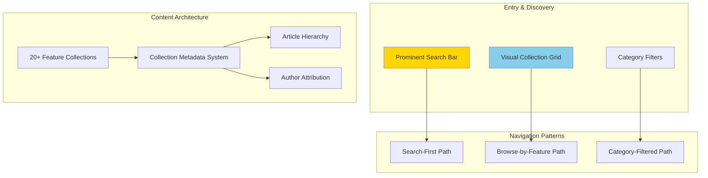

#### Architectural Features

**1. Collection-Based Organization**
- **20 distinct collections** organized by software feature domain
- Each collection functions as a **mini-knowledge base**
- **Visual hierarchy**: Icon → Title → Description → Metadata

**Collection Card Structure**:
```
┌─────────────────────────────┐
│  [Icon]                     │
│  Collection Title           │
│  Brief Description          │
│  [Author Avatar] Jon Smith  │
│  12 articles                │
└─────────────────────────────┘
```

**2. Visual Design System**
- **Grid layout** (4-5 columns on desktop)
- **Consistent color scheme** (teal/white)
- **Icon-based** visual identification
- **Responsive design** for mobile/tablet

**3. Metadata Architecture**
- Author attribution (name + avatar)
- Article count per collection
- Last updated timestamps
- Category/tag system

**4. Search System**
- **Prominent placement** at top of page
- Placeholder text for guidance ("Search for articles...")
- Likely keyword-based with relevance ranking
- Search results show collection + article matches

**5. User Flow Patterns**

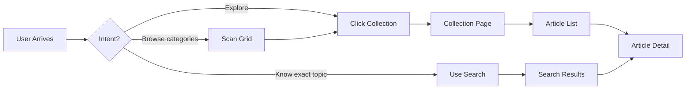

#### Information Hierarchy

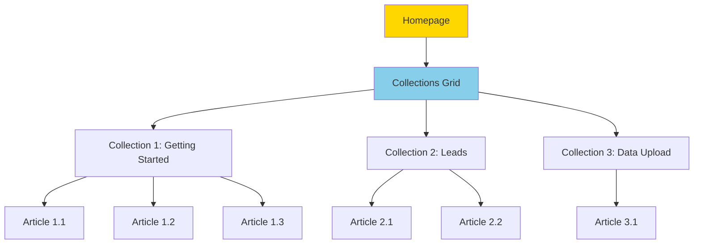

---

### 2. FreedomSoft Help Desk Architecture

**URL**: https://helpdesk.freedomsoft.com/hc/en-us

**Status**: ❌ **BLOCKED (403 Forbidden)**

**Analysis**: Unable to access due to Cloudflare security or aggressive bot protection.

**Implications**:
- Likely using Zendesk or Help Scout platform
- Standard help desk security measures in place
- May have similar collection-based structure (Zendesk default)

---

### 3. InvestorFuse Help Desk Architecture

**URL**: https://www.investorfuse.com/if3support

#### Core Structural Components

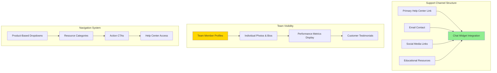

#### Architectural Features

**1. Multi-Channel Support Architecture**

```
┌────────────────────────────────────┐
│  SUPPORT CHANNELS                  │
├────────────────────────────────────┤
│  • Email: answers@investorfuse.com │
│  • Chat: Intercom widget embedded  │
│  • Social: FB, Twitter, IG, YouTube│
│  • Resources: Blog, Podcast, Docs  │
│  • Help Center: Knowledge base     │
└────────────────────────────────────┘
```

**2. Team-Centric Design**

**Team Profile Card Structure**:
```
┌─────────────────────────────┐
│  [Professional Photo]       │
│  Name: Sarah Johnson        │
│  Role: Support Specialist   │
│  Bio: 5+ years experience   │
│  ─────────────────────────  │
│  Avg Response: 2h 30m       │
│  Rating: ⭐ 4.9/5.0         │
│  Conversations: 1,234       │
└─────────────────────────────┘
```

**3. Navigation Architecture**
- **Top-level**: Product-based organization (IF 2.0, IF 3)
- **Secondary**: Resources dropdown (Help, Blog, Podcast, Videos)
- **CTAs**: Book Demo, Get Started, Sign In
- **Breadcrumb navigation**: Clear paths back to top level

**4. Transparency & Trust Building**
- **Real performance metrics** (not fabricated)
- **Human faces and names** (not just roles)
- **Customer testimonials** with quotes
- **Direct contact information** prominently displayed

**5. User Flow Patterns**

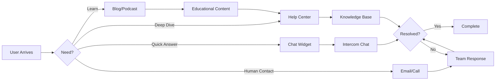

#### Information Architecture

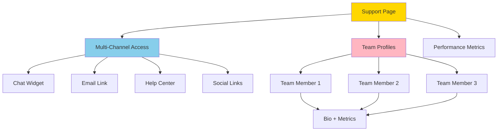

---

## Architectural Patterns Comparison

### Pattern Matrix: REsimpli vs InvestorFuse

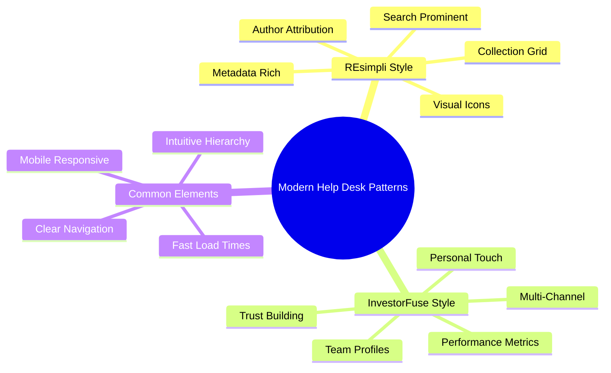

### Feature Comparison Table

| Architectural Feature | REsimpli | InvestorFuse | Industry Standard |
|----------------------|----------|--------------|-------------------|
| **Content Organization** | Collection-based (20+) | Channel-based | Collection-based ✓ |
| **Visual Navigation** | Grid with icons | Dropdown menus | Grid or tabs |
| **Search Prominence** | Very high (top center) | Medium (header) | High placement ✓ |
| **Team Visibility** | Author avatars only | Full team profiles | Varies widely |
| **Channel Count** | 2 (Search + Chat) | 5+ (Email, Chat, Social, etc.) | 3-5 channels ✓ |
| **Performance Metrics** | Not displayed | Prominently displayed | Rarely shown |
| **Mobile Design** | Fully responsive | Fully responsive | Required ✓ |
| **Article Metadata** | Author, count, date | Less visible | Author + date ✓ |
| **Color Scheme** | Teal/white (branded) | Blue/white (branded) | Brand-matched ✓ |
| **CTA Visibility** | Low (help-focused) | High (sales-focused) | Depends on goal |

---

## Structural Pattern Analysis

### 1. Content Organization Patterns

**REsimpli Approach** (Feature-First):
```
Homepage
├── Search Bar (global)
├── Collection: Getting Started
│   ├── Article: Account Setup
│   ├── Article: First Login
│   └── Article: Dashboard Tour
├── Collection: Leads Management
│   ├── Article: Adding Leads
│   ├── Article: Lead Filters
│   └── Article: Lead Export
└── Collection: Data Upload
    ├── Article: CSV Import
    └── Article: Data Mapping
```

**InvestorFuse Approach** (Channel-First):
```
Support Hub
├── Chat Channel (Intercom)
├── Email Channel (Direct)
├── Help Center (Articles)
│   ├── IF 2.0 Docs
│   └── IF 3.0 Docs
├── Educational Resources
│   ├── Blog Articles
│   ├── Podcast Episodes
│   └── Video Tutorials
└── Team Profiles
    ├── Support Team
    └── Performance Metrics
```

### 2. Visual Design Patterns

**REsimpli Visual Hierarchy**:
```
Layer 1: Search (Hero prominence)
Layer 2: Collection Grid (Primary browse)
Layer 3: Collection Cards (Visual navigation)
Layer 4: Article List (Content access)
Layer 5: Article Detail (Consumption)
```

**InvestorFuse Visual Hierarchy**:
```
Layer 1: Navigation Bar (Product focus)
Layer 2: Team Profiles (Trust building)
Layer 3: Channel Options (Multi-path)
Layer 4: Content Access (Secondary)
```

### 3. User Flow Patterns

**Search-First Flow** (REsimpli):
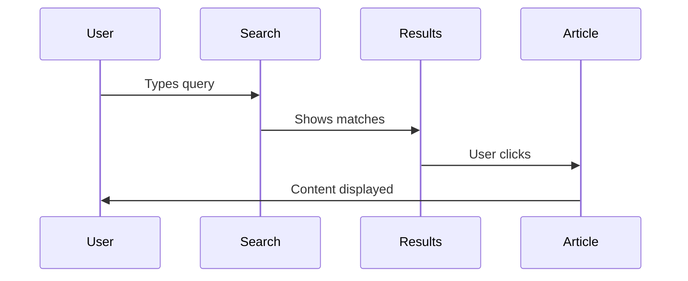

**Browse-First Flow** (REsimpli):
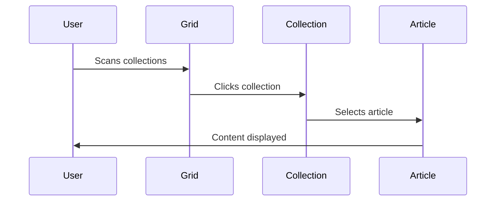

**Multi-Channel Flow** (InvestorFuse):
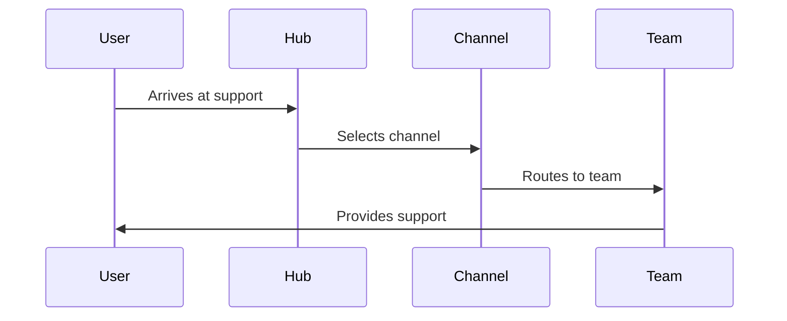

---

## Pete's Current State (Structural Assessment)

Based on repository analysis, Pete currently has:

### Existing Architecture

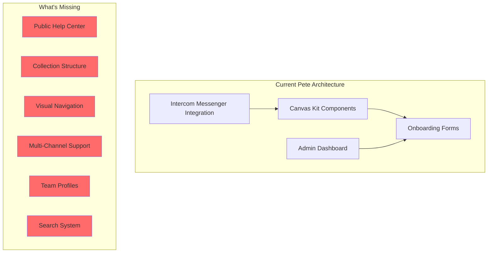

### Gap Analysis

| Component | Status | REsimpli Has | InvestorFuse Has |
|-----------|--------|--------------|------------------|
| Public Help Center | ❌ Missing | ✅ Yes | ✅ Yes |
| Collection Organization | ❌ Missing | ✅ 20+ collections | ⚠️ Product-based |
| Search System | ❌ Missing | ✅ Prominent | ✅ Header search |
| Visual Grid Layout | ❌ Missing | ✅ 4-5 column grid | ❌ List-based |
| Team Profiles | ❌ Missing | ⚠️ Author avatars | ✅ Full profiles |
| Performance Metrics | ❌ Missing | ❌ No | ✅ Yes |
| Multi-Channel | ⚠️ Messenger only | ⚠️ 2 channels | ✅ 5+ channels |
| Mobile Responsive | ⚠️ Unknown | ✅ Yes | ✅ Yes |

---

## Transformation Roadmap: Pure Architecture Focus

### Target Architecture

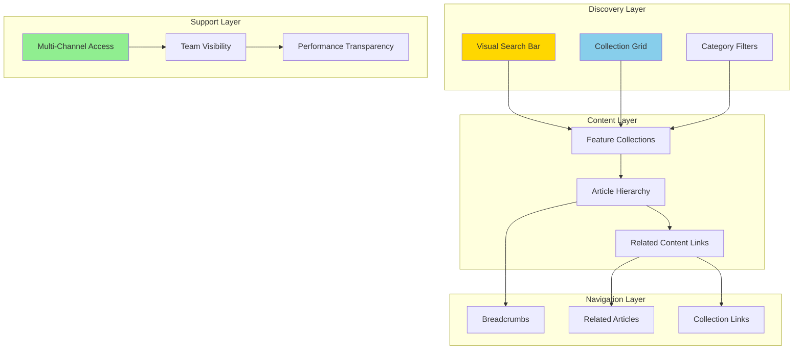

---

## Implementation Plan: 6 Stages

### Stage 1: Foundation - Public Help Center (4-5 hours)

**Goal**: Create basic public-facing help center structure

**Deliverables**:
- `/help` route in Next.js
- Homepage with hero section
- Basic navigation structure
- Mobile-responsive layout
- Pete branding (purple/pink theme)

**Architecture**:
```
/help
├── index.tsx          (Homepage)
├── search/            (Search results page)
├── collections/       (Collection list)
│   └── [id]/         (Collection detail)
└── articles/          (Article pages)
    └── [id]/         (Article detail)
```

**Design Pattern**: REsimpli-inspired homepage

```
┌─────────────────────────────────────┐
│  [Pete Logo]      [Search]    [CTA] │
├─────────────────────────────────────┤
│                                     │
│   Get Help with Pete                │
│   [────────────────────────────]   │  ← Search bar
│                                     │
│   ┌───────┐  ┌───────┐  ┌───────┐ │
│   │ [🚀] │  │ [📊] │  │ [⚙️] │ │  ← Collection grid
│   │Start │  │ Data │  │Setup│ │
│   │ (5)  │  │ (12) │  │ (8) │ │
│   └───────┘  └───────┘  └───────┘ │
│                                     │
└─────────────────────────────────────┘
```

---

### Stage 2: Collection Architecture (5-6 hours)

**Goal**: Build REsimpli-style collection system

**Data Structure**:
```typescript
interface Collection {
  id: string;
  slug: string;
  title: string;
  description: string;
  icon: string;           // Icon identifier or SVG
  color?: string;         // Optional accent color
  category: Category;
  articles: Article[];
  metadata: {
    articleCount: number;
    lastUpdated: Date;
    author: Author;
    featured: boolean;
  };
}

interface Article {
  id: string;
  slug: string;
  collectionId: string;
  title: string;
  content: string;        // Markdown or HTML
  excerpt: string;
  metadata: {
    author: Author;
    publishedAt: Date;
    updatedAt: Date;
    views: number;
    helpful: number;
    notHelpful: number;
  };
  related: string[];      // Article IDs
}

interface Author {
  id: string;
  name: string;
  avatar: string;
  role: string;
  email?: string;
}

type Category =
  | 'getting-started'
  | 'data-management'
  | 'workflows'
  | 'integrations'
  | 'technical'
  | 'training'
  | 'company';
```

**Recommended Collections** (Based on Pete's domain):
1. **Getting Started** (🚀) - Onboarding, account setup, first steps
2. **Data Upload & Import** (📊) - CSV import, property data, data mapping
3. **Workflows** (🔄) - Automation, triggers, workflow management
4. **Company Management** (🏢) - Settings, team, permissions
5. **Training & Certification** (🎓) - Training topics, progress tracking
6. **Integrations** (🔌) - Third-party integrations, API access
7. **Technical Support** (⚙️) - Troubleshooting, error messages
8. **Analytics** (📈) - Dashboard, reports, insights

**Visual Grid Implementation**:
- 4 columns on desktop (1200px+)
- 3 columns on tablet (768px-1199px)
- 1 column on mobile (<768px)
- Card hover effects
- Icon + Title + Description + Metadata

---

### Stage 3: Search System (4-5 hours)

**Goal**: Implement prominent search with keyword matching

**Features**:
- Global search bar (header)
- Hero search (homepage)
- Search results page
- Keyword highlighting
- Result ranking (title > excerpt > content)
- Collection + Article results
- "No results" state with suggestions

**Search Flow**:
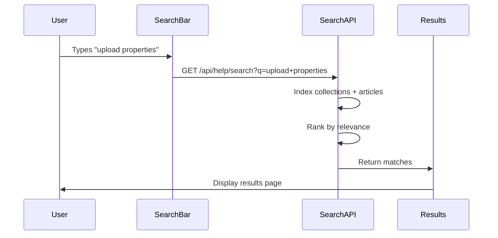

**Search Algorithm** (Simple Keyword Matching):
```typescript
function searchHelp(query: string) {
  const terms = query.toLowerCase().split(' ');
  const results: SearchResult[] = [];

  // Search collections
  collections.forEach(col => {
    let score = 0;
    terms.forEach(term => {
      if (col.title.toLowerCase().includes(term)) score += 10;
      if (col.description.toLowerCase().includes(term)) score += 5;
    });
    if (score > 0) {
      results.push({ type: 'collection', item: col, score });
    }
  });

  // Search articles
  articles.forEach(art => {
    let score = 0;
    terms.forEach(term => {
      if (art.title.toLowerCase().includes(term)) score += 10;
      if (art.excerpt.toLowerCase().includes(term)) score += 5;
      if (art.content.toLowerCase().includes(term)) score += 1;
    });
    if (score > 0) {
      results.push({ type: 'article', item: art, score });
    }
  });

  return results.sort((a, b) => b.score - a.score);
}
```

---

### Stage 4: Multi-Channel Integration (4-5 hours)

**Goal**: Add InvestorFuse-style multi-channel support

**Channels to Implement**:
1. **Intercom Chat Widget** (✅ Already have)
2. **Email Support** (✅ Already have EMAIL_USER/EMAIL_PASS)
3. **Help Center** (New - what we're building)
4. **Social Media Links** (Optional - add links to Pete's social)
5. **Community Forum** (Optional - future consideration)

**Multi-Channel Hub Page**:
```
/help/support

┌─────────────────────────────────────┐
│  Need More Help?                    │
├─────────────────────────────────────┤
│  ┌───────────────────────────────┐ │
│  │  💬 Chat with Us              │ │
│  │  Available 9am-5pm EST        │ │
│  │  [Start Chat]                 │ │
│  └───────────────────────────────┘ │
│                                     │
│  ┌───────────────────────────────┐ │
│  │  📧 Email Support             │ │
│  │  support@peterei.com          │ │
│  │  Response within 24 hours     │ │
│  └───────────────────────────────┘ │
│                                     │
│  ┌───────────────────────────────┐ │
│  │  📚 Help Center               │ │
│  │  Browse articles & guides     │ │
│  │  [View All Collections]       │ │
│  └───────────────────────────────┘ │
└─────────────────────────────────────┘
```

**Implementation**:
- Create `/help/support` page
- Add channel cards with icons
- Link to existing Intercom widget
- Display email contact prominently
- Add expected response times
- Include team availability hours

---

### Stage 5: Team Transparency (3-4 hours)

**Goal**: Add InvestorFuse-style team profiles and metrics

**Team Profile Page**:
```
/help/team

┌─────────────────────────────────────┐
│  Meet the Pete Support Team        │
├─────────────────────────────────────┤
│  ┌───────────────┐  ┌─────────────┐│
│  │ [Photo]       │  │ [Photo]     ││
│  │ Jon Smith     │  │ Mark C.     ││
│  │ Lead Support  │  │ Tech Lead   ││
│  │ ───────────── │  │ ─────────── ││
│  │ Avg: 2h 30m   │  │ Avg: 3h 15m ││
│  │ Rating: 4.9   │  │ Rating: 4.8 ││
│  │ 1,234 convos  │  │ 987 convos  ││
│  └───────────────┘  └─────────────┘│
└─────────────────────────────────────┘
```

**Data Source**: Pull metrics from existing Intercom data

**Metrics to Display**:
- Average response time (from conversation timestamps)
- Total conversations handled (from Intercom cache)
- Customer ratings (if available in Intercom)
- Team member bio and expertise areas

**Implementation**:
```typescript
// Calculate from existing Intercom data
async function getTeamMetrics() {
  const admins = await getAdmins(); // Existing function
  const conversations = await getConversations(); // Existing cache

  return admins.map(admin => {
    const adminConvos = conversations.filter(c =>
      c.assignee?.id === admin.id
    );

    const avgResponseTime = calculateAvgResponseTime(adminConvos);
    const rating = calculateRating(adminConvos);

    return {
      ...admin,
      metrics: {
        avgResponseTime,
        rating,
        conversationCount: adminConvos.length
      }
    };
  });
}
```

---

### Stage 6: Visual Polish & Related Content (3-4 hours)

**Goal**: Add visual polish and content linking

**Features to Add**:
1. **Related Articles** - Show 3-5 related articles at bottom of each article
2. **Related Collections** - Show related collections on collection pages
3. **Breadcrumb Navigation** - Show path (Home > Collection > Article)
4. **Article Feedback** - "Was this helpful?" buttons
5. **View Count Display** - Show popularity
6. **Last Updated** - Show freshness
7. **Print/Share Buttons** - Allow article sharing
8. **Mobile Optimization** - Ensure responsive design

**Related Content Algorithm** (Simple):
```typescript
function getRelatedArticles(article: Article) {
  // Same collection articles
  const sameCollection = articles.filter(a =>
    a.collectionId === article.collectionId &&
    a.id !== article.id
  );

  // Similar title/content (keyword matching)
  const keywords = extractKeywords(article.title + ' ' + article.excerpt);
  const similar = articles.filter(a => {
    const aKeywords = extractKeywords(a.title + ' ' + a.excerpt);
    const overlap = keywords.filter(k => aKeywords.includes(k));
    return overlap.length > 2 && a.id !== article.id;
  });

  // Combine and limit to 5
  return [...sameCollection, ...similar]
    .slice(0, 5)
    .sort((a, b) => b.metadata.views - a.metadata.views);
}
```

**Breadcrumb Implementation**:
```
Home > Getting Started > Account Setup
```

**Article Footer**:
```
┌─────────────────────────────────────┐
│  Was this helpful?                  │
│  [👍 Yes (24)]  [👎 No (2)]        │
├─────────────────────────────────────┤
│  Related Articles                   │
│  • Setting up your first workflow   │
│  • Importing data via CSV           │
│  • Understanding user permissions   │
└─────────────────────────────────────┘
```

---

## Success Metrics

### Technical Metrics
- **Page Load Time**: < 2 seconds for all help pages
- **Search Response**: < 500ms for search results
- **Mobile Score**: > 90/100 on Google Lighthouse
- **Uptime**: > 99.5% help center availability

### User Experience Metrics
- **Self-Service Rate**: > 50% of users find answers without contacting support
- **Search Success Rate**: > 70% of searches lead to article views
- **Article Helpfulness**: > 70% "helpful" ratings
- **Bounce Rate**: < 40% on help center pages
- **Time on Page**: > 2 minutes average (indicates reading)

### Business Metrics
- **Support Ticket Reduction**: 25% fewer tickets due to better self-service
- **Article Views**: Track most-viewed articles to identify pain points
- **Collection Popularity**: Understand which features need more docs
- **Channel Distribution**: Track which support channels are most used

---

## Technology Stack

### Frontend
- **Next.js 15** (App Router)
- **React Server Components**
- **Tailwind CSS** (for styling)
- **shadcn/ui** (for UI components)
- **next/image** (for optimized images)

### Content Management
- **File-Based** (Markdown or JSON files)
- **Git-Based** (version control for content)
- **Dynamic Imports** (for scalability)

### Search
- **In-Memory Indexing** (simple keyword search)
- **Future**: Algolia or Meilisearch for advanced search

### Data Storage
- **JSON Files** (for collections and articles)
- **Intercom API** (for team metrics)
- **File System** (for images and assets)

---

## File Structure

```
pete-intercom-nextjs/
├── src/
│   ├── app/
│   │   ├── help/
│   │   │   ├── page.tsx                    # Homepage
│   │   │   ├── search/
│   │   │   │   └── page.tsx               # Search results
│   │   │   ├── collections/
│   │   │   │   ├── page.tsx               # All collections
│   │   │   │   └── [id]/
│   │   │   │       └── page.tsx           # Collection detail
│   │   │   ├── articles/
│   │   │   │   └── [id]/
│   │   │   │       └── page.tsx           # Article detail
│   │   │   ├── support/
│   │   │   │   └── page.tsx               # Multi-channel hub
│   │   │   └── team/
│   │   │       └── page.tsx               # Team profiles
│   │   └── api/
│   │       └── help/
│   │           ├── search/
│   │           │   └── route.ts           # Search API
│   │           └── feedback/
│   │               └── route.ts           # Article feedback
│   ├── components/
│   │   └── help/
│   │       ├── SearchBar.tsx              # Search component
│   │       ├── CollectionGrid.tsx         # Collection grid
│   │       ├── CollectionCard.tsx         # Collection card
│   │       ├── ArticleList.tsx            # Article list
│   │       ├── ArticleContent.tsx         # Article display
│   │       ├── Breadcrumbs.tsx            # Navigation
│   │       ├── RelatedArticles.tsx        # Related content
│   │       ├── FeedbackWidget.tsx         # Helpful buttons
│   │       ├── TeamMemberCard.tsx         # Team profile
│   │       └── ChannelCard.tsx            # Support channel
│   ├── lib/
│   │   └── help/
│   │       ├── collections.ts             # Collection data access
│   │       ├── articles.ts                # Article data access
│   │       ├── search.ts                  # Search logic
│   │       └── related.ts                 # Related content logic
│   └── data/
│       └── help/
│           ├── collections/
│           │   ├── getting-started.json
│           │   ├── data-upload.json
│           │   └── ...
│           └── articles/
│               ├── account-setup.md
│               ├── csv-import.md
│               └── ...
```

---

## Implementation Timeline

| Stage | Description | Hours | Priority |
|-------|-------------|-------|----------|
| **Stage 1** | Foundation & Homepage | 4-5 | Critical |
| **Stage 2** | Collection Architecture | 5-6 | Critical |
| **Stage 3** | Search System | 4-5 | High |
| **Stage 4** | Multi-Channel Integration | 4-5 | High |
| **Stage 5** | Team Transparency | 3-4 | Medium |
| **Stage 6** | Visual Polish | 3-4 | Medium |
| **TOTAL** | Complete Help Center | 23-29 hours | - |

**Recommended Approach**: Build Stages 1-3 first (foundation + search), then assess and prioritize Stages 4-6 based on business needs.

---

## Risk Assessment

### Low Risk ✅
- **Next.js Integration** - Already using Next.js 15
- **File-Based Content** - Similar to existing questionnaire system
- **Responsive Design** - Tailwind CSS already configured
- **Intercom Integration** - Already have API access

### Medium Risk ⚠️
- **Content Creation** - Need to create 50+ articles from scratch
- **Search Performance** - Simple keyword search may not scale beyond 200 articles
- **Visual Design** - Matching REsimpli's polish requires design skill
- **Mobile UX** - Ensuring great mobile experience

### Mitigation Strategies
1. **Content**: Start with 20 essential articles, expand over time
2. **Search**: Start simple, upgrade to Algolia if needed
3. **Design**: Use shadcn/ui components for consistency
4. **Mobile**: Test on real devices frequently

---

## Next Steps (Immediate Actions)

1. **Review & Approve Plan** - Get feedback on approach and priorities
2. **Content Audit** - Identify existing content that can be migrated
3. **Design Mockups** - Create visual mockups for key pages
4. **Start Stage 1** - Build `/help` homepage and basic structure
5. **Create Sample Content** - Write 5-10 articles for testing
6. **GitHub Issues** - Create 6 issues for each stage

---

## Questions for Clarification

1. **Current Help Desk**: Do you have an existing Intercom help center? URL?
2. **Content Priority**: Which collections/topics are most urgent?
3. **Team Size**: How many team members should have profiles?
4. **Branding**: Should we use Pete's purple/pink gradient theme?
5. **Timeline**: What's the target launch date?
6. **Budget**: Any budget for tools like Algolia (search) or Vercel (hosting)?

---

**Total Estimated Time**: 23-29 hours (3-4 days of focused work)
**Complexity**: Medium (UI/content work, no complex backend logic)
**Risk**: Low (building on proven patterns, no experimental tech)
**Value**: High (industry-standard help desk, improved self-service, reduced support load)

---

_This analysis focuses purely on architectural and structural patterns from REsimpli and InvestorFuse, without assuming any existing AI infrastructure._
