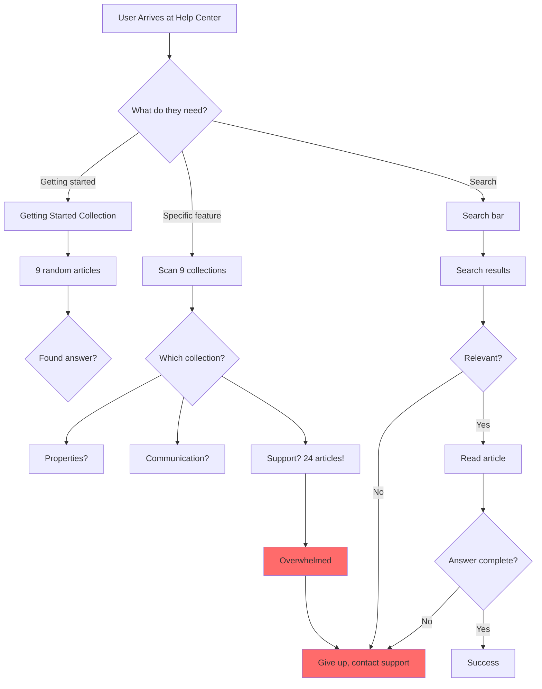
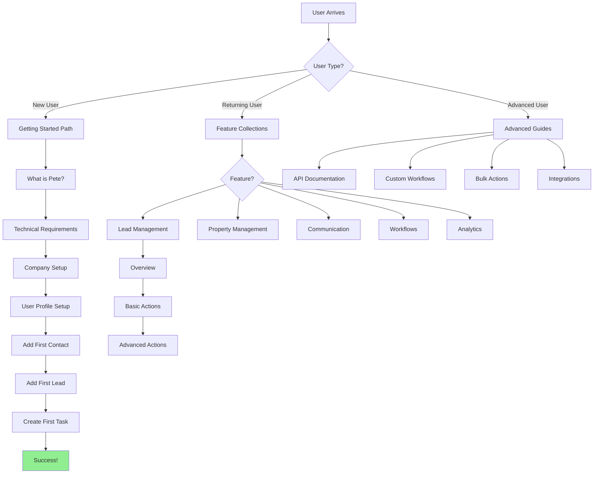

# Pete Help Desk: Complete Content Architecture Audit

**Date**: 2025-10-08
**URL**: https://help.thepete.io/en/
**Total Collections**: 9
**Total Articles**: 59 articles
**Single Author**: Jon Nolen

---

## Executive Summary: Critical Issues Found

### 🚨 Major Problems with Current Structure

1. **"Support" Collection is a Dumping Ground** - 24 articles (41% of all content) with no clear organization
2. **Inconsistent Article Naming** - Mix of question-based ("How to...") and date-stamped support tickets ("Pete Support 12/26/24")
3. **No Clear User Journey** - Articles don't build on each other logically
4. **Duplicate Article Titles** - "How to Set Up User Profile" appears twice in Getting Started
5. **Poor Categorization** - Email templates in Communication, but email setup in Support collection
6. **Missing Foundational Content** - No "What is Pete?" or "Pete Platform Overview" article
7. **Date-Stamped Articles in Support** - Suggests these were support tickets converted to articles (not proper documentation)
8. **Workflow Content Split** - Workflows in 3 places: Workflows collection (1 article), Training (2 articles), Support (1 article)

---

## Complete Content Inventory

### 1. Getting Started (9 articles)

**Description**: "Everything you need to get started with Pete, all in one place."

**Articles**:
1. "How to edit columns or change order in grid view?"
2. "How To Add a Contact"
3. "How Can I View My Notifications?"
4. "How to set up your user profile?"
5. "Which Notifications Will you Receive?"
6. "How to set up your company within Pete?"
7. "How To Set Your Business Days and Hours?"
8. "What are the Technical Requirements for Using Pete?"
9. "How to Set Up User Profile" ⚠️ **DUPLICATE of #4**

#### Content Flow Analysis

**Expected Logical Flow**:
```
1. Technical Requirements (start here - can they use Pete?)
2. Set up company profile
3. Set up user profile
4. Set business days/hours
5. Add contacts
6. View notifications
7. Customize grid view
```

**Current Flow Problems**:
- ❌ Technical Requirements is article #8 (should be #1)
- ❌ Company setup is #6 (should come before user setup)
- ❌ Grid view customization is #1 (too advanced for "Getting Started")
- ❌ Duplicate user profile article (#4 and #9)

**Categorization Issues**:
- "How to edit columns or change order in grid view?" - This is TOO ADVANCED for Getting Started
- Should be in a "Customization" or "Advanced Tips" collection

---

### 2. Workflows & Automation (1 article)

**Description**: "Workflows are essential for automating your Pete and streamlining tasks."

**Articles**:
1. "How to set up or edit your team and responsibilities?"

#### Content Flow Analysis

**Critical Issues**:
- ❌ **WRONG ARTICLE IN WRONG COLLECTION** - "Set up team and responsibilities" is NOT about workflows
- ❌ This article belongs in "Company Management" or "Team Setup"
- ❌ Collection title promises "Workflows & Automation" but delivers team setup
- ❌ Missing: Actual workflow setup, workflow triggers, workflow actions, workflow examples

**What SHOULD be here**:
- "What are Workflows in Pete?"
- "Creating Your First Workflow"
- "Workflow Triggers Explained"
- "Workflow Actions: Email, SMS, Tasks"
- "Workflow Templates and Examples"
- "Troubleshooting Workflows"

**Note**: There are 2 workflow training videos in the Training collection that should be cross-referenced here.

---

### 3. Tasks (3 articles)

**Description**: "This section explains how to set up tasks and how this feature works."

**Articles**:
1. "Can I Get a Printout of My Tasks?"
2. "How to action your tasks?"
3. "How to view or assign tasks to your team?"

#### Content Flow Analysis

**Logical Flow (Correct Order)**:
```
3. How to view or assign tasks to your team? (OVERVIEW - should be #1)
2. How to action your tasks? (ACTION - should be #2)
1. Can I Get a Printout of My Tasks? (ADVANCED - should be #3)
```

**Current Order is Backwards**: Starts with advanced feature (printing) before explaining basics (viewing/actioning)

**Missing Content**:
- "What are Tasks in Pete?" (conceptual intro)
- "Creating a New Task"
- "Task Statuses Explained"
- "Task Notifications and Reminders"
- "Task Templates" (mentioned in Support collection but not here)

**Cross-Reference Issues**:
- Support collection has "Creating Task Templates" (article #15) - should be in this collection
- Support collection has "Task Management in the Dashboard" (article #16) - should be in this collection

---

### 4. Communication (8 articles)

**Description**: "This section covers key information for configuring your communication settings."

**Articles**:
1. "How to Record and/or Transcribe Phone Calls?"
2. "How to View, Upload, Add, or Delete Email Templates?"
3. "How to set up a campaign?"
4. "How to Get a Phone Number?"
5. "Setting up an Emergency Address"
6. "Setting Up the Voicemail"
7. "How to Download Recorded Calls?"
8. "Setting Up the IVR"

#### Content Flow Analysis

**Current Flow is Chaotic** - Jumps between email, phone, and campaigns with no logic

**Recommended Logical Flow**:

**Email Communication Path**:
```
1. Email setup fundamentals (MISSING - in Support collection instead)
2. How to View, Upload, Add, or Delete Email Templates? (currently #2)
3. How to set up a campaign? (currently #3)
```

**Phone Communication Path**:
```
4. How to Get a Phone Number? (currently #4)
5. Setting up an Emergency Address (currently #5)
6. Setting Up the Voicemail (currently #6)
7. Setting Up the IVR (currently #8)
8. How to Record and/or Transcribe Phone Calls? (currently #1)
9. How to Download Recorded Calls? (currently #7)
```

**Critical Issues**:
- ❌ Email setup is in Support collection (article #5) - should be HERE
- ❌ No intro article explaining communication channels
- ❌ Phone setup flow is scattered (get number → emergency address → voicemail → IVR)
- ❌ Recording calls appears BEFORE voicemail setup (backwards)

**Missing Content**:
- "Communication Channels Overview"
- "Email Setup and Configuration" (currently in Support)
- "SMS Communication Setup"
- "Email Deliverability Best Practices"
- "Phone Call Best Practices"

---

### 5. Properties (6 articles)

**Description**: "This collection offers guidance on navigating properties with ease."

**Articles**:
1. "How can I add more photos of my property?"
2. "How to View or Edit Property Statuses?"
3. "How to View the Lifecycle Details of Each Property?"
4. "How Can I Manually Add a Lead?"
5. "How to Customize or Edit a Phase?"
6. "How Can I Manually Delete a Lead?"

#### Content Flow Analysis

**Critical Categorization Issues**:
- ❌ **LEADS ARE NOT PROPERTIES** - Articles #4 and #6 are about LEADS, not properties
- ❌ "Manually Add a Lead" and "Manually Delete a Lead" belong in a "Lead Management" collection

**Logical Flow (After Removing Lead Articles)**:
```
FOUNDATIONAL (Missing):
- "What are Properties in Pete?"
- "Property vs Lead: Understanding the Difference"
- "Creating Your First Property"

CURRENT ARTICLES (Reorganized):
2. How to View or Edit Property Statuses? (OVERVIEW - should be #1)
5. How to Customize or Edit a Phase? (CUSTOMIZATION - should be #2)
3. How to View the Lifecycle Details of Each Property? (ADVANCED - should be #3)
1. How can I add more photos of my property? (ENHANCEMENT - should be #4)
```

**Missing Content**:
- "Creating a New Property"
- "Property Fields Explained"
- "Property vs Lead Distinction"
- "Importing Properties from CSV"
- "Property Search and Filters"
- "Bulk Property Actions"

**Cross-Reference Issues**:
- Support collection has "Property Details Management" (article #11) - overlaps with this collection
- Support collection has "Understanding Phases and Statuses" (article #12) - belongs HERE, not Support
- Support collection has "Utilizing Pete for Real Estate Investing Management" (article #9) - foundational article that should be in Getting Started

---

### 6. Integrations (1 article)

**Description**: "Steps to Set Up Integrations Efficiently."

**Articles**:
1. "Setting up Lead Delivery in MotivatedSellers.com to Interface with Pete"

#### Content Flow Analysis

**Critical Issues**:
- ❌ **ONLY ONE INTEGRATION DOCUMENTED** - Not scalable
- ❌ No overview article explaining what integrations are available
- ❌ No generic "How to Connect Integrations" article

**Missing Content**:
- "Available Integrations in Pete"
- "How to Connect an Integration"
- "Zapier Integration Setup"
- "API Access for Developers"
- "Webhook Configuration"
- "Integration Troubleshooting"

**Recommendation**: This collection needs 10+ articles to be useful

---

### 7. Training (3 articles)

**Description**: "In this section, we will provide helpful video training to enhance your knowledge of Pete."

**Articles**:
1. "Pete Training 12/4/2024 - Creating and Using SMS, Task, and Email Templates in Workflows"
2. "Pete Training 02/26/25 - Creating and Managing Workflows in Pete"
3. "Pete Training 03/12/25 - Creating and Managing Rehab Scopes"

#### Content Flow Analysis

**Issues**:
- ⚠️ **DATE-STAMPED TITLES** - Not evergreen, looks outdated quickly
- ❌ Workflow training is HERE but "Workflows & Automation" collection has wrong content
- ❌ "Rehab Scopes" article is isolated - no related content

**Better Titles**:
- "Video: Creating Templates in Workflows" (remove date)
- "Video: Workflow Setup and Management" (remove date)
- "Video: Managing Rehab Scopes" (remove date)

**Missing Content**:
- Video training for basic features (not just workflows)
- Training for phone system setup
- Training for lead management
- Training for property management
- Training for dashboard/KPI usage

**Recommendation**: Training videos should supplement written articles, not replace them

---

### 8. Support (24 articles) ⚠️ **MAJOR PROBLEM**

**Description**: "In this section, we will provide a comprehensive guide to help you navigate better into Pete."

**Articles** (Grouped by Theme):

#### User Setup and Configuration (4 articles)
1. "Pete Support 12/26/24 - User Profile Setup and Email Configuration"
2. "Pete Support 12/26/24 - User Rights Management in the System"
3. "Pete Support 12/26/24 - Onboarding Setup for New Users in Pete"
4. "Pete Support 12/26/24 - General Settings Configuration for Company Software"

#### System and Email Management (4 articles)
5. "Pete Support 12/26/24 - Email Setup and Configuration in Pete"
6. "Pete Support 12/26/24 - Creating an Email Template"
7. "Pete Support 12/26/24 - Porting Phone Number"
8. "Pete Support 12/26/24 - Phone System Setup and Configuration"

#### Lead and Property Management (5 articles)
9. "Pete Support 02/01/24 - Utilizing Pete for Real Estate Investing Management"
10. "Pete Support 12/26/24 - Adding a New Lead in Pete"
11. "Pete Support 12/26/24 - Property Details Management"
12. "Pete Support 12/26/24 - Understanding Phases and Statuses in Property Management"
13. "Pete Support 12/26/24 - Effective Use of the Lead Management System"

#### Workflow and Task Management (3 articles)
14. "Pete Support 12/26/24 - Using Workflows to Change Lead Temperature in Bulk"
15. "Pete Support 12/26/24 - Creating Task Templates"
16. "Pete Support 12/26/24 - Task Management in the Dashboard"

#### Dashboard and KPI Tools (4 articles)
17. "Pete Support 12/26/24 - Creating Single Value KPIs on Company Dashboard"
18. "Pete Support 12/26/24 - Dashboard Configuration for KPIs"
19. "Pete Support 12/26/24 - Creating a Custom KPI on the Company Dashboard"
20. "Pete Support 02/04/25 - Sharing KPIs and Dashboards in Company Dashboard Tool"

#### Miscellaneous (1 article)
21. "Pete Support 12/16/24 - Importing Data into the CRM"

#### Content Flow Analysis

**🚨 CRITICAL ISSUES - THIS IS A DISASTER**:

1. **Date-Stamped "Pete Support" Titles** - These look like support tickets, not documentation
   - Not evergreen
   - Poor SEO
   - Not scannable
   - No clear topic at a glance

2. **41% of All Content in One Collection** - 24 out of 59 articles
   - Impossible to navigate
   - No clear organization
   - Users can't find what they need

3. **Content Belongs in Other Collections**:
   - Articles #1-4 → Should be in "Getting Started" or "User Management"
   - Articles #5-8 → Should be in "Communication"
   - Articles #9-13 → Should be split between "Properties" and "Lead Management" (new collection)
   - Articles #14-16 → Should be in "Workflows" and "Tasks"
   - Articles #17-20 → Should be in "Analytics & Reporting" (new collection)
   - Article #21 → Should be in "Data Management" (new collection)

4. **Duplicate Content Issues**:
   - "Email Setup" is here AND in Communication
   - "User Profile Setup" is here AND in Getting Started (twice!)
   - "Phone System Setup" is here AND partially in Communication
   - "Task Templates" is here but Tasks collection doesn't mention it

5. **Missing Cross-References**:
   - No links between related articles
   - No "See also" sections
   - No "Prerequisites" sections

**Recommendation**: **DISMANTLE THIS COLLECTION ENTIRELY** and redistribute content to proper categories

---

### 9. Update Notes (4 articles)

**Description**: "Stay up to date with the latest feature enhancements and updates."

**Articles**:
1. "🏡 Release Notes 6/7/2025"
2. "🏡 Release Notes 7/22/2025"
3. "🏡 Release Notes 8/1/2025"
4. "🏡 Release Notes 9/8/2025"

#### Content Flow Analysis

**Issues**:
- ⚠️ **FUTURE DATES** - Articles dated 6/7/2025, 7/22/2025, 8/1/2025, 9/8/2025 (it's October 2025 now)
- ⚠️ Emoji in titles (🏡) - not searchable, not accessible
- ✅ **CORRECT STRUCTURE** - Chronological order makes sense for release notes

**Recommendations**:
- Add "What's New" article linking to latest updates
- Add changelog/version number to titles
- Link release notes to affected articles (e.g., "See updated Phone Setup guide")

---

## User Journey Analysis

### Current User Journey (Broken)



### Ideal User Journey (What It Should Be)



---

## Content Categorization Issues

### Articles in Wrong Collections

| Article | Current Collection | Should Be In |
|---------|-------------------|--------------|
| "How to edit columns or change order in grid view?" | Getting Started | Customization / Advanced Tips |
| "How to set up or edit your team and responsibilities?" | Workflows & Automation | Company Management |
| "How Can I Manually Add a Lead?" | Properties | Lead Management (new) |
| "How Can I Manually Delete a Lead?" | Properties | Lead Management (new) |
| ALL 24 Support articles | Support | Various proper collections |

### Missing Collections

Based on content analysis, these collections should exist:

1. **Lead Management** (Currently scattered across Properties and Support)
   - What are Leads?
   - Creating a Lead
   - Lead Statuses
   - Lead Temperature
   - Lead Routing
   - Bulk Lead Actions

2. **Company Management** (Currently in Getting Started and Support)
   - Company Profile Setup
   - Team and Responsibilities
   - User Rights and Permissions
   - Business Hours
   - Company Settings

3. **Data Management** (Currently just 1 article in Support)
   - Importing Contacts
   - Importing Leads
   - Importing Properties
   - CSV Format Requirements
   - Data Mapping
   - Bulk Updates

4. **Analytics & Reporting** (Currently in Support)
   - Dashboard Overview
   - Creating KPIs
   - Custom Reports
   - Sharing Dashboards
   - Data Export

5. **Customization** (Currently scattered)
   - Grid View Customization
   - Custom Fields
   - Custom Phases
   - Custom Statuses
   - Email Templates

6. **Troubleshooting** (Missing entirely)
   - Common Errors
   - Phone Not Working
   - Email Not Sending
   - Workflow Not Triggering
   - Login Issues

---

## Article Naming Conventions Analysis

### Current Naming Patterns

**Question-Based Titles** (Good):
- "How to..." (32 articles) ✅
- "How Can I..." (5 articles) ✅
- "Can I..." (1 article) ✅
- "Which..." (1 article) ✅
- "What are..." (1 article) ✅

**Date-Stamped Support Tickets** (Bad):
- "Pete Support 12/26/24 - [Topic]" (20 articles) ❌
- "Pete Training 12/4/2024 - [Topic]" (3 articles) ⚠️

**Release Notes** (Acceptable):
- "🏡 Release Notes [Date]" (4 articles) ⚠️

### Naming Convention Problems

1. **Inconsistent Capitalization**:
   - "How To Add a Contact" vs "How to set up a campaign?"
   - "Setting up an Emergency Address" vs "Setting Up the Voicemail"

2. **"Pete Support" Prefix is Anti-Pattern**:
   - Makes articles look like support tickets
   - Date-stamping makes content look stale
   - Long titles that are hard to scan

3. **No Verb Consistency**:
   - "Setting up" vs "Setting Up" vs "How to set up"
   - "View or Edit" vs "View, Upload, Add, or Delete"

### Recommended Naming Convention

**Format**: `[Action Verb] + [Object] + [Optional: Context]`

**Examples**:
- **Good**: "Set Up Your User Profile"
- **Good**: "Add a New Contact"
- **Good**: "Configure Email Templates"
- **Bad**: "Pete Support 12/26/24 - User Profile Setup and Email Configuration"

**Rules**:
1. Title case for all article titles
2. Start with action verb when possible
3. Keep titles under 60 characters
4. No dates in titles (use "Last updated" metadata)
5. Avoid "How to" when action verb is sufficient
6. Use parallel structure within collections

---

## Content Gap Analysis

### Missing Foundational Content

1. **"What is Pete?" Overview**
   - Platform purpose
   - Key features overview
   - Who Pete is for
   - How Pete fits into real estate investing workflow

2. **"Pete Terminology Glossary"**
   - Lead vs Property vs Contact
   - Phase vs Status
   - Workflow vs Campaign
   - Task vs Reminder

3. **"Pete Platform Architecture"**
   - How modules connect
   - Data flow between features
   - Integration points

### Missing Feature Documentation

1. **Lead Management** (5-10 articles needed)
2. **Contact Management** (3-5 articles needed)
3. **Data Import/Export** (5-7 articles needed)
4. **Bulk Actions** (3-5 articles needed)
5. **Search and Filters** (3-5 articles needed)
6. **Mobile App Usage** (if applicable)
7. **API Documentation** (if applicable)

### Missing User Guidance

1. **Common Workflows Examples**
   - "Workflow: New Lead Nurture Sequence"
   - "Workflow: Property Acquisition Process"
   - "Workflow: Follow-Up Automation"

2. **Best Practices Guides**
   - "Email Deliverability Best Practices"
   - "Lead Management Best Practices"
   - "Workflow Optimization Tips"

3. **Troubleshooting Guides**
   - "Why Isn't My Email Sending?"
   - "Why Isn't My Workflow Triggering?"
   - "Why Can't I See My Leads?"

---

## Competitor Comparison: Pete vs REsimpli

### REsimpli Strengths

1. **20 focused collections** - Each collection has clear scope
2. **Clear article flow** - Articles build on each other
3. **Consistent naming** - All titles follow same pattern
4. **No "dumping ground"** - Every article has proper home
5. **Visual organization** - Icons, metadata, author attribution
6. **Search-first design** - Prominent search bar

### Pete Weaknesses

1. **9 collections, 1 is a dumping ground** - "Support" has 41% of content
2. **No clear article flow** - Articles seem random
3. **Inconsistent naming** - Mix of question-based and date-stamped
4. **Date-stamped support tickets** - Looks unprofessional
5. **Poor categorization** - Leads in Properties, Workflows in Training
6. **Duplicate articles** - User Profile setup appears 3 times

---

## Recommended Restructuring Plan

### Phase 1: Stop the Bleeding (Immediate - 1 week)

1. **Rename all "Pete Support" articles** - Remove dates, use action verbs
2. **Fix duplicate articles** - Consolidate user profile articles
3. **Move misplaced articles** - Leads to Lead Management, etc.
4. **Create missing foundational articles**:
   - "What is Pete?"
   - "Pete Terminology Glossary"
   - "Getting Started: Your First Week with Pete"

### Phase 2: Dismantle Support Collection (Week 2)

1. **Create 4 new collections**:
   - Lead Management (8-10 articles)
   - Company Management (5-7 articles)
   - Data Management (5-7 articles)
   - Analytics & Reporting (5-7 articles)

2. **Redistribute Support articles** to proper collections

3. **Rename Support collection** to "Troubleshooting" with only troubleshooting content

### Phase 3: Establish Content Flow (Week 3-4)

1. **Number articles within collections** to show reading order:
   - "1. Overview of [Feature]"
   - "2. Setting Up [Feature]"
   - "3. Using [Feature] for Common Tasks"
   - "4. Advanced [Feature] Techniques"

2. **Add "Prerequisites" section** to each article:
   - "Before you begin, make sure you've completed: [link to prerequisite article]"

3. **Add "Next Steps" section** to each article:
   - "Now that you've learned X, you're ready to: [link to next article]"

4. **Add "Related Articles" section** to each article

### Phase 4: Fill Content Gaps (Week 5-8)

1. **Write missing foundational articles**
2. **Expand thin collections** (Workflows, Integrations, Training)
3. **Add troubleshooting guides**
4. **Add best practices guides**
5. **Add workflow examples**

---

## Proposed New Collection Structure

```
📚 Pete Help Center (59 articles → 80+ articles)

├── 🚀 Getting Started (12 articles) - RESTRUCTURED
│   ├── 1. What is Pete? (NEW)
│   ├── 2. Pete Terminology Glossary (NEW)
│   ├── 3. Technical Requirements
│   ├── 4. Set Up Your Company Profile
│   ├── 5. Set Up Your User Profile
│   ├── 6. Configure Business Hours
│   ├── 7. Add Your First Contact
│   ├── 8. Add Your First Lead (MOVED from Properties)
│   ├── 9. Create Your First Task
│   ├── 10. View Your Notifications
│   ├── 11. Understand Notification Types
│   └── 12. Your First Week with Pete (NEW)
│
├── 📊 Lead Management (10 articles) - NEW COLLECTION
│   ├── 1. What are Leads in Pete? (NEW)
│   ├── 2. Manually Add a Lead (MOVED from Properties)
│   ├── 3. Import Leads from CSV (MOVED from Support)
│   ├── 4. Lead Statuses Explained (MOVED from Support)
│   ├── 5. Lead Temperature and Scoring (MOVED from Support)
│   ├── 6. Effective Lead Management (MOVED from Support)
│   ├── 7. Lead Routing and Assignment (NEW)
│   ├── 8. Convert Lead to Property (NEW)
│   ├── 9. Bulk Lead Actions (NEW)
│   └── 10. Delete a Lead (MOVED from Properties)
│
├── 🏡 Property Management (8 articles) - REFOCUSED
│   ├── 1. What are Properties in Pete? (NEW)
│   ├── 2. Property vs Lead: Understanding the Difference (NEW)
│   ├── 3. Create a New Property (NEW)
│   ├── 4. Property Statuses (RENAMED from "View or Edit")
│   ├── 5. Property Phases (RENAMED from "Customize or Edit a Phase")
│   ├── 6. Property Lifecycle Details
│   ├── 7. Add Photos to Properties
│   └── 8. Property Search and Filters (NEW)
│
├── 💬 Communication (12 articles) - EXPANDED
│   ├── Email (5 articles)
│   │   ├── 1. Email Setup and Configuration (MOVED from Support)
│   │   ├── 2. Create Email Templates (MOVED from Support)
│   │   ├── 3. Set Up a Campaign
│   │   ├── 4. Email Deliverability Best Practices (NEW)
│   │   └── 5. Troubleshooting Email Issues (NEW)
│   ├── Phone (6 articles)
│   │   ├── 6. Get a Phone Number
│   │   ├── 7. Port Your Existing Number (MOVED from Support)
│   │   ├── 8. Set Up Emergency Address
│   │   ├── 9. Configure Voicemail
│   │   ├── 10. Configure IVR
│   │   └── 11. Phone System Setup (MOVED from Support)
│   └── Call Recording (2 articles)
│       ├── 12. Record and Transcribe Calls
│       └── 13. Download Recorded Calls
│
├── ⚡ Workflows & Automation (8 articles) - REBUILT
│   ├── 1. What are Workflows in Pete? (NEW)
│   ├── 2. Creating Your First Workflow (MOVED from Training)
│   ├── 3. Workflow Triggers Explained (NEW)
│   ├── 4. Workflow Actions: Email, SMS, Tasks (MOVED from Training)
│   ├── 5. Using Workflows to Change Lead Temperature (MOVED from Support)
│   ├── 6. Workflow Templates and Examples (NEW)
│   ├── 7. Testing and Debugging Workflows (NEW)
│   └── 8. Advanced Workflow Techniques (NEW)
│
├── ✅ Task Management (6 articles) - EXPANDED
│   ├── 1. What are Tasks in Pete? (NEW)
│   ├── 2. View and Assign Tasks
│   ├── 3. Action Your Tasks
│   ├── 4. Create Task Templates (MOVED from Support)
│   ├── 5. Task Management in Dashboard (MOVED from Support)
│   └── 6. Print Tasks
│
├── 🏢 Company Management (7 articles) - NEW COLLECTION
│   ├── 1. Company Profile Setup (MOVED from Support)
│   ├── 2. Set Up Teams and Responsibilities (MOVED from Workflows)
│   ├── 3. User Rights and Permissions (MOVED from Support)
│   ├── 4. Onboarding New Users (MOVED from Support)
│   ├── 5. General Settings Configuration (MOVED from Support)
│   ├── 6. User Profile Management (CONSOLIDATED from Getting Started + Support)
│   └── 7. Company-Wide Defaults (NEW)
│
├── 📈 Analytics & Reporting (5 articles) - NEW COLLECTION
│   ├── 1. Dashboard Overview (NEW)
│   ├── 2. Creating Single Value KPIs (MOVED from Support)
│   ├── 3. Creating Custom KPIs (MOVED from Support)
│   ├── 4. Dashboard Configuration (MOVED from Support)
│   └── 5. Sharing KPIs and Dashboards (MOVED from Support)
│
├── 🔄 Data Management (6 articles) - NEW COLLECTION
│   ├── 1. Importing Data Overview (NEW)
│   ├── 2. Import Contacts from CSV (NEW)
│   ├── 3. Import Leads from CSV (MOVED from Support)
│   ├── 4. Import Properties from CSV (NEW)
│   ├── 5. CSV Format Requirements (NEW)
│   └── 6. Bulk Data Updates (NEW)
│
├── 🔌 Integrations (6 articles) - EXPANDED
│   ├── 1. Available Integrations in Pete (NEW)
│   ├── 2. How to Connect an Integration (NEW)
│   ├── 3. MotivatedSellers.com Integration
│   ├── 4. Zapier Integration (NEW)
│   ├── 5. API Access for Developers (NEW)
│   └── 6. Troubleshooting Integrations (NEW)
│
├── 🎓 Training & Videos (8 articles) - EXPANDED
│   ├── 1. Pete Training Video Library (NEW)
│   ├── 2. Video: Getting Started with Pete (NEW)
│   ├── 3. Video: Lead Management Basics (NEW)
│   ├── 4. Video: Creating Workflows (RENAMED)
│   ├── 5. Video: Using Templates in Workflows (RENAMED)
│   ├── 6. Video: Managing Rehab Scopes (RENAMED)
│   ├── 7. Video: Phone System Setup (NEW)
│   └── 8. Video: Dashboard and KPI Basics (NEW)
│
├── 🎨 Customization (5 articles) - NEW COLLECTION
│   ├── 1. Customize Grid View (MOVED from Getting Started)
│   ├── 2. Custom Fields (NEW)
│   ├── 3. Custom Property Phases (MOVED from Properties)
│   ├── 4. Custom Lead Statuses (MOVED from Properties)
│   └── 5. Custom Email Templates (reference to Communication)
│
├── 🔧 Troubleshooting (8 articles) - NEW COLLECTION
│   ├── 1. Common Error Messages (NEW)
│   ├── 2. Email Not Sending (NEW)
│   ├── 3. Phone Not Working (NEW)
│   ├── 4. Workflow Not Triggering (NEW)
│   ├── 5. Login Issues (NEW)
│   ├── 6. Data Import Failures (NEW)
│   ├── 7. Performance Issues (NEW)
│   └── 8. Contact Support (NEW)
│
└── 📋 Update Notes (4 articles) - UNCHANGED
    ├── Release Notes 6/7/2025
    ├── Release Notes 7/22/2025
    ├── Release Notes 8/1/2025
    └── Release Notes 9/8/2025
```

**New Totals**:
- **14 collections** (was 9)
- **~100 articles** (was 59)
- **Avg 7 articles per collection** (was 6.5, but "Support" had 24)
- **No collection over 12 articles**

---

## Article Flow Patterns: Before vs After

### Example: Lead Management Journey

**BEFORE (Broken Flow)**:
```
User wants to learn about leads:
1. Searches "leads"
2. Finds "How Can I Manually Add a Lead?" in Properties ❌
3. Finds "Adding a New Lead in Pete" in Support ❌
4. Finds "Effective Use of the Lead Management System" in Support ❌
5. Confused - which article do I read first?
6. No clear path from beginner to advanced
```

**AFTER (Clear Flow)**:
```
User wants to learn about leads:
1. Goes to "Lead Management" collection
2. Sees clear numbered progression:
   1. What are Leads in Pete? (CONCEPT)
   2. Manually Add a Lead (BASIC)
   3. Import Leads from CSV (BULK)
   4. Lead Statuses Explained (UNDERSTANDING)
   5. Lead Temperature and Scoring (ADVANCED)
   6. Effective Lead Management (BEST PRACTICES)
   7. Lead Routing and Assignment (AUTOMATION)
   8. Convert Lead to Property (PROGRESSION)
   9. Bulk Lead Actions (POWER USER)
   10. Delete a Lead (CLEANUP)
3. Each article has:
   - Prerequisites: "Complete article #1 before this"
   - Next Steps: "Ready for article #5?"
   - Related Articles: "See also: Property Management"
```

### Example: Communication Setup Journey

**BEFORE (Chaotic Flow)**:
```
User wants to set up email:
1. Goes to "Communication" collection
2. Sees "How to set up a campaign?" as #3 ❌
3. Doesn't see "Email Setup" article (it's in Support) ❌
4. Confused - where's the email setup?
5. Searches "email setup"
6. Finds "Pete Support 12/26/24 - Email Setup and Configuration in Pete" ❌
7. Title looks like a support ticket, not documentation
```

**AFTER (Clear Flow)**:
```
User wants to set up email:
1. Goes to "Communication" collection
2. Sees clear sub-sections:
   EMAIL:
   1. Email Setup and Configuration (START HERE)
   2. Create Email Templates (NEXT)
   3. Set Up a Campaign (THEN)
   4. Email Deliverability Best Practices (OPTIMIZE)
   5. Troubleshooting Email Issues (IF STUCK)

   PHONE:
   6-11. Phone-related articles

   CALL RECORDING:
   12-13. Recording articles
3. Clear progression from setup → usage → optimization
```

---

## Article Title Transformation Examples

### Renaming "Pete Support" Articles

**BEFORE** → **AFTER**

1. "Pete Support 12/26/24 - User Profile Setup and Email Configuration"
   → "Set Up Your User Profile"
   → SPLIT: "Configure Email Settings"

2. "Pete Support 12/26/24 - User Rights Management in the System"
   → "Manage User Rights and Permissions"

3. "Pete Support 12/26/24 - Onboarding Setup for New Users in Pete"
   → "Onboard New Team Members"

4. "Pete Support 12/26/24 - General Settings Configuration for Company Software"
   → "Configure Company Settings"

5. "Pete Support 12/26/24 - Email Setup and Configuration in Pete"
   → "Set Up Email Communication"

6. "Pete Support 12/26/24 - Creating an Email Template"
   → "Create Email Templates"

7. "Pete Support 12/26/24 - Porting Phone Number"
   → "Port Your Existing Phone Number"

8. "Pete Support 12/26/24 - Phone System Setup and Configuration"
   → "Set Up the Phone System"

9. "Pete Support 02/01/24 - Utilizing Pete for Real Estate Investing Management"
   → "What is Pete? A Real Estate Investor's Guide"

10. "Pete Support 12/26/24 - Adding a New Lead in Pete"
    → "Add a New Lead"

11. "Pete Support 12/26/24 - Property Details Management"
    → "Manage Property Details"

12. "Pete Support 12/26/24 - Understanding Phases and Statuses in Property Management"
    → "Understanding Property Phases and Statuses"

13. "Pete Support 12/26/24 - Effective Use of the Lead Management System"
    → "Lead Management Best Practices"

14. "Pete Support 12/26/24 - Using Workflows to Change Lead Temperature in Bulk"
    → "Bulk Update Lead Temperature with Workflows"

15. "Pete Support 12/26/24 - Creating Task Templates"
    → "Create Task Templates"

16. "Pete Support 12/26/24 - Task Management in the Dashboard"
    → "Manage Tasks from Your Dashboard"

17. "Pete Support 12/26/24 - Creating Single Value KPIs on Company Dashboard"
    → "Create Single-Value KPIs"

18. "Pete Support 12/26/24 - Dashboard Configuration for KPIs"
    → "Configure Your KPI Dashboard"

19. "Pete Support 12/26/24 - Creating a Custom KPI on the Company Dashboard"
    → "Create Custom KPIs"

20. "Pete Support 02/04/25 - Sharing KPIs and Dashboards in Company Dashboard Tool"
    → "Share KPIs and Dashboards"

21. "Pete Support 12/16/24 - Importing Data into the CRM"
    → "Import Data into Pete"

---

## Success Metrics for Restructuring

### Metrics to Track

1. **Article Discoverability**
   - % of users who find answer in first collection visited
   - Average clicks to reach target article
   - Search success rate

2. **Content Engagement**
   - Average time on page
   - Article completion rate (scroll depth)
   - "Was this helpful?" positive ratings

3. **Support Ticket Reduction**
   - % reduction in "How do I...?" tickets
   - Topics with most tickets → prioritize articles

4. **User Flow Analysis**
   - Most common article sequences
   - Drop-off points (where users give up)
   - Cross-references most clicked

### Target Improvements

- **50% reduction** in "getting started" support tickets
- **70% search success rate** (up from estimated 40%)
- **80% positive helpfulness ratings** (up from unknown baseline)
- **Average 3 clicks to find answer** (down from estimated 8+)
- **2x article completion rate** (users actually read full articles)

---

## Implementation Checklist

### Week 1: Quick Wins
- [ ] Rename all "Pete Support" articles (remove dates, action verbs)
- [ ] Fix duplicate "User Profile" articles (consolidate to 1)
- [ ] Move misplaced articles (Leads out of Properties)
- [ ] Write "What is Pete?" foundational article
- [ ] Write "Pete Terminology Glossary"

### Week 2: Create New Collections
- [ ] Create "Lead Management" collection
- [ ] Create "Company Management" collection
- [ ] Create "Data Management" collection
- [ ] Create "Analytics & Reporting" collection
- [ ] Create "Customization" collection
- [ ] Create "Troubleshooting" collection

### Week 3: Redistribute Content
- [ ] Move articles from Support to proper collections
- [ ] Rename "Workflows & Automation" article to match collection
- [ ] Reorganize Getting Started collection
- [ ] Add numbering to articles (1, 2, 3...)

### Week 4: Add Article Flow Elements
- [ ] Add "Prerequisites" section to all articles
- [ ] Add "Next Steps" section to all articles
- [ ] Add "Related Articles" section to all articles
- [ ] Add breadcrumb navigation

### Week 5-8: Fill Content Gaps
- [ ] Write missing foundational articles (10 articles)
- [ ] Expand Workflows collection (7 new articles)
- [ ] Expand Integrations collection (5 new articles)
- [ ] Write Troubleshooting articles (8 new articles)
- [ ] Add workflow examples (5 new articles)
- [ ] Add best practices guides (5 new articles)

---

## Conclusion: The Path Forward

**Current State**: 59 articles across 9 collections, with 41% of content in a poorly organized "Support" dumping ground.

**Target State**: ~100 well-organized articles across 14 focused collections, with clear progression from beginner to advanced.

**Key Changes**:
1. ❌ **ELIMINATE** "Pete Support" date-stamped titles
2. ✅ **CREATE** 5 new collections (Lead Management, Company Management, Data Management, Analytics, Troubleshooting)
3. ✅ **REDISTRIBUTE** 24 Support articles to proper homes
4. ✅ **NUMBER** articles within collections to show reading order
5. ✅ **ADD** prerequisites, next steps, and related articles to each article
6. ✅ **WRITE** 40+ new articles to fill gaps
7. ✅ **ESTABLISH** clear user journeys for common tasks

**Expected Outcomes**:
- 50% fewer "How do I...?" support tickets
- Users can self-serve without contacting support
- Clear learning paths for new users
- Professional, well-organized help center
- Improved SEO and discoverability
- Easier for Pete team to maintain and expand

---

**This audit reveals that Pete's help center needs significant restructuring, but the content exists - it just needs to be organized properly.**
