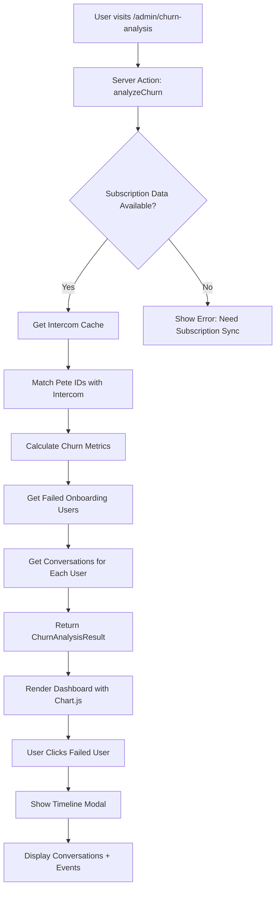

# Timeline & Churn Analysis Architecture

**Date**: 2025-09-30
**Status**: Planning Phase
**Goal**: Build timeline visualization + churn analysis system using existing Intercom data

---

## Vision

**User Request**: "show me failed onboarding - it can show users we lost and the conversations we had in support with them"

**Desired Features**:
1. **Timeline View** - Visualize user journey through conversations + events
2. **Churn Analysis** - Track when users quit (subscription canceled)
3. **Failed Onboarding Detection** - Identify users who churned during onboarding
4. **Conversation Context** - Show support conversations tied to each user/company
5. **Chart.js Visualization** - Visual charts for churn rate, trends, patterns

---

## What We Have Already Built

### ✅ Data Foundation (COMPLETE)
- **410 Contacts** cached from Intercom (cache/intercom-cache.json)
- **94 Companies** cached with Pete IDs, tags, segments, revenue
- **1022 Conversations** with full message history, timestamps, ratings
- **All custom attributes** exposed: user_training_topic, WebinarConfirmed, Petetraining, LastInvoiceUrl
- **Pete IDs linked** to Intercom IDs (external_id, company_id fields)
- **Tags & Segments** available for classification

### ✅ UI Pages Built (COMPLETE)
- `/admin/contacts` - Browse all 410 contacts with Pete IDs, tags, location
- `/admin/companies` - Browse all 94 companies with Pete IDs, plans, revenue
- `/admin/conversations` - Browse all 1022 conversations with state, ratings
- `/admin/onboarding-insights` - Conversation analysis with timeline data

### ✅ LangGraph AI Agent (COMPLETE)
- **PeteAI** (`src/services/langraph-agent.ts`) - Intelligent tool usage
- **7 tools** for searching contacts, companies, conversations, timelines
- **OpenRouter API** configured correctly (gpt-4o-mini)
- **fuzzy_search_company** - Handles typos, returns full company data
- **get_company_timeline** - Gets conversation history for a company
- **search_contacts** - Returns all contact fields including custom attributes

---

## What's Missing for Timeline/Churn

### ❌ Subscription/Cancellation Data
**Problem**: We don't have subscription cancellation dates in Intercom cache.

**What we need**:
- Pete subscription database or API
- Fields needed:
  - `subscription_start_date`
  - `subscription_end_date` (or `canceled_at`)
  - `subscription_status` (active/canceled/expired)
  - `cancellation_reason` (optional)

**Where this data comes from**:
- Pete's internal subscription system
- Stripe webhook events
- Custom attributes in Intercom if synced from Pete

**Action**: Need to identify where Pete stores subscription data and sync it to Intercom custom attributes OR build API integration.

### ❌ Timeline Visualization Component
**What we need**: React component to display user journey

**Proposed structure**:
```tsx
<UserTimeline userId="245">
  <TimelineEvent type="signup" date="2024-01-15" />
  <TimelineEvent type="onboarding_started" date="2024-01-16" />
  <TimelineEvent type="conversation" conversationId="123" date="2024-01-18" />
  <TimelineEvent type="subscription_active" date="2024-01-20" />
  <TimelineEvent type="conversation" conversationId="456" date="2024-02-05" />
  <TimelineEvent type="subscription_canceled" date="2024-02-10" reason="Too complex" />
</UserTimeline>
```

**Libraries to consider**:
- `react-vertical-timeline-component` - Clean timeline UI
- Or custom CSS with Chart.js for interactive timelines

### ❌ Churn Analysis Server Action
**What we need**: Calculate churn metrics

**Proposed action** (`src/actions/churn-analysis.ts`):
```typescript
export async function analyzeChurn(options: {
  startDate: Date;
  endDate: Date;
  segment?: string;
}) {
  // 1. Get all contacts with subscription data
  // 2. Filter by date range
  // 3. Calculate churn rate = (canceled / total active)
  // 4. Group by cancellation reasons
  // 5. Find conversations during onboarding period
  // 6. Return structured data for Chart.js

  return {
    churnRate: 12.5,  // percentage
    totalCanceled: 15,
    totalActive: 105,
    byReason: {
      'Too complex': 8,
      'Too expensive': 4,
      'Missing features': 3
    },
    byMonth: [
      { month: 'Jan 2024', churned: 2, active: 98 },
      { month: 'Feb 2024', churned: 5, active: 93 },
      // ...
    ],
    failedOnboarding: [
      {
        userId: '245',
        name: 'Matthew',
        company: 'MN Nice Home Buyers',
        cancellationDate: '2024-02-10',
        daysSinceSignup: 25,
        conversationCount: 12,
        lastConversationTopic: 'Data import errors',
        churnReason: 'Too complex'
      }
    ]
  };
}
```

### ❌ Churn Dashboard Page
**What we need**: `/admin/churn-analysis` page

**Features**:
- Chart.js visualizations:
  - Line chart: Churn rate over time
  - Bar chart: Churn by reason
  - Funnel chart: Onboarding drop-off points
- Table of churned users with timelines
- Filter by date range, segment, cancellation reason
- Click user → Show timeline modal
- PeteAI integration: "Show me why users are churning"

---

## Proposed Architecture



---

## Implementation Plan

### Phase 1: Data Foundation (1-2 days)
1. **Identify subscription data source**
   - Check Pete internal DB schema
   - Check Stripe integration
   - Check if subscription dates in Intercom custom attributes

2. **Sync subscription data to Intercom**
   - Create sync script if needed
   - OR build Pete API integration
   - Store in custom attributes: `subscription_start`, `subscription_status`, `canceled_at`, `cancellation_reason`

3. **Test data availability**
   - Query Intercom for subscription fields
   - Verify data accuracy

### Phase 2: Timeline Component (1 day)
1. **Build UserTimeline component** (`src/components/timeline/UserTimeline.tsx`)
   - Accept userId prop
   - Fetch user data + conversations
   - Render vertical timeline with events
   - Use icons for event types (💬 conversation, ✅ signup, ❌ cancel)

2. **Build TimelineEvent component**
   - Handle different event types
   - Show conversation excerpts
   - Link to conversation detail

3. **Test timeline rendering**
   - Show sample user journey
   - Verify all events display correctly

### Phase 3: Churn Analysis Engine (2-3 days)
1. **Build analyzeChurn action** (`src/actions/churn-analysis.ts`)
   - Calculate churn rate
   - Group by cancellation reasons
   - Find failed onboarding (churned within 30 days)
   - Get conversations for churned users

2. **Build getChurnedUserTimeline action**
   - Get all events for a specific user
   - Order chronologically
   - Return structured timeline data

3. **Test calculations**
   - Verify churn rate accuracy
   - Test edge cases (no cancellations, all churned, etc.)

### Phase 4: Dashboard UI (2-3 days)
1. **Build churn analysis page** (`/admin/churn-analysis`)
   - Stats cards: Total churned, churn rate, avg lifetime
   - Chart.js visualizations:
     - Churn trend line chart
     - Reasons bar chart
     - Onboarding funnel
   - Table of failed onboarding users
   - Date range picker

2. **Build timeline modal**
   - Opens when user clicks churned user
   - Shows full timeline with conversations
   - Links to contact detail page

3. **Style with Pete branding**
   - Purple gradients
   - Clean cards
   - Responsive design

### Phase 5: PeteAI Integration (1 day)
1. **Add churn analysis tools to LangGraph**
   - `analyze_churn_rate` tool
   - `find_failed_onboarding` tool
   - `get_user_timeline` tool

2. **Test AI queries**
   - "show me failed onboarding"
   - "why are users churning?"
   - "what conversations did churned users have?"

3. **Add tool descriptions**
   - Update SYSTEM_PROMPT with churn tools
   - Add examples of churn queries

---

## Data Structure

### ChurnAnalysisResult Type
```typescript
export interface ChurnAnalysisResult {
  dateRange: {
    start: Date;
    end: Date;
  };
  metrics: {
    totalUsers: number;
    activeUsers: number;
    churnedUsers: number;
    churnRate: number;  // percentage
    averageLifetimeDays: number;
  };
  byReason: Record<string, number>;
  byMonth: Array<{
    month: string;
    churned: number;
    active: number;
    churnRate: number;
  }>;
  failedOnboarding: Array<{
    userId: string;
    externalId?: string;  // Pete user ID
    name: string;
    email: string;
    company: string;
    companyId?: string;  // Pete company ID
    signupDate: Date;
    cancellationDate: Date;
    daysSinceSignup: number;
    conversationCount: number;
    conversations: Array<{
      id: string;
      createdAt: Date;
      topic: string;
      excerpt: string;
      state: string;
    }>;
    churnReason?: string;
    tags: string[];
    segments: string[];
  }>;
}
```

### UserTimelineData Type
```typescript
export interface UserTimelineData {
  userId: string;
  userName: string;
  userEmail: string;
  company: string;
  events: Array<{
    type: 'signup' | 'onboarding_started' | 'conversation' | 'subscription_active' | 'subscription_canceled' | 'custom_attribute_changed';
    date: Date;
    title: string;
    description?: string;
    conversationId?: string;
    metadata?: Record<string, any>;
  }>;
}
```

---

## Key Questions to Answer

### ❓ Where is Pete subscription data?
- Is it in a Pete database?
- Is it synced to Intercom?
- Do we need to build an integration?

### ❓ How do we determine "failed onboarding"?
**Proposed logic**:
- User canceled within 30 days of signup
- User had < 5 conversations
- User didn't complete onboarding questionnaire
- User has tag "Failed Onboarding" or "Churned Early"

### ❓ What cancellation reasons exist?
- Do we have structured cancellation reasons?
- Or free-text feedback?
- Are they in Intercom custom attributes?

### ❓ How do we link conversations to onboarding?
**Proposed**:
- Conversations within first 30 days = onboarding-related
- Conversations tagged with "Onboarding", "Setup", "Getting Started"
- Conversations with specific keywords (import, setup, configure)

---

## Technical Stack

### Frontend
- **React Server Components** - Next.js 15 pages
- **Chart.js** - Churn visualizations
- **react-vertical-timeline-component** OR custom CSS - Timeline UI
- **shadcn/ui** - Cards, tables, modals, date pickers

### Backend
- **Server Actions** - Next.js server-side logic
- **TypeScript** - Strict types for all data structures
- **Intercom Cache** - cache/intercom-cache.json as data source
- **Pete API** (if exists) - Subscription data integration

### AI Layer
- **LangGraph** - Agent framework
- **OpenRouter** - LLM provider (gpt-4o-mini)
- **Custom Tools** - Churn analysis, timeline retrieval

---

## Success Metrics

### User Can
- ✅ View churn rate over time (line chart)
- ✅ See why users are churning (bar chart by reason)
- ✅ Find users who failed onboarding (table with filters)
- ✅ Click a user → See their full timeline
- ✅ See conversations tied to each user
- ✅ Ask PeteAI: "show me failed onboarding" → Get structured answer

### Data Accuracy
- Churn rate matches manual calculation
- Failed onboarding users correctly identified
- Conversations properly linked to users
- Subscription dates accurate

### Performance
- Dashboard loads in < 2 seconds
- Timeline modal renders instantly
- Charts interactive and responsive
- AI queries return in < 5 seconds

---

## Next Steps (Immediate Actions)

1. **Investigate subscription data source** - Check Pete DB, Stripe, Intercom
2. **Document subscription fields** - What exists, what's missing
3. **Build data sync** - Get subscription data into Intercom cache
4. **Create timeline component** - Start with basic vertical timeline
5. **Build churn analysis action** - Calculate metrics from cache
6. **Create dashboard page** - Wire up UI with Chart.js

---

## Dependencies

### External
- Pete subscription database access OR API
- Stripe webhook integration (if subscription data from Stripe)

### Internal
- ✅ Intercom cache with contacts, companies, conversations
- ✅ PeteAI LangGraph agent
- ✅ Admin UI framework with shadcn/ui
- ✅ Server Actions infrastructure

### Libraries to Add
- `chart.js` + `react-chartjs-2` - Charts
- `date-fns` - Date manipulation
- `react-vertical-timeline-component` (optional) - Timeline UI

---

## Risk & Mitigation

### Risk: Subscription data not available
**Mitigation**:
- Start with conversation-based churn detection
- Use "last_seen_at" as proxy for churn (> 90 days inactive)
- Build subscription sync in parallel

### Risk: Churn reasons not structured
**Mitigation**:
- Use NLP to extract themes from cancellation conversations
- Add manual tagging workflow
- Build AI tool to categorize reasons

### Risk: Performance with 410+ contacts
**Mitigation**:
- Cache churn analysis results
- Paginate failed onboarding table
- Use React.memo for timeline events
- Implement date range filters to reduce dataset

---

**Bottom Line**: We have ALL the Intercom data needed for timeline visualization. The ONLY missing piece is subscription cancellation dates from Pete. Once we have that, we can build the churn dashboard in ~1 week.
