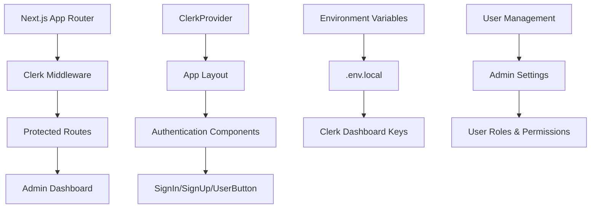

# Clerk Authentication Integration Plan

**Date:** 2025-01-30
**Status:** Planning Phase
**Priority:** High
**Branch:** Next-refactor

---

## 🎯 Project Overview

Integrate [Clerk](https://clerk.com/) authentication into the Pete Intercom Next.js application using the **App Router** approach. This will provide secure user authentication, session management, and user management capabilities.

## 📋 Current State Analysis

### ✅ What We Have

- Next.js 15 with App Router
- TypeScript configuration
- Existing admin dashboard structure
- Pete branding and UI components
- Environment variable management

### ❌ What We Need

- Clerk authentication system
- User session management
- Protected routes
- User management UI
- Integration with existing admin tools

---

## 🏗️ Implementation Architecture



---

## 📝 Implementation Stages

### Stage 1: Clerk Setup & Configuration

**Priority:** CRITICAL
**Branch:** `feat/clerk-setup`
**Estimated Time:** 2-3 hours

#### Tasks:

1. **Install Clerk SDK**

   - Install `@clerk/nextjs@latest`
   - Verify package installation

2. **Environment Configuration**

   - Create Clerk application in dashboard
   - Add environment variables to `.env.local`
   - Verify `.gitignore` excludes `.env*` files

3. **Middleware Setup**

   - Create `middleware.ts` with `clerkMiddleware()`
   - Configure route protection patterns
   - Test middleware functionality

4. **Provider Integration**
   - Wrap app with `<ClerkProvider>` in `app/layout.tsx`
   - Add authentication components to header
   - Test basic authentication flow

#### Files to Create/Modify:

- `package.json` - Add Clerk dependency
- `.env.local` - Add Clerk keys (not tracked)
- `middleware.ts` - NEW: Clerk middleware
- `app/layout.tsx` - Add ClerkProvider and auth components

#### Success Criteria:

- [ ] Clerk SDK installed successfully
- [ ] Environment variables configured
- [ ] Middleware protects admin routes
- [ ] Sign in/out functionality works
- [ ] User button displays correctly

---

### Stage 2: Protected Routes & Admin Access

**Priority:** HIGH
**Branch:** `feat/protected-routes`
**Estimated Time:** 3-4 hours

#### Tasks:

1. **Route Protection**

   - Protect all `/admin/*` routes
   - Add redirect logic for unauthenticated users
   - Configure public routes (home, auth pages)

2. **Admin Dashboard Integration**

   - Add user context to admin pages
   - Display user information in header
   - Add logout functionality

3. **Authentication Guards**

   - Create `requireAuth()` utility function
   - Add server-side auth checks
   - Handle authentication errors gracefully

4. **User Experience**
   - Add loading states during auth
   - Improve sign-in/sign-up UI
   - Add proper error handling

#### Files to Create/Modify:

- `src/middleware.ts` - Update route protection
- `src/app/admin/**/*.tsx` - Add auth guards
- `src/components/auth/` - NEW: Auth components
- `src/utils/auth.ts` - NEW: Auth utilities

#### Success Criteria:

- [ ] All admin routes require authentication
- [ ] Unauthenticated users redirected to sign-in
- [ ] User context available in admin pages
- [ ] Smooth authentication flow
- [ ] Proper error handling

---

### Stage 3: User Management & Settings

**Priority:** MEDIUM
**Branch:** `feat/user-management`
**Estimated Time:** 4-5 hours

#### Tasks:

1. **User Management UI**

   - Create user management page
   - Display user list and details
   - Add user role management

2. **Settings Integration**

   - Add Clerk settings to admin settings
   - Configure user permissions
   - Add organization management

3. **Profile Management**

   - User profile editing
   - Avatar upload functionality
   - Account settings

4. **Admin Controls**
   - User invitation system
   - Role-based access control
   - User activity monitoring

#### Files to Create/Modify:

- `src/app/admin/users/page.tsx` - NEW: User management
- `src/app/admin/settings/clerk/page.tsx` - NEW: Clerk settings
- `src/components/user-management/` - NEW: User components
- `src/actions/user-management.ts` - NEW: User actions

#### Success Criteria:

- [ ] User management interface functional
- [ ] Role-based permissions working
- [ ] User invitation system active
- [ ] Settings integration complete
- [ ] Profile management available

---

### Stage 4: Advanced Features & Integration

**Priority:** LOW
**Branch:** `feat/clerk-advanced`
**Estimated Time:** 3-4 hours

#### Tasks:

1. **Webhooks Integration**

   - Set up Clerk webhooks
   - Sync user data with Intercom
   - Handle user lifecycle events

2. **Custom Claims & Metadata**

   - Add custom user properties
   - Sync with PeteIRE data
   - Enhanced user profiles

3. **SSO Integration**

   - Configure social logins
   - Add enterprise SSO options
   - Multi-factor authentication

4. **Analytics & Monitoring**
   - User activity tracking
   - Authentication metrics
   - Security monitoring

#### Files to Create/Modify:

- `src/app/api/webhooks/clerk/route.ts` - NEW: Webhook handler
- `src/services/clerk-integration.ts` - NEW: Integration service
- `src/types/clerk.ts` - NEW: Clerk types
- `src/utils/webhooks.ts` - NEW: Webhook utilities

#### Success Criteria:

- [ ] Webhooks processing correctly
- [ ] User data synced with Intercom
- [ ] Custom claims working
- [ ] SSO options available
- [ ] Analytics dashboard functional

---

## 🔧 Technical Implementation Details

### Environment Variables Required

```bash
# .env.local (DO NOT COMMIT)
NEXT_PUBLIC_CLERK_PUBLISHABLE_KEY=pk_test_...
CLERK_SECRET_KEY=sk_test_...
NEXT_PUBLIC_CLERK_SIGN_IN_URL=/sign-in
NEXT_PUBLIC_CLERK_SIGN_UP_URL=/sign-up
NEXT_PUBLIC_CLERK_AFTER_SIGN_IN_URL=/admin
NEXT_PUBLIC_CLERK_AFTER_SIGN_UP_URL=/admin
```

### Middleware Configuration

```typescript
// middleware.ts
import { clerkMiddleware, createRouteMatcher } from '@clerk/nextjs/server';

const isProtectedRoute = createRouteMatcher(['/admin(.*)', '/api/admin(.*)']);

export default clerkMiddleware((auth, req) => {
  if (isProtectedRoute(req)) auth().protect();
});

export const config = {
  matcher: [
    // Skip Next.js internals and all static files, unless found in search params
    '/((?!_next|[^?]*\\.(?:html?|css|js(?!on)|jpe?g|webp|png|gif|svg|ttf|woff2?|ico|csv|docx?|xlsx?|zip|webmanifest)).*)',
    // Always run for API routes
    '/(api|trpc)(.*)',
  ],
};
```

### Layout Integration

```typescript
// app/layout.tsx
import { ClerkProvider } from '@clerk/nextjs';
import { Header } from '@/components/header';

export default function RootLayout({
  children,
}: {
  children: React.ReactNode;
}) {
  return (
    <ClerkProvider>
      <html lang="en">
        <body>
          <Header />
          {children}
        </body>
      </html>
    </ClerkProvider>
  );
}
```

---

## 🎨 UI Components Plan

### Authentication Components

```typescript
// src/components/auth/AuthButton.tsx
import {
  SignInButton,
  SignUpButton,
  UserButton,
  SignedIn,
  SignedOut,
} from '@clerk/nextjs';

export function AuthButton() {
  return (
    <>
      <SignedOut>
        <SignInButton mode="modal">
          <Button variant="outline">Sign In</Button>
        </SignInButton>
        <SignUpButton mode="modal">
          <Button>Sign Up</Button>
        </SignUpButton>
      </SignedOut>
      <SignedIn>
        <UserButton
          appearance={{
            elements: {
              avatarBox: 'w-8 h-8',
            },
          }}
        />
      </SignedIn>
    </>
  );
}
```

### Protected Route Wrapper

```typescript
// src/components/auth/ProtectedRoute.tsx
import { auth } from '@clerk/nextjs/server';
import { redirect } from 'next/navigation';

export async function ProtectedRoute({
  children,
}: {
  children: React.ReactNode;
}) {
  const { userId } = await auth();

  if (!userId) {
    redirect('/sign-in');
  }

  return <>{children}</>;
}
```

---

## 📊 Success Metrics

### Technical Metrics

- [ ] Authentication flow completes in <2 seconds
- [ ] All admin routes properly protected
- [ ] Zero authentication-related errors
- [ ] User sessions persist correctly
- [ ] Webhook processing <1 second

### User Experience Metrics

- [ ] Sign-in process intuitive
- [ ] User management interface functional
- [ ] Role-based access working
- [ ] Profile management available
- [ ] Admin controls accessible

### Security Metrics

- [ ] All sensitive routes protected
- [ ] User data properly secured
- [ ] Session management secure
- [ ] Webhook validation working
- [ ] No authentication bypasses

---

## 🚨 Critical Requirements

### Security Considerations

1. **Environment Variables**: Never commit real keys to repository
2. **Route Protection**: All admin routes must be protected
3. **User Data**: Proper handling of sensitive information
4. **Webhooks**: Secure webhook endpoint validation
5. **Session Management**: Proper session handling and cleanup

### Performance Requirements

1. **Fast Authentication**: <2 second sign-in process
2. **Efficient Middleware**: Minimal performance impact
3. **Optimized Components**: Lazy loading where appropriate
4. **Caching**: Proper caching of user data
5. **Error Handling**: Graceful error recovery

---

## 🔗 Integration Points

### Existing Systems

- **Admin Dashboard**: Integrate with existing admin tools
- **Intercom Cache**: Sync user data with Intercom
- **Settings System**: Add Clerk settings to existing settings
- **UI Components**: Use existing shadcn/ui components
- **Pete Branding**: Maintain consistent Pete styling

### Future Enhancements

- **Multi-tenant Support**: Organization-based access
- **Advanced Permissions**: Granular role management
- **Audit Logging**: User action tracking
- **API Integration**: Clerk API for advanced features
- **Custom Domains**: Branded authentication pages

---

## 📝 Notes

### Development Guidelines

- Always use latest Clerk SDK version
- Follow App Router patterns exclusively
- Maintain type safety throughout
- Test authentication flows thoroughly
- Document all custom implementations

### Testing Strategy

- Unit tests for auth utilities
- Integration tests for protected routes
- E2E tests for authentication flows
- Security testing for route protection
- Performance testing for middleware

---

## 🚀 Next Steps

1. **Create GitHub Issues** for each stage
2. **Set up Clerk Dashboard** account
3. **Install Clerk SDK** and configure environment
4. **Implement Stage 1** (Setup & Configuration)
5. **Test authentication flow** thoroughly
6. **Proceed to Stage 2** (Protected Routes)

---

_This plan ensures secure, scalable authentication integration while maintaining the existing Pete Intercom application architecture and user experience._
