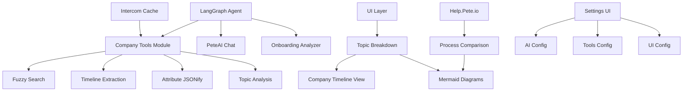

# Company Timeline Analysis System - Development Plan

## 🎯 Project Overview
Build a smart NLP-based onboarding analysis system that:
- Groups conversations by company_id to show complete company timelines
- Uses LangGraph agent with specialized tools for data extraction
- Provides topic-specific analysis with visual Mermaid diagrams
- Compares actual process vs documented process (help.thepete.io)
- Maintains type safety across all components
- Provides UI configuration for all settings

## 📊 System Architecture



## 🏗️ What We Already Have (Analysis)

### ✅ Existing Infrastructure
1. **Intercom Cache System** (`src/services/intercom.ts`)
   - Caches conversations, contacts, companies
   - Already populated with data
   - Good performance

2. **Type System** (`src/types/index.ts`)
   - `IntercomConversation` (HAS priority property - line 226)
   - `IntercomContact`
   - `IntercomCompany`
   - All properly typed

3. **Company Lookup Actions** (`src/actions/company-lookup.ts`)
   - `searchCompanyByName()` - exact match only
   - `getCompanyById()`
   - `updateCompanyAttributes()`
   - `listCompanies()`

4. **Onboarding Analysis** (`src/actions/onboarding-analysis.ts`)
   - Analyzes conversations for onboarding keywords
   - Groups by topics
   - Generates Mermaid diagrams
   - **NOT yet grouped by company_id**

5. **UI Components**
   - shadcn/ui configured
   - Settings page with UI config
   - Mermaid diagram renderer
   - Topic breakdown filters

6. **Company Tools Module** (`src/services/company-tools.ts`)
   - ✅ JUST CREATED
   - `fuzzySearchCompany()` - handles partial matches
   - `getCompanyTimeline()` - full company conversation history
   - `extractCompanyAttributes()` - JSONifies company data
   - `analyzeTopicByCompany()` - groups topic by companies

### ❌ What's Missing

1. **LangGraph Integration**
   - Tools not yet integrated into agent
   - PeteAI can't access company tools
   - No structured tool calling

2. **Company-Grouped Analysis**
   - Topic breakdown doesn't group by company
   - No company timeline view in UI
   - No per-company Mermaid diagrams

3. **Help Docs Comparison**
   - Can't fetch help.thepete.io content
   - No comparison logic
   - No diff visualization

4. **Settings UI for Agent**
   - No AI config in settings
   - No tools config visibility
   - Can't see what PeteAI has access to

5. **Build Error**
   - TypeScript claims `priority` doesn't exist
   - But it DOES exist in types (line 226)
   - Likely cache/build issue

## 📝 Development Stages

### Stage 1: Fix Build & Type Issues ⚠️ CRITICAL
**Priority**: IMMEDIATE
**Branch**: `fix/typescript-build-error`

#### Tasks:
1. Verify IntercomConversation type exports correctly
2. Check if cache types match runtime types
3. Add explicit type assertion if needed
4. Test build passes

**Files**:
- `src/types/index.ts` - verify exports
- `src/actions/conversations.ts:77` - add type guard if needed

**GitHub Issue**: #TBD

---

### Stage 2: Enhanced Company Search (PeteAI Fix)
**Priority**: HIGH
**Branch**: `feat/fuzzy-company-search`

#### Tasks:
1. Integrate `fuzzySearchCompany()` into PeteAI
2. Update LangGraph agent with company search tool
3. Test "stkcam" → finds "Stkcam" company
4. Show company_id in results

**Files**:
- `src/services/langraph-agent.ts` - add tool
- `src/services/onboarding-agent.ts` - add tool
- Test in PeteAI chat

**GitHub Issue**: #TBD

---

### Stage 3: Company Timeline View
**Priority**: HIGH
**Branch**: `feat/company-timeline-ui`

#### Tasks:
1. Create `/admin/companies/[id]/timeline` page
2. Display all conversations for company
3. Show contact list
4. Topic breakdown chart
5. Timeline visualization

**Files**:
- `src/app/admin/companies/[id]/timeline/page.tsx` - NEW
- Uses `getCompanyTimeline()` tool

**GitHub Issue**: #TBD

---

### Stage 4: Topic-by-Company Analysis
**Priority**: MEDIUM
**Branch**: `feat/topic-company-grouping`

#### Tasks:
1. Update onboarding insights to group by company
2. Show companies per topic
3. Drill-down to company timeline
4. Update Mermaid diagrams

**Files**:
- `src/actions/onboarding-analysis.ts` - enhance
- `src/app/admin/onboarding-insights/page.tsx` - update UI

**GitHub Issue**: #TBD

---

### Stage 5: Settings UI for Agent Config
**Priority**: MEDIUM
**Branch**: `feat/agent-config-ui`

#### Tasks:
1. Add AI Config to `/admin/settings`
2. Show available tools
3. Configure model, temperature, tokens
4. Tool enable/disable toggles

**Files**:
- `src/types/ui-config.ts` - add AIConfig type
- `src/actions/ui-config.ts` - add AI config CRUD
- `src/app/admin/settings/ai/page.tsx` - NEW

**GitHub Issue**: #TBD

---

### Stage 6: Help Docs Comparison
**Priority**: LOW
**Branch**: `feat/help-docs-comparison`

#### Tasks:
1. Create WebFetch tool for help.thepete.io
2. Parse documentation structure
3. Compare actual vs documented process
4. Show diff in UI

**Files**:
- `src/services/help-docs-fetcher.ts` - NEW
- `src/actions/onboarding-analysis.ts` - add comparison
- UI components for diff view

**GitHub Issue**: #TBD

---

## 🎨 UI Component Plan

### Company Timeline Page Component Tree
```
CompanyTimelinePage
├── CompanyHeader
│   ├── CompanyName
│   ├── CompanyStats (users, conversations)
│   └── CompanyActions
├── TimelineChart (visual timeline)
├── TopicBreakdown (topics for this company)
├── ConversationList
│   └── ConversationCard[]
└── ContactList
    └── ContactCard[]
```

### Settings AI Config Component Tree
```
AIConfigPage
├── ModelSelector (dropdown)
├── TemperatureSlider
├── MaxTokensInput
├── ToolsConfig
│   └── ToolToggle[] (enable/disable each tool)
└── SaveButton
```

## 🔧 GitHub Workflow

### Process:
1. Create issue for each stage
2. Create feature branch
3. Implement with commits
4. Test locally
5. Push commits
6. Create PR
7. Mark issue complete
8. Link commits to DEV_MAN plan
9. Merge to Next-refactor

### Commands:
```bash
# Create issue
gh issue create --title "Fix TypeScript build error in conversations.ts" \\
  --body "IntercomConversation priority property type mismatch" \\
  --label "bug,typescript"

# Create branch
git checkout -b fix/typescript-build-error

# After commits
git push origin fix/typescript-build-error

# Create PR
gh pr create --base Next-refactor --fill

# Close issue when done
gh issue close <issue-number> --comment "Fixed in commit abc123"
```

## 📋 Type Safety Checklist

- [ ] All company tools return typed results
- [ ] LangGraph tools have proper schemas
- [ ] UI components use proper types
- [ ] No `any` types in production code
- [ ] API responses validated with Zod (if needed)
- [ ] Settings config is typed
- [ ] Agent tools are typed

## 🎯 Success Criteria

### Stage 1 (Build Fix)
- [ ] `pnpm build` succeeds
- [ ] No TypeScript errors
- [ ] Deploy to Render works

### Stage 2 (Company Search)
- [ ] PeteAI can find "stkcam" → shows company_id
- [ ] Fuzzy search works with partial names
- [ ] Returns company attributes

### Stage 3 (Timeline View)
- [ ] Can view full company history
- [ ] Shows all conversations chronologically
- [ ] Displays contacts and topics
- [ ] Visual timeline renders

### Stage 4 (Topic Grouping)
- [ ] Topics show which companies affected
- [ ] Can drill down to company view
- [ ] Mermaid diagrams update per company

### Stage 5 (Agent Settings)
- [ ] Can configure AI model
- [ ] Can see available tools
- [ ] Settings persist
- [ ] UI updates globally

### Stage 6 (Help Docs)
- [ ] Fetches help.thepete.io content
- [ ] Compares actual vs documented
- [ ] Shows differences
- [ ] Suggests improvements

## 📝 Notes

- Always check existing code before building
- Reuse components and patterns
- Keep type safety at all times
- Add UI for every config option
- Document as you go
- Test incrementally
- Commit often with clear messages

## 🔗 Related Files

- `CLAUDE.md` - Project instructions
- `nextjs-migration-plan.md` - Overall architecture
- Type definitions: `src/types/index.ts`
- Intercom cache: `src/services/intercom.ts`
- Company tools: `src/services/company-tools.ts`