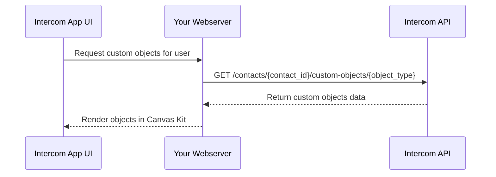
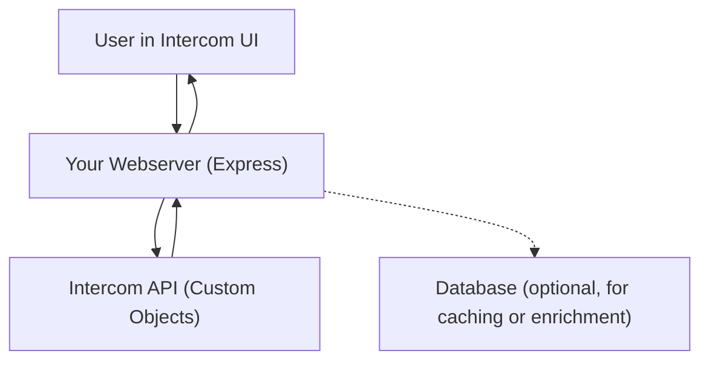

# Chapter 2: Custom Objects in Intercom – Storage, Fetching, and Mutability 🧱

## Introduction

Custom objects in Intercom allow you to store structured, app-specific data (like subscriptions, devices, or preferences) that can be linked to users, companies, or conversations. Understanding how Intercom stores, retrieves, and manages these objects is crucial for building powerful, data-driven apps.

---

## Core Concepts: The Lego Analogy 🧱

Think of custom objects as Lego bricks:

- **Each object** is a brick with a unique shape (schema).
- **Attributes** are the studs and holes—defining how bricks (objects) connect to users or other data.
- **APIs** are your hands—assembling, modifying, or inspecting the Lego structure.

**Reference:**

- [Intercom Custom Objects Docs](https://developers.intercom.com/docs/custom-objects-overview)

---

## How Intercom Stores Custom Objects

- **Schema Definition:**  
  You define a custom object schema (the "shape" of your Lego brick) via the Intercom API or dashboard. This includes the object's name, attributes, and relationships.
- **Data Storage:**  
  Intercom stores each object instance in its backend, indexed by a unique identifier. Objects can be linked to contacts, companies, or conversations.
- **Persistence:**  
  All custom objects are stored in Intercom's cloud infrastructure, ensuring durability and availability.

**Key Properties:**

- Each object has a unique `id`.
- Attributes are defined by the schema.
- Relationships (links) connect objects to users, companies, etc.

---

## Are Custom Objects Immutable?

**No, custom objects in Intercom are mutable.**

- You can create, update, and delete custom object instances via the API.
- Schema changes (adding/removing attributes) are also possible, but should be done with care.

**Best Practice:**

- Treat schema changes as migrations—plan and test before applying to production.

---

## Fetching Custom Objects for the UI

To display custom objects in your Intercom app UI, you need to fetch them from Intercom's API:

### 1. Fetch by Object Type

**Endpoint:**  
`GET /custom-objects/{object_type}`  
Returns a list of all objects of a given type.

### 2. Fetch by ID

**Endpoint:**  
`GET /custom-objects/{object_type}/{object_id}`  
Returns a specific object instance.

### 3. Fetch Linked to a User

**Endpoint:**  
`GET /contacts/{contact_id}/custom-objects/{object_type}`  
Returns all custom objects of a type linked to a specific contact.

**Reference:**

- [Custom Objects API Reference](https://developers.intercom.com/reference/get_custom_objects)

---

## Mermaid Diagram: Fetching Custom Objects



---

## App Diagram: Data Flow



---

## Code Example: Fetching Custom Objects (Node.js/Express + Axios)

```js
const axios = require('axios');

async function fetchUserCustomObjects(contactId, objectType) {
  const url = `https://api.intercom.io/contacts/${contactId}/custom-objects/${objectType}`;
  const response = await axios.get(url, {
    headers: {
      Authorization: `Bearer ${process.env.INTERCOM_TOKEN}`,
      Accept: 'application/json',
    },
  });
  return response.data;
}
```

---

## Real-World Use Case

**Example:**  
A SaaS dashboard tracks user subscriptions as custom objects. When a user opens the Intercom Messenger, your app fetches their subscription objects and displays them in a Canvas Kit card, allowing support agents to see and act on the latest subscription data.

---

## Updating and Creating Custom Object Instances in Intercom

### Can you dynamically create or update a PeteUserTrainingTopic custom object via the API?

**Yes, you can dynamically create or update a custom object instance (such as PeteUserTrainingTopic) using the Intercom REST API.**

To create or update a custom object instance, use the following endpoint:

```
POST /custom_object_instances/{custom_object_type_identifier}
```

- Replace `{custom_object_type_identifier}` with your object type, e.g., `PeteUserTrainingTopic`.
- The payload must include at least an `external_id` and can include any custom attributes defined in your schema (such as `Title`, `external_created_at`, `external_updated_at`).

**Example (using axios in Node.js):**

```js
const axios = require('axios');

async function createOrUpdatePeteUserTrainingTopic(
  externalId,
  title,
  createdAt,
  updatedAt
) {
  const url =
    'https://api.intercom.io/custom_object_instances/PeteUserTrainingTopic';
  const payload = {
    external_id: externalId,
    external_created_at: createdAt,
    external_updated_at: updatedAt,
    custom_attributes: {
      Title: title,
    },
  };
  const response = await axios.post(url, payload, {
    headers: {
      Authorization: `Bearer ${process.env.INTERCOM_TOKEN}`,
      'Content-Type': 'application/json',
      'Intercom-Version': '2.13',
    },
  });
  return response.data;
}
```

- If an instance with the given `external_id` exists, it will be updated. If not, a new instance will be created.
- You can call this endpoint from your webserver or backend to keep Intercom in sync with your external system.

**Reference:**

- [Create or Update Custom Object Instance (Intercom Docs)](https://developers.intercom.com/docs/references/rest-api/api.intercom.io/custom-object-instances/custom_object_instance)

### Do custom objects have to be tied to a user?

**No, custom objects do not have to be tied to a user.**

- Custom object instances can exist independently in Intercom.
- However, you can optionally link (associate) custom object instances to users (contacts), companies, or conversations for richer data relationships.
- Linking is done via relationship attributes defined in your custom object schema and managed via the API.

**Use Case:**

- You might have a PeteUserTrainingTopic that is not yet assigned to any user, or you might link it to a user when relevant (e.g., when a user completes a training topic).

**Summary Table:**
| Action | API Supported? | UI Supported? |
|--------|---------------|---------------|
| Create new custom object instance | ✅ | ✅ |
| Update existing custom object instance | ✅ | ✅ |
| Link custom object to user/contact | ✅ | ✅ (if schema allows) |
| Standalone custom object (no user) | ✅ | ✅ |

---

## Q&A

```json
{
  "questions": [
    {
      "question": "Are Intercom custom objects immutable?",
      "answer": "No, they are mutable—you can create, update, and delete them via the API."
    },
    {
      "question": "How do you fetch all custom objects of a type linked to a user?",
      "answer": "Use GET /contacts/{contact_id}/custom-objects/{object_type}."
    },
    {
      "question": "What should you consider before changing a custom object schema?",
      "answer": "Treat schema changes as migrations—plan and test before applying to production."
    },
    {
      "question": "Where are custom objects stored?",
      "answer": "In Intercom's cloud backend, indexed by unique IDs."
    }
  ]
}
```

---

**Did this chapter clarify how Intercom stores and fetches custom objects? Let me know if you need more details or examples! 🚀**  
**Do you need clarification on any part of this chapter before moving forward? ✅**

**Did this answer clarify how to update and create custom objects in Intercom, and whether they must be tied to users? Let me know if you need more details or examples! 🚀**
