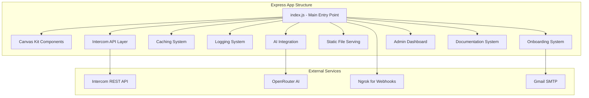
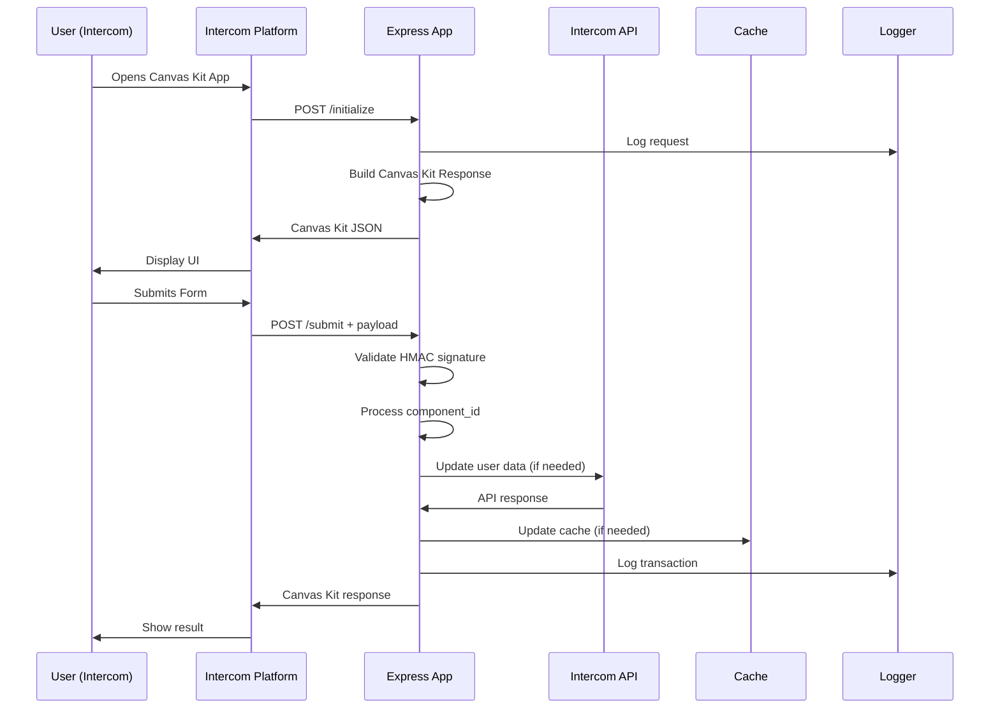

# Express App Analysis - Complete Feature Inventory

*Generated: 2025-09-29*

## Overview

This document provides a comprehensive line-by-line analysis of the Pete Intercom Express application, cataloging every feature, endpoint, service, and dependency to ensure complete migration coverage to Next.js.

## Application Architecture



## Core Files Analysis

### 1. Main Application (`src/index.js`) - 992 lines

**Key Features:**
- Express.js server with body parsing
- Canvas Kit validation middleware with HMAC-SHA256 signature verification
- Onboarding questionnaire system with 7-level structure
- Static file serving from `/public` directory
- Webhook handling and route registration
- Real-time logging and debugging

**Critical Components:**
```javascript
// Line 76-88: Signature validation middleware
function validateSignature(req, res, next) {
  const signature = req.header('X-Body-Signature');
  const rawBody = JSON.stringify(req.body);
  const hmac = crypto.createHmac('sha256', CLIENT_SECRET);
  hmac.update(rawBody, 'utf8');
  const digest = hmac.digest('hex');
  if (digest !== signature) {
    return res.status(401).json({ error: 'Invalid signature' });
  }
  next();
}
```

**All Endpoints Discovered:**

#### Canvas Kit Endpoints
- `POST /initialize` - Canvas Kit initialization with main menu
- `POST /submit` - Canvas Kit form submission handler
- `POST /pete-user-training` - Training topic input form

#### API Endpoints
- `GET /api/endpoints` - Lists all registered routes
- `GET /api/intercom/cache/status` - Cache status information
- `GET /api/intercom/contacts/test` - Contact testing endpoint
- `POST /bulk-update-training-topic` - Bulk user training updates

#### Static/UI Endpoints
- `GET /` - Main landing page
- `GET /popout` - Standalone onboarding form
- `POST /popout-submit` - Process popout form submissions
- `GET /hooks` - Display current webhook endpoints
- `GET /logs` - Application logs viewer
- `GET /logs/:type` - Specific log file viewer
- `GET /get-user-training-topic` - Retrieve user training topic

#### Admin Panel Endpoints
- `GET /admin/` - Admin menu
- `GET /admin/training` - Training management
- `GET /admin/support` - Support dashboard
- `GET /admin/health` - Health check dashboard
- `GET /admin/logs` - Admin logs viewer
- `GET /admin/peteAI` - AI interface
- `GET /admin/testapi` - API testing interface

#### Documentation System
- `GET /whatsworking` - Markdown documentation with Mermaid rendering
- `GET /docs/*` - Generic markdown viewer for DEV_MAN
- `GET /devman/` - Documentation index
- `GET /testapi` - API testing page

#### Health & Monitoring
- `GET /health` - Application health status with uptime
- `POST /webhooks` - Webhook receiver

**Environment Variables Required:**
```bash
INTERCOM_CLIENT_SECRET    # Canvas Kit signature validation
INTERCOM_ACCESS_TOKEN     # API authentication
INTERCOM_CLIENT_ID        # App identification
PORT                      # Server port (default: 4000)
NODE_ENV                  # Environment mode
EMAIL_USER               # Gmail SMTP user
EMAIL_PASS               # Gmail SMTP password
USER_ID                  # Fallback Intercom user ID
WORKSPACE_ID             # Intercom workspace
```

### 2. Canvas Kit Components (`src/intercom/canvasKit.js`) - 76 lines

**Features:**
- Text component builder with styling
- Button component with action types (submit, url)
- Input component with validation
- Error response builder
- Canvas Kit response formatter
- Debug logging for all outgoing responses

**Component Types Supported:**
- `text` - With styles: header, error, muted
- `button` - With actions: submit, url (with new_tab support)
- `input` - With required field validation
- Complete Canvas Kit response wrapper

### 3. Intercom API Layer (`src/api/intercom.js`) - 363 lines

**Core Functionality:**
- Paginated data fetching with automatic continuation
- Authentication header management
- Response array extraction from various API formats
- Error handling and logging
- Proxy GET requests with query parameter support

**API Endpoints Wrapped:**
- `/admins` - Admin management
- `/contacts` - User/contact management
- `/companies` - Company data
- `/conversations` - Conversation data
- `/me` - Current user info
- AI Content endpoints: `/ai/content_import_sources`, `/ai/external_pages`

**Advanced Features:**
- Search functionality with live/cache toggle
- Bulk operations support
- Training topic management
- Custom attribute updates

### 4. Caching System (`src/api/intercomCache.js`) - 124 lines

**Cache Implementation:**
- In-memory storage for contacts, companies, admins, conversations
- Automatic refresh with Promise.all parallel loading
- Pagination handling with object-based and string-based next URLs
- Array extraction from various Intercom response formats
- Last refresh timestamp tracking

**Cache Operations:**
- `refreshCache()` - Full cache refresh
- `getCache()` - Current cache access
- `getCacheStatus()` - Cache statistics

### 5. Logging System (`src/utils/logger.js`) - 33 lines

**Logging Features:**
- File-based logging with automatic directory creation
- Log levels: INFO, ERROR, DEBUG
- Timestamp formatting
- Environment-aware console output
- Multiple log file support (app.log, api.log)

### 6. AI Integration (`src/ai/peteai.js`) - 32 lines

**PeteAI Implementation:**
- OpenRouter integration with Llama 3.2 3B model
- Express router for `/PeteAI/` endpoint
- Error handling and response formatting
- Environment-based configuration

### 7. Onboarding System (`src/onboarding_questions.json`) - 156 lines

**Questionnaire Structure:**
- 4 main sections with 35 total questions
- Current Systems (11 questions)
- Items Needed From Them (2 questions)
- Questions (22 questions)
- Info for them (3 questions)

**Question Format:**
```json
{
  "shorthand": "Brief identifier",
  "detailed": "Full question text with context"
}
```

## Dependencies Analysis

### Production Dependencies (25 packages)
```json
{
  "axios": "^1.9.0",           // HTTP client for API calls
  "body-parser": "^1.20.2",   // Express body parsing
  "chalk": "5",                // Terminal styling
  "chart.js": "^4.5.0",       // Chart generation
  "dotenv": "^16.3.1",        // Environment variables
  "express": "^4.18.2",       // Web framework
  "marked": "^16.0.0",        // Markdown parsing
  "mermaid": "^11.8.0",       // Diagram rendering
  "node-fetch": "^3.3.2",     // Fetch polyfill (NOT needed in Next.js)
  "nodemailer": "^6.9.0",     // Email sending
  "nodemon": "^3.1.10",       // Development auto-restart
  "openai": "^5.8.4",         // OpenAI/OpenRouter client
  "uuid": "^11.1.0"           // UUID generation
}
```

### Development Dependencies (3 packages)
```json
{
  "@eslint/js": "^9.30.1",
  "eslint": "^9.30.1",
  "globals": "^16.3.0"
}
```

## Data Flow Analysis



## File System Structure

```
intercomApp/
├── src/
│   ├── index.js                 # Main application (992 lines)
│   ├── intercom/
│   │   └── canvasKit.js         # Canvas Kit helpers (76 lines)
│   ├── api/
│   │   ├── intercom.js          # API routes (363 lines)
│   │   └── intercomCache.js     # Caching system (124 lines)
│   ├── ai/
│   │   └── peteai.js           # AI integration (32 lines)
│   ├── utils/
│   │   ├── logger.js           # Logging system (33 lines)
│   │   ├── chart.js            # Chart utilities
│   │   ├── codeMap.js          # Code mapping
│   │   └── waitRender.js       # Rendering utilities
│   ├── scripts/                # Bash utilities (15+ scripts)
│   │   ├── get_admins.sh
│   │   ├── update_user_training_topic.sh
│   │   ├── get_contact_id_by_email.sh
│   │   └── ...
│   ├── tests/
│   │   ├── endpoint_health_test.js
│   │   └── dev_with_health_check.mjs
│   └── onboarding_questions.json
├── public/                     # Static assets
│   ├── index.html
│   ├── admin/                  # Admin dashboard files
│   └── globals.css
├── package.json
├── start.sh                    # Production starter
└── README.md
```

## Security Implementation

**Signature Validation:**
- HMAC-SHA256 verification for all Canvas Kit requests
- CLIENT_SECRET-based signature generation
- Raw body JSON string hashing
- Automatic rejection of invalid signatures

**Environment Security:**
- All secrets in environment variables
- No hardcoded tokens or credentials
- Access token substring logging (first 8 chars only)

## Critical Integration Points

1. **Canvas Kit Compliance:** Strict adherence to Intercom Canvas Kit specifications
2. **Webhook Validation:** Required signature validation for security
3. **Intercom API Integration:** Full REST API wrapper with caching
4. **Email Integration:** Nodemailer for onboarding notifications
5. **AI Integration:** OpenRouter for PeteAI functionality
6. **Static File Serving:** Public directory hosting
7. **Markdown Processing:** DEV_MAN documentation system

## Performance Considerations

- **Caching Strategy:** In-memory cache with refresh capabilities
- **Pagination Handling:** Automatic continuation for large datasets
- **Parallel Loading:** Promise.all for cache refresh
- **Logging Optimization:** File-based logging with environment awareness
- **Static Asset Serving:** Express.static middleware

---

*This analysis represents a complete inventory of the Express application as of the pre-Next.js migration baseline. Every endpoint, feature, and integration point has been catalogued for migration planning.*