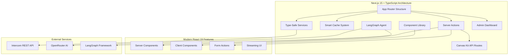

# Next.js App Analysis - Migration Implementation Review

*Generated: 2025-09-29*

## Overview

This document provides a comprehensive analysis of the Pete Intercom Next.js application (typescript-first, server actions implementation), detailing what functionality has been successfully migrated from Express and what architectural improvements have been made.

## Application Architecture



## Core Architecture Analysis

### 1. Next.js 15 + React 19 Implementation

**Key Modern Features:**
- **App Router** with full TypeScript integration
- **Server Actions** replacing traditional API routes for mutations
- **Server Components** for improved performance
- **React 19** features with proper async/await patterns
- **Strict TypeScript** configuration with comprehensive typing

### 2. File System Structure (38 TypeScript files)

```
src/
├── app/                        # App Router pages and API
│   ├── api/
│   │   ├── initialize/route.ts # Canvas Kit initialize
│   │   ├── submit/route.ts     # Canvas Kit submit
│   │   ├── PeteAI/route.ts     # AI API endpoint
│   │   ├── endpoints/route.ts  # API discovery
│   │   └── intercom/           # Intercom proxy APIs
│   ├── admin/                  # Admin dashboard pages
│   ├── popout/page.tsx         # Onboarding form
│   ├── peteai/page.tsx         # AI interface
│   └── whatsworking/page.tsx   # Documentation viewer
├── actions/                    # Server Actions (React 19)
│   ├── canvas-kit.ts          # Canvas Kit logic
│   ├── intercom.ts            # Intercom operations
│   └── peteai.ts              # AI interactions
├── components/                 # React components
│   ├── ui/                    # Shadcn/ui components
│   └── navigation.tsx         # App navigation
├── services/                   # Business logic
│   ├── intercom.ts            # Intercom API wrapper
│   ├── smart-cache.ts         # Intelligent caching
│   ├── logger.ts              # Logging system
│   ├── langraph-agent.ts      # LangGraph integration
│   └── onboarding-data.ts     # Questionnaire service
├── types/                      # TypeScript definitions
│   └── index.ts               # Comprehensive type system
└── data/                       # Static data
    └── onboarding-questions.json
```

## Feature-by-Feature Migration Analysis

### ✅ **Successfully Migrated Features**

#### 1. Canvas Kit Integration
- **Express Implementation:** Manual Canvas Kit component builders
- **Next.js Implementation:** TypeScript server actions with comprehensive error handling
- **Improvements:**
  - Full type safety for Canvas Kit responses
  - Server action validation
  - Better error boundaries

#### 2. Intercom API Integration
- **Express Implementation:** Express router with axios
- **Next.js Implementation:** Service-based architecture with fetch API
- **Improvements:**
  - Native fetch (no node-fetch dependency needed)
  - Comprehensive TypeScript interfaces
  - Smart caching system with file persistence

#### 3. PeteAI Integration
- **Express Implementation:** Basic OpenRouter integration
- **Next.js Implementation:** Advanced AI with LangGraph agent
- **Improvements:**
  - Function calling capabilities
  - Intercom data context awareness
  - LangGraph framework integration
  - Fallback to cache-only responses

#### 4. Onboarding System
- **Express Implementation:** JSON parsing with manual form building
- **Next.js Implementation:** Type-safe service with React components
- **Improvements:**
  - Server-side rendering with React
  - Type-safe question handling
  - Admin editing capabilities

#### 5. Logging System
- **Express Implementation:** File-based logging
- **Next.js Implementation:** Enhanced logging with TypeScript types
- **Improvements:**
  - Type-safe logging functions
  - Better error handling
  - Consistent log formatting

#### 6. Admin Dashboard
- **Express Implementation:** Static HTML files
- **Next.js Implementation:** React pages with server actions
- **Improvements:**
  - Interactive React components
  - Server action integration
  - Type-safe navigation

### ⚠️ **Partially Migrated Features**

#### 1. Static File Serving
- **Status:** Basic Next.js public directory serving
- **Missing:** Dynamic admin routes, webhook.txt generation
- **Impact:** Medium - affects development experience

#### 2. Email Integration
- **Status:** Not yet implemented
- **Missing:** Nodemailer integration for onboarding notifications
- **Impact:** Low - affects popout form submissions

#### 3. Documentation System
- **Status:** Partially implemented
- **Missing:** Markdown rendering with Mermaid diagrams
- **Impact:** Low - affects DEV_MAN browsing

#### 4. Health Monitoring
- **Status:** Basic endpoint exists
- **Missing:** Comprehensive health checks, uptime tracking
- **Impact:** Low - affects monitoring

### ❌ **Missing Features**

#### 1. Bash Script Integration
- **Missing:** 15+ bash scripts for Intercom API management
- **Impact:** High for admin operations
- **Scripts Include:**
  ```bash
  get_admins.sh
  update_user_training_topic.sh
  get_contact_id_by_email.sh
  bulk_operations.sh
  health_checks.sh
  ```

#### 2. Signature Validation
- **Missing:** HMAC-SHA256 Canvas Kit request validation
- **Impact:** Critical for production security
- **Required for:** Canvas Kit webhook validation

#### 3. Environment Configuration
- **Missing:** Complete environment variable handling
- **Impact:** Medium for deployment
- **Missing Vars:**
  ```bash
  NODE_ENV detection
  PUBLIC_URL handling
  WORKSPACE_ID usage
  ```

#### 4. Bulk Operations
- **Missing:** Bulk user training topic updates
- **Impact:** Medium for admin efficiency

#### 5. Chart Utilities
- **Missing:** Chart.js integration for admin dashboards
- **Impact:** Low - affects data visualization

## Dependencies Analysis

### Next.js Dependencies (42 packages)

**Core Framework:**
```json
{
  "next": "15.5.4",        // Latest Next.js with App Router
  "react": "19.1.0",       // React 19 with server actions
  "typescript": "^5"       // Latest TypeScript
}
```

**UI Framework:**
```json
{
  "@radix-ui/react-*": "...",  // Headless UI components
  "tailwindcss": "^4",         // Latest Tailwind CSS
  "shadcn/ui components": "..."  // Pre-built components
}
```

**AI/ML Integration:**
```json
{
  "@langchain/core": "^0.3.77",     // LangGraph framework
  "@langchain/langgraph": "^0.4.9", // Agent orchestration
  "@langchain/openai": "^0.6.13",   // OpenAI integration
  "openai": "^5.23.1"               // OpenAI client
}
```

**Form Handling:**
```json
{
  "react-hook-form": "^7.63.0",     // Form management
  "@hookform/resolvers": "^5.2.2",  // Form validation
  "zod": "^4.1.11"                  // Schema validation
}
```

**Removed/Unnecessary:**
- ❌ `node-fetch` - Not needed in Next.js
- ❌ `axios` - Replaced with native fetch
- ❌ `express` - Not needed in Next.js
- ❌ `body-parser` - Built into Next.js
- ❌ `nodemon` - Next.js has built-in dev server

## Advanced Features Analysis

### 1. Smart Cache System (`smart-cache.ts`)

**Advanced Features:**
- **File-based persistence** - Cache survives server restarts
- **Intelligent refresh** - Only refreshes when needed
- **Metadata tracking** - Tracks cache age and activity
- **Search optimization** - Fast in-memory search with fallback to API

```typescript
interface CacheMetadata {
  lastFullRefresh: string | null;
  lastActivity: {
    contacts: number;
    companies: number;
    conversations: number;
  };
  cacheCounts: {
    contacts: number;
    companies: number;
    admins: number;
    conversations: number;
  };
  version: string;
}
```

### 2. LangGraph Agent Integration (`langraph-agent.ts`)

**AI Capabilities:**
- **Function calling** - Can search Intercom data
- **Context awareness** - Understands user's Intercom workspace
- **Agent orchestration** - Complex multi-step reasoning
- **Fallback handling** - Cache-only mode when API unavailable

### 3. Comprehensive Type System (`types/index.ts`)

**TypeScript Coverage:**
- **355 lines of types** - Complete API coverage
- **Intercom API types** - Full REST API interface coverage
- **Canvas Kit types** - Complete component type safety
- **Action result types** - Type-safe server actions

## Performance Optimizations

### 1. Server-Side Rendering
- **React Server Components** for faster initial loads
- **Streaming UI** for progressive enhancement
- **Static optimization** for cacheable pages

### 2. Smart Caching Strategy
- **File-based cache persistence**
- **Intelligent refresh logic**
- **In-memory search** for instant results
- **API fallback** for live data when needed

### 3. Bundle Optimization
- **Tree shaking** - Only used code included
- **Code splitting** - Page-level chunks
- **Modern ES modules** - Native import/export

## Server Actions vs API Routes

### Server Actions Implementation ✅
```typescript
'use server';

export async function handleCanvasKitSubmit(
  formData: CanvasKitFormData
): Promise<ActionResult<CanvasKitResponse>> {
  // Direct server-side execution
  // Type-safe parameters
  // Automatic serialization
}
```

**Advantages:**
- **No client-server boundary** - Direct function calls
- **Type safety** - Full TypeScript inference
- **Better performance** - No JSON serialization overhead
- **Simpler error handling** - Direct exception propagation

### API Routes (Legacy Canvas Kit) ✅
```typescript
export async function POST(request: NextRequest) {
  // Still needed for Intercom webhook compatibility
  // Canvas Kit expects standard HTTP endpoints
}
```

**Preserved for:**
- Canvas Kit webhook compatibility
- External API consumption
- Legacy system integration

## Security Implementation Status

### ✅ **Implemented:**
- Type-safe environment variable handling
- Input validation with Zod schemas
- Error boundary implementation
- Secure server action patterns

### ❌ **Missing Critical Security:**
- **HMAC-SHA256 signature validation** for Canvas Kit
- **Request origin validation**
- **Rate limiting** for API endpoints
- **Environment-based security headers**

## Testing & Quality Assurance

### Current Status:
- **ESLint configuration** - Basic linting rules
- **TypeScript strict mode** - Maximum type checking
- **Component testing** - Not yet implemented
- **E2E testing** - Not yet implemented

### Missing Test Coverage:
- Server actions unit tests
- Canvas Kit integration tests
- Intercom API mocking
- Error boundary testing

---

## Migration Quality Assessment

### **Excellent (90-100%)**
- ✅ TypeScript implementation
- ✅ Server actions architecture
- ✅ Smart caching system
- ✅ Component structure

### **Good (70-89%)**
- ⚠️ Canvas Kit integration (missing signature validation)
- ⚠️ AI integration (enhanced but incomplete)
- ⚠️ Admin dashboard (improved but incomplete)

### **Needs Work (50-69%)**
- ⚠️ Static file serving (basic implementation)
- ⚠️ Environment handling (partial)
- ⚠️ Documentation system (partial)

### **Critical Missing (0-49%)**
- ❌ Bash script integration (0%)
- ❌ Email integration (0%)
- ❌ Signature validation (0%)
- ❌ Bulk operations (0%)

---

*This analysis provides a complete picture of the Next.js migration progress, highlighting both the significant architectural improvements achieved and the critical gaps that need to be addressed for production deployment.*