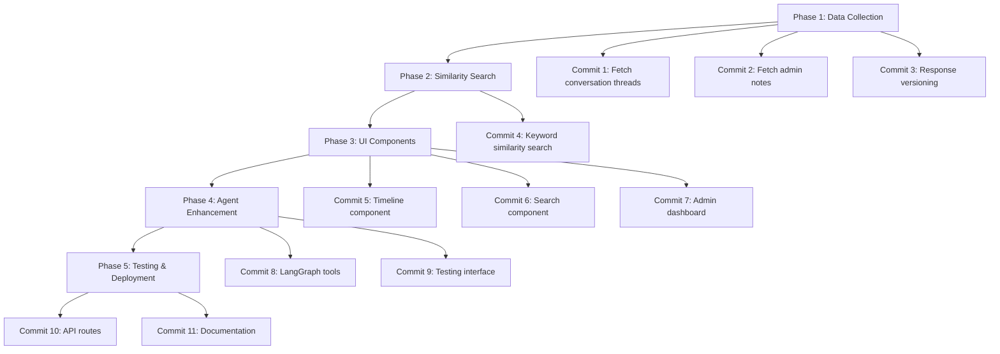
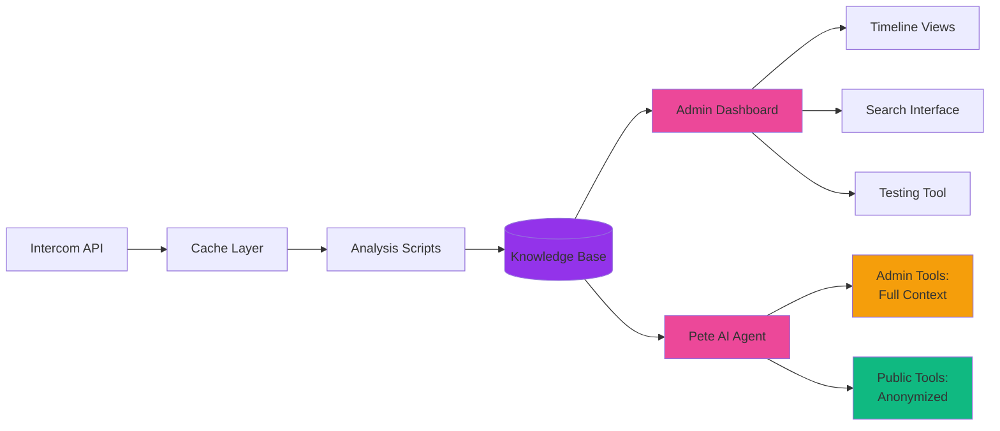
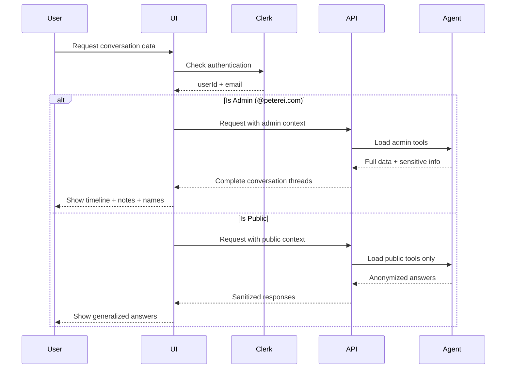
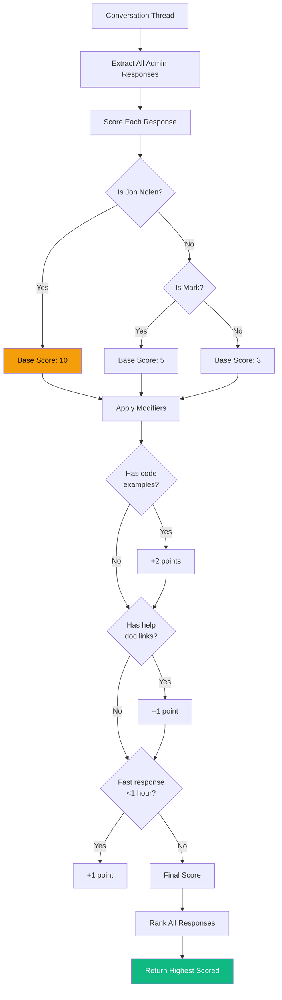
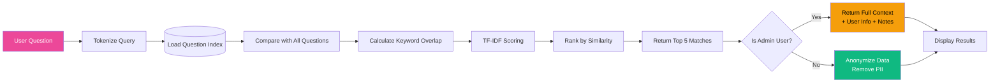
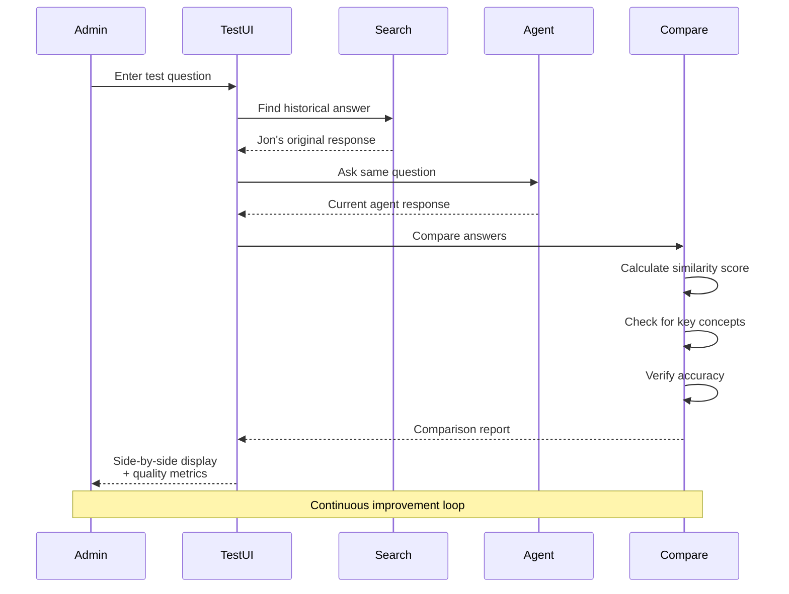
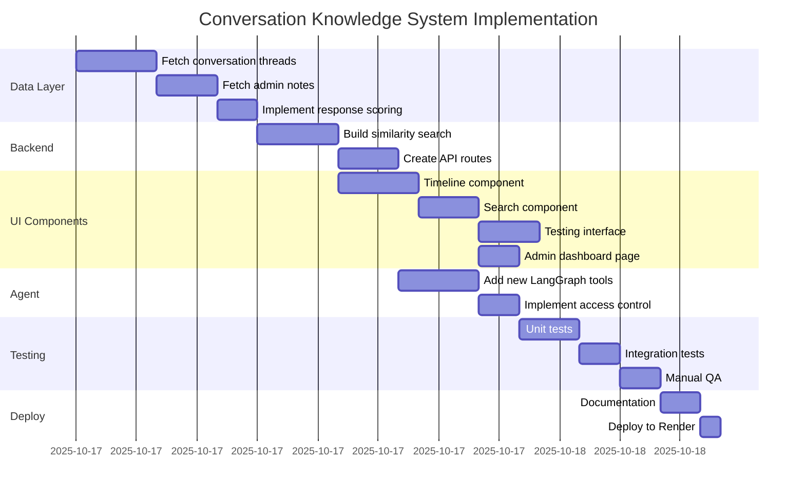
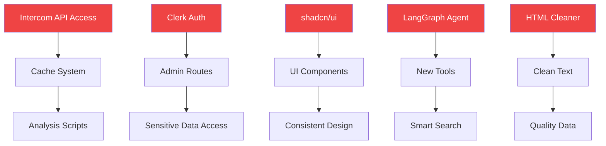

# Conversation Knowledge System - Visual Roadmap

## 🗺️ Implementation Phases



## 📊 Data Flow Architecture



## 🔐 Access Control Flow



## 🎨 UI Component Hierarchy

```mermaid
graph TD
    Page[/admin/insights/conversations]
    Page --> Tabs[Tabs Component]

    Tabs --> Tab1[Search Tab]
    Tabs --> Tab2[Top Questions Tab]
    Tabs --> Tab3[Timelines Tab]
    Tabs --> Tab4[Testing Tab]

    Tab1 --> Search[SimilarQuestionsSearch]
    Search --> Results[Search Results List]
    Results --> QuestionCard[SimilarQuestionCard]

    Tab3 --> Timeline[ConversationTimeline]
    Timeline --> Mermaid[Mermaid Journey Diagram]
    Timeline --> Messages[Message List]
    Messages --> MessageCard[MessageCard]
    Timeline --> Notes[NotesSection]

    Tab4 --> Testing[AgentTestingInterface]
    Testing --> Comparison[ComparisonReport]

    style Page fill:#9333ea,color:#fff
    style Tabs fill:#ec4899,color:#fff
    style Search fill:#8b5cf6,color:#fff
    style Timeline fill:#8b5cf6,color:#fff
    style Testing fill:#8b5cf6,color:#fff
```

## 🧬 Response Versioning Logic



## 🔍 Similarity Search Process



## 🧪 Agent Testing Flow



## 📅 Timeline (Estimated 3-4 days)



## 🎯 Success Criteria Checklist

### Data Quality ✅
- [ ] All conversation threads fetched completely
- [ ] Admin notes properly attributed (Jon vs Mark)
- [ ] No HTML artifacts in message bodies
- [ ] Response scores calculated correctly

### UI/UX ✅
- [ ] Timeline diagrams render without errors
- [ ] Search returns relevant results in <500ms
- [ ] Mobile responsive design works perfectly
- [ ] Pete branding (purple gradients) preserved
- [ ] Components use shadcn/ui patterns (DRY)

### Security ✅
- [ ] Clerk authentication required for admin routes
- [ ] Public users never see sensitive data
- [ ] Admin tools only available to @peterei.com users
- [ ] No PII leaks in anonymized responses

### Agent Intelligence ✅
- [ ] Finds similar past questions accurately
- [ ] Prioritizes Jon's responses over Mark's
- [ ] Generates meaningful journey diagrams
- [ ] Testing shows improvement over baseline

### Performance ✅
- [ ] Dashboard loads in <2 seconds
- [ ] Search completes in <500ms
- [ ] No new caching issues introduced
- [ ] Agent response time unchanged

## 🚨 Critical Dependencies



---

## 📝 Quick Reference

### Key Files to Modify
- ✏️ `src/scripts/full-conversation-analysis.ts` - Add threads/notes
- ✏️ `src/services/langraph-agent.ts` - Add new tools
- ✏️ `src/services/intercom.ts` - May need cache updates

### New Files to Create
- 🆕 `src/services/similarity-search.ts`
- 🆕 `src/utils/conversation-scorer.ts`
- 🆕 `src/utils/journey-diagram-generator.ts`
- 🆕 `src/components/conversations/*.tsx` (6 files)
- 🆕 `src/app/(admin)/admin/insights/conversations/page.tsx`
- 🆕 `src/app/api/conversations/**/*.ts` (3 routes)

### Data Output Locations
- 📁 `data/conversation-analysis/threads/`
- 📁 `data/conversation-analysis/notes/`
- 📁 `data/conversation-analysis/index/`

---

**Ready to start?** Begin with Commit 1: Fetch conversation threads 🚀
