# Help Desk Architecture Analysis & Transformation Plan

**Date**: 2025-10-08
**Status**: Research & Planning Phase
**Goal**: Transform Pete's Intercom help desk to match the structural patterns of industry-leading real estate software help desks

---

## Executive Summary

Analyzed three top-tier real estate SaaS help desk architectures:
1. **REsimpli** - Collection-based, highly visual, metadata-rich
2. **FreedomSoft** - BLOCKED (403 error, likely Cloudflare protection)
3. **InvestorFuse** - Team-centric, multi-channel support, personalized approach

**Key Finding**: Modern help desks use **hierarchical collection systems** with **visual navigation**, **multi-channel support**, and **rich metadata** to improve user discovery and engagement.

---

## Competitor Analysis

### 1. REsimpli Help Desk Architecture

**URL**: https://help.resimpli.com/en/

#### Structural Components

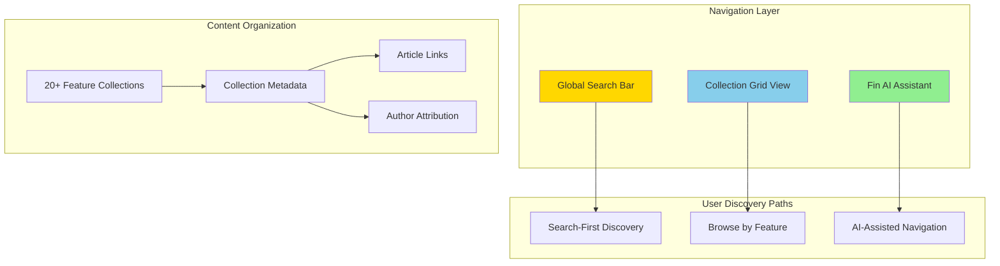

#### Key Architectural Features

1. **Collection-Based Organization**
   - 20 distinct collections grouped by software feature
   - Collections act as mini-knowledge bases
   - Each collection shows:
     - Feature icon/visual representation
     - Author avatar and name
     - Article count
     - Descriptive title

2. **Visual Hierarchy**
   - **Grid layout** for collection browsing
   - **Color-coded** with teal/white color scheme
   - **Icon-based** navigation
   - **Metadata-rich** presentation

3. **Search Architecture**
   - Prominent search bar with placeholder text
   - Keyword-based retrieval
   - AI-assisted search (Fin AI) with loading states

4. **Author-Centric**
   - Multi-author content management
   - Visual author representation (avatars)
   - Author attribution on every collection

5. **User Flow Patterns**
   - Browse → Select Collection → View Articles
   - Search → Keyword Match → Relevant Content
   - AI Assist → Natural Language Query → Guided Discovery

#### Information Architecture

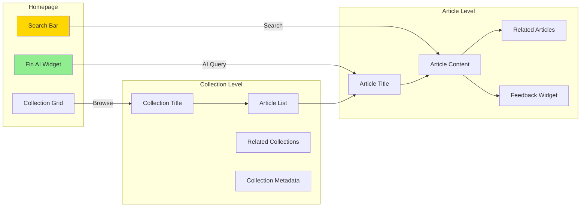

---

### 2. FreedomSoft Help Desk Architecture

**URL**: https://helpdesk.freedomsoft.com/hc/en-us

**Status**: ❌ BLOCKED (403 Forbidden)

**Analysis**: Unable to access due to Cloudflare security or bot protection. This suggests they use aggressive anti-scraping measures.

**Implication**: Cannot analyze architectural patterns, but blocking indicates they may be using Zendesk or similar platform with default security settings.

---

### 3. InvestorFuse Help Desk Architecture

**URL**: https://www.investorfuse.com/if3support

#### Structural Components

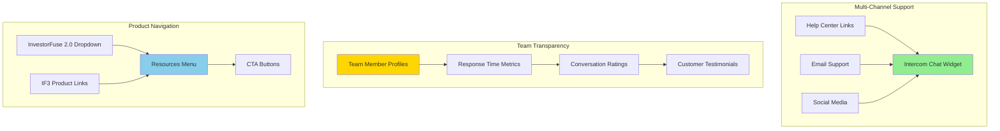

#### Key Architectural Features

1. **Team-Centric Design**
   - Individual team member profiles with photos
   - Performance metrics displayed visually
   - Conversation ratings (e.g., "4.9/5.0")
   - Response time transparency (e.g., "2h 30m average")

2. **Multi-Channel Support Strategy**
   - Email: answers@investorfuse.com
   - Intercom chat widget (embedded)
   - Social media links (Facebook, Twitter, Instagram, YouTube)
   - Blog and podcast for educational content
   - Help center + documentation

3. **Navigation Architecture**
   - Top-level product navigation (IF2.0, IF3)
   - Resources dropdown with categorized links
   - Clear CTAs: "Book A Demo", "Get Started", "Sign In"
   - Hierarchical menu organization

4. **Personalization & Trust**
   - Human faces and names (not just roles)
   - Real performance metrics (not fabricated)
   - Customer remarks and testimonials
   - Direct contact information

5. **User Flow Patterns**
   - Multiple entry points: Chat, Email, Help Center, Social
   - Self-service first, human escalation available
   - Product-specific support paths

#### Information Architecture

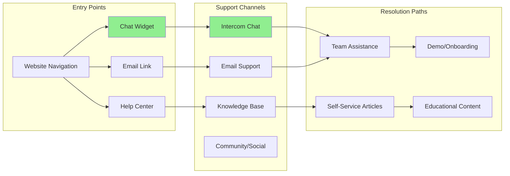

---

## Structural Patterns Comparison

### Common Architectural Elements

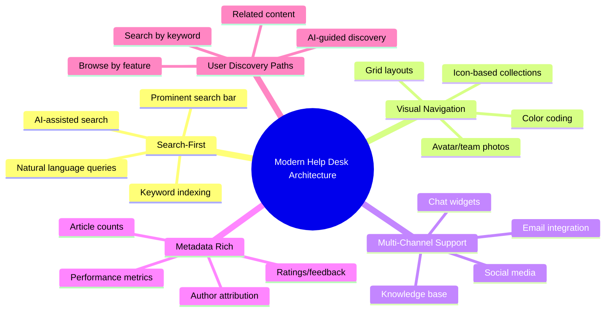

### Architecture Matrix

| Feature | REsimpli | FreedomSoft | InvestorFuse | Pete (Current) |
|---------|----------|-------------|--------------|----------------|
| **Collection-Based Organization** | ✅ 20+ collections | ❓ Unknown | ⚠️ Limited | ❌ Missing |
| **Visual Search Bar** | ✅ Prominent | ❓ Unknown | ⚠️ Basic | ❌ Missing |
| **AI Assistant Integration** | ✅ Fin AI | ❓ Unknown | ⚠️ Chat widget | ✅ PeteAI exists |
| **Author Attribution** | ✅ Multi-author | ❓ Unknown | ✅ Team profiles | ❌ Missing |
| **Metadata Display** | ✅ Rich (counts, authors) | ❓ Unknown | ✅ Metrics | ⚠️ Limited |
| **Grid Layout** | ✅ Collection grid | ❓ Unknown | ⚠️ List-based | ❌ Missing |
| **Multi-Channel Support** | ⚠️ Chat + Search | ❓ Unknown | ✅ 5+ channels | ⚠️ 2 channels |
| **Related Content** | ✅ Article/collection links | ❓ Unknown | ⚠️ Limited | ❌ Missing |
| **Performance Metrics** | ❌ Not shown | ❓ Unknown | ✅ Response time, ratings | ❌ Missing |
| **Mobile-Friendly** | ✅ Responsive | ❓ Unknown | ✅ Responsive | ⚠️ Unknown |

**Legend**: ✅ Fully Implemented | ⚠️ Partially Implemented | ❌ Missing | ❓ Unknown (blocked access)

---

## Pete's Current Intercom Architecture

Based on `CLAUDE.md` and `DEV_MAN/` analysis:

### Current Architecture

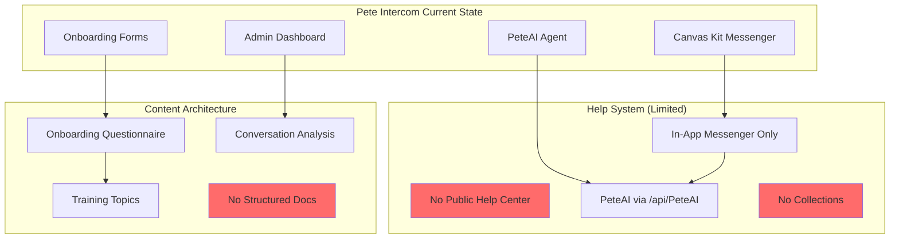

### Current Capabilities (What We Have)

✅ **Strong Foundation**:
- PeteAI LangGraph agent with 10+ tools
- Intercom Canvas Kit integration
- Admin dashboard with analytics
- Conversation analysis system
- 7-levels deep onboarding questionnaire
- Real-time Intercom data access (410 contacts, 94 companies, 1022 conversations)

❌ **Missing Components**:
- No public-facing help center
- No collection-based organization
- No search functionality
- No author attribution system
- No visual navigation/grid layout
- No multi-channel support (only Messenger)
- No related content linking
- No performance metrics display

---

## Transformation Plan: Pete's Help Desk Evolution

### Vision Statement

**Transform Pete's Intercom integration from a conversational-only interface into a comprehensive, visually-rich help center that combines:**
- REsimpli's collection-based architecture
- InvestorFuse's team transparency and multi-channel support
- Pete's existing AI-powered assistance (PeteAI)

### Target Architecture

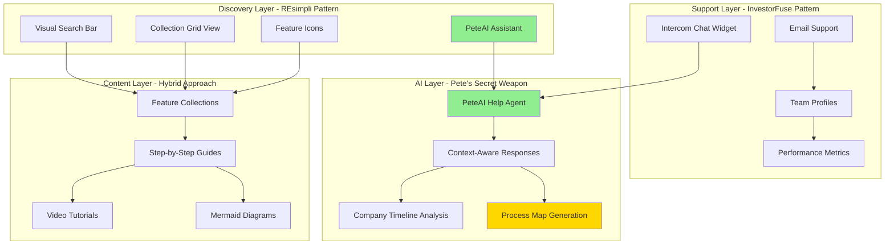

---

## Implementation Roadmap (6 Stages)

### Stage 1: Help Center Foundation (3-4 hours)

**Goal**: Create public-facing help center with basic structure

**Tasks**:
- [ ] Create `/help` page route in Next.js
- [ ] Design collection-based homepage (REsimpli pattern)
- [ ] Implement visual search bar
- [ ] Add collection grid layout
- [ ] Create collection detail pages
- [ ] Integrate PeteAI widget on every page

**Files to Create**:
```
src/app/help/page.tsx                  # Help center homepage
src/app/help/collections/[id]/page.tsx # Collection detail pages
src/app/help/articles/[id]/page.tsx    # Article pages
src/components/help/SearchBar.tsx      # Visual search component
src/components/help/CollectionGrid.tsx # Collection grid
src/components/help/PeteAIWidget.tsx   # AI assistant widget
```

**Design Mockup**:
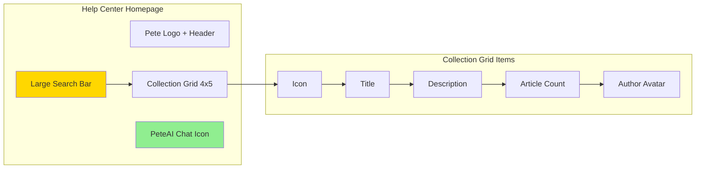

---

### Stage 2: Content Collections System (4-5 hours)

**Goal**: Build collection architecture similar to REsimpli

**Tasks**:
- [ ] Define collection data structure
- [ ] Create collection categories (Getting Started, Data Upload, Workflows, etc.)
- [ ] Add collection metadata (author, article count, icons)
- [ ] Implement collection filtering/sorting
- [ ] Add related collections linking
- [ ] Create collection management admin UI

**Data Structure**:
```typescript
interface HelpCollection {
  id: string;
  title: string;
  description: string;
  icon: string; // Icon name or URL
  author: {
    name: string;
    avatar: string;
    email: string;
  };
  articleCount: number;
  articles: HelpArticle[];
  relatedCollections: string[]; // Collection IDs
  metadata: {
    createdAt: Date;
    updatedAt: Date;
    featured: boolean;
    category: 'getting-started' | 'data' | 'workflows' | 'technical' | 'training';
  };
}

interface HelpArticle {
  id: string;
  collectionId: string;
  title: string;
  content: string; // Markdown or HTML
  steps?: string[]; // For step-by-step guides
  mermaidDiagrams?: string[]; // Generated process maps
  videoUrl?: string;
  relatedArticles: string[]; // Article IDs
  metadata: {
    createdAt: Date;
    updatedAt: Date;
    views: number;
    helpfulVotes: number;
    author: Author;
  };
}
```

**Collections to Create**:
1. **Getting Started** - Onboarding, first steps, account setup
2. **Data Upload & Import** - CSV upload, property import, data mapping
3. **Workflows & Automation** - Workflow creation, triggers, actions
4. **Training & Certification** - Pete Training topics, progress tracking
5. **Integrations** - Third-party integrations, API usage
6. **Technical Support** - Troubleshooting, error messages, debugging
7. **Company Management** - Company settings, team management, permissions
8. **Analytics & Reporting** - Dashboard usage, custom reports, insights

---

### Stage 3: AI-Powered Search & Discovery (3-4 hours)

**Goal**: Leverage PeteAI for intelligent search and content recommendation

**Tasks**:
- [ ] Integrate PeteAI into search functionality
- [ ] Add natural language query processing
- [ ] Implement semantic search (not just keyword matching)
- [ ] Create "Ask PeteAI" widget on every help page
- [ ] Add AI-generated content recommendations
- [ ] Build search analytics dashboard

**Architecture**:
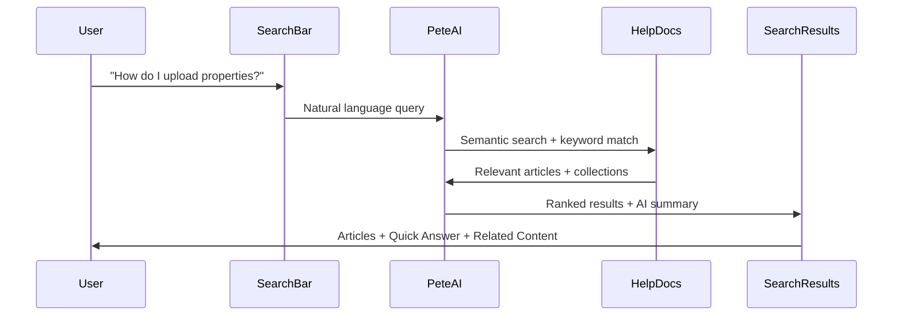

**Enhanced PeteAI Tools**:
- `search_help_content(query)` - Semantic search across all help content
- `recommend_articles(context)` - Context-aware article recommendations
- `generate_quick_answer(query)` - AI-generated summary before full article
- `track_search_analytics(query, results)` - Learn from user search patterns

---

### Stage 4: Team Transparency & Metrics (2-3 hours)

**Goal**: Add InvestorFuse-style team profiles and performance metrics

**Tasks**:
- [ ] Create team member profiles page
- [ ] Add support performance metrics (response time, ratings)
- [ ] Display conversation statistics
- [ ] Add customer testimonials section
- [ ] Create "Meet the Team" collection
- [ ] Implement feedback collection system

**Team Metrics to Display**:
- Average response time (from Intercom data)
- Conversation ratings (from existing analytics)
- Total conversations handled
- Customer satisfaction scores
- Team member expertise areas

**UI Component**:
```typescript
interface TeamMember {
  name: string;
  role: string;
  avatar: string;
  bio: string;
  expertiseAreas: string[]; // ['Data Upload', 'Workflows', etc.]
  metrics: {
    avgResponseTime: string; // "2h 30m"
    conversationsHandled: number;
    rating: number; // 4.9/5.0
    joinedDate: Date;
  };
  socialLinks?: {
    linkedin?: string;
    twitter?: string;
    email: string;
  };
}
```

---

### Stage 5: Multi-Channel Integration (3-4 hours)

**Goal**: Expand beyond Intercom Messenger to multiple support channels

**Tasks**:
- [ ] Add email support integration (existing EMAIL_USER/EMAIL_PASS)
- [ ] Create public chat widget for website embedding
- [ ] Add social media support links
- [ ] Implement webhook for external channel messages
- [ ] Create unified inbox view in admin dashboard
- [ ] Add channel-specific response templates

**Multi-Channel Architecture**:
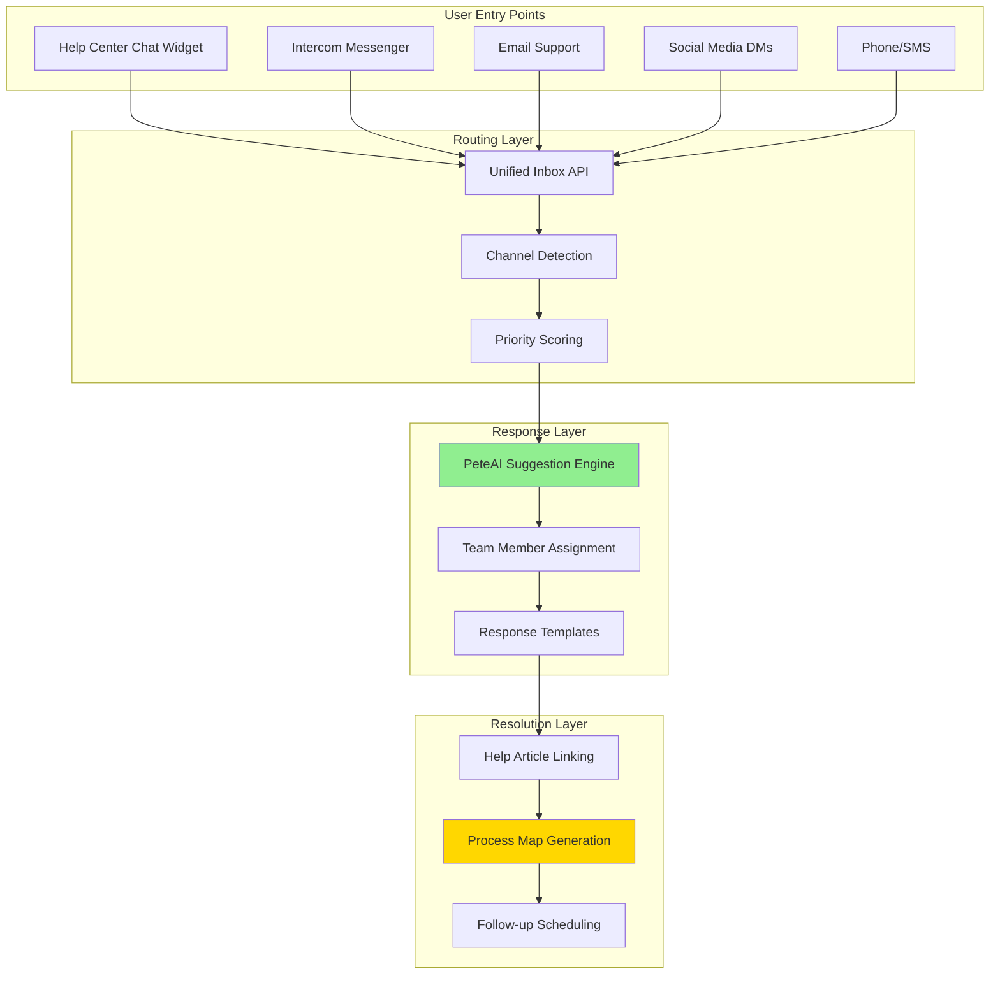

---

### Stage 6: Visual Content & Process Maps (4-5 hours)

**Goal**: Leverage Pete's existing Mermaid diagram generation for visual help content

**Tasks**:
- [ ] Auto-generate Mermaid diagrams for step-by-step guides
- [ ] Add video tutorial embedding
- [ ] Create interactive process flows
- [ ] Implement screenshot annotation system
- [ ] Add GIF/animation support for UI walkthroughs
- [ ] Build visual content management in admin dashboard

**Content Types**:
1. **Step-by-Step Guides** - Text + Mermaid flowcharts
2. **Video Tutorials** - Embedded videos with transcript
3. **Interactive Demos** - Clickable process flows
4. **Screenshot Guides** - Annotated screenshots
5. **GIF Walkthroughs** - Animated UI interactions

**Mermaid Integration** (Already Built!):
```typescript
// From existing PeteAI agent
generate_process_map(
  title: "Uploading Properties",
  steps: [...],
  sourceUrl: "https://help.thepete.io/articles/upload-properties"
)

// Generates clickable Mermaid diagram
// Each step links to full documentation
// Already working in Pete's codebase!
```

---

## Architecture Comparison: Before vs After

### Current State (Before)

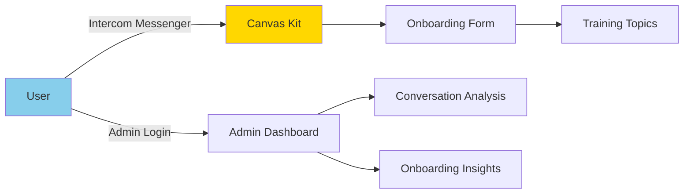

### Target State (After)

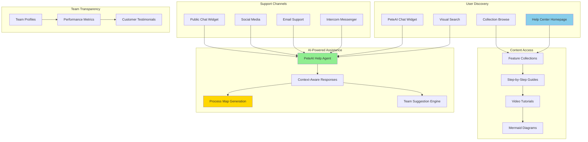

---

## Success Metrics

### Technical Metrics
- **Search Relevance**: > 90% of searches return relevant results (AI-powered)
- **Page Load Time**: < 2 seconds for help center pages
- **Mobile Responsiveness**: 100% responsive design
- **AI Response Time**: < 5 seconds for PeteAI suggestions
- **Multi-Channel Uptime**: > 99% availability

### User Experience Metrics
- **Self-Service Rate**: > 60% of users find answers without contacting support
- **Search Success Rate**: > 80% of searches lead to article views
- **Article Helpfulness**: > 75% positive ratings on articles
- **Multi-Channel Adoption**: > 40% of users use non-Messenger channels

### Business Metrics
- **Support Ticket Reduction**: 30% fewer tickets due to better self-service
- **Team Efficiency**: 25% faster response times with AI suggestions
- **Customer Satisfaction**: > 4.5/5.0 average rating
- **Knowledge Base Growth**: 50+ articles within 3 months

---

## Technology Stack

### Frontend
- **Next.js 15** (already in use)
- **React Server Components** (already in use)
- **Tailwind CSS** (already configured)
- **shadcn/ui** (for UI components)
- **Mermaid.js** (for diagrams - already in use)

### Backend
- **Next.js API Routes** (already in use)
- **Server Actions** (already in use)
- **Intercom API** (already integrated)
- **OpenRouter API** (already configured for PeteAI)

### AI & Search
- **LangGraph Agent** (already built - PeteAI)
- **GPT-4o-mini** (already in use via OpenRouter)
- **Semantic Search** (to be added)
- **Vector Embeddings** (optional - for advanced search)

### Data Storage
- **Intercom Cache** (already built - 410 contacts, 94 companies, 1022 conversations)
- **File-Based JSON** (for help content - similar to existing questionnaire storage)
- **Markdown Files** (for article content)

---

## Risk Assessment

### Low Risk ✅
- **PeteAI Integration** - Already built and working
- **Intercom API** - Already integrated and stable
- **Next.js Framework** - Already on Next.js 15
- **Mermaid Diagrams** - Already generating process maps

### Medium Risk ⚠️
- **Multi-Channel Support** - New webhook integrations needed
- **Search Performance** - Need to optimize for semantic search
- **Content Migration** - Creating initial help content from scratch
- **Visual Design** - Matching REsimpli's polished UI

### Mitigation Strategies
1. **Incremental Rollout** - Launch Stage 1-2 first, then add features
2. **Content Templates** - Use PeteAI to generate initial article drafts
3. **Design System** - Use shadcn/ui for consistent, polished components
4. **Performance Monitoring** - Add analytics from day 1 to track success

---

## Dependencies & Prerequisites

### ✅ Already Have
- Next.js 15 + TypeScript
- PeteAI LangGraph Agent with 10+ tools
- Intercom API integration
- Admin dashboard framework
- Mermaid diagram generation
- Conversation analysis system
- Email integration (EMAIL_USER/EMAIL_PASS)

### ❌ Need to Add
- Help center content (collections + articles)
- Public-facing help center UI
- Multi-channel webhook integrations
- Team profile data
- Performance metrics calculation
- Search indexing system

---

## Next Steps (Immediate Actions)

1. **Review This Plan** - Get feedback on approach and priorities
2. **Provide Pete Help Desk URL** - Need to see current help desk structure
3. **Create GitHub Issues** - Break down into 6 stage-based issues
4. **Design Mockups** - Create visual mockups for help center homepage
5. **Content Audit** - Identify existing help content to migrate
6. **Start Stage 1** - Create `/help` page route and basic structure

---

## Questions for Clarification

1. **Current Help Desk**: What is the URL for Pete's current Intercom help center? (Not provided yet)
2. **Content Ownership**: Who will be the primary author for help articles? (For author attribution)
3. **Branding**: Should we match Pete's existing brand colors (purple-to-pink gradients)?
4. **Priority**: Which stage should we tackle first? (Recommendation: Stage 1 + Stage 2)
5. **Timeline**: What's the target launch date for the new help center?
6. **Team Profiles**: Which team members should be featured on the "Meet the Team" page?

---

## Appendix: Architecture Diagrams Reference

### REsimpli Collection Architecture
- Grid-based layout with 4-5 columns
- Icon + Title + Description + Metadata
- Author avatars on every collection
- Article counts displayed prominently
- Color-coded by category (teal/white scheme)

### InvestorFuse Multi-Channel Architecture
- 5+ support channels (Chat, Email, Social, Blog, Podcast)
- Team member profiles with photos and bios
- Performance metrics (response time, ratings)
- Customer testimonials and social proof
- Clear CTAs for demo/signup/sign-in

### Pete's Hybrid Approach
- **REsimpli's visual navigation** + **InvestorFuse's team transparency** + **Pete's AI-powered assistance**
- Unique value prop: AI-generated process maps with clickable steps
- Integration with existing Intercom data (410 contacts, 94 companies, 1022 conversations)
- Seamless connection between help center and Canvas Kit onboarding

---

**Total Estimated Time**: 19-25 hours (3-4 days)
**Complexity**: Medium (mostly UI/UX work, content creation, integration work)
**Risk**: Low (building on existing, proven infrastructure)
**Value**: High (industry-leading help desk architecture + AI-powered assistance)

---

_This analysis follows Pete's DEV_MAN standards with comprehensive Mermaid diagrams, stage-based implementation plans, and clear success criteria._
