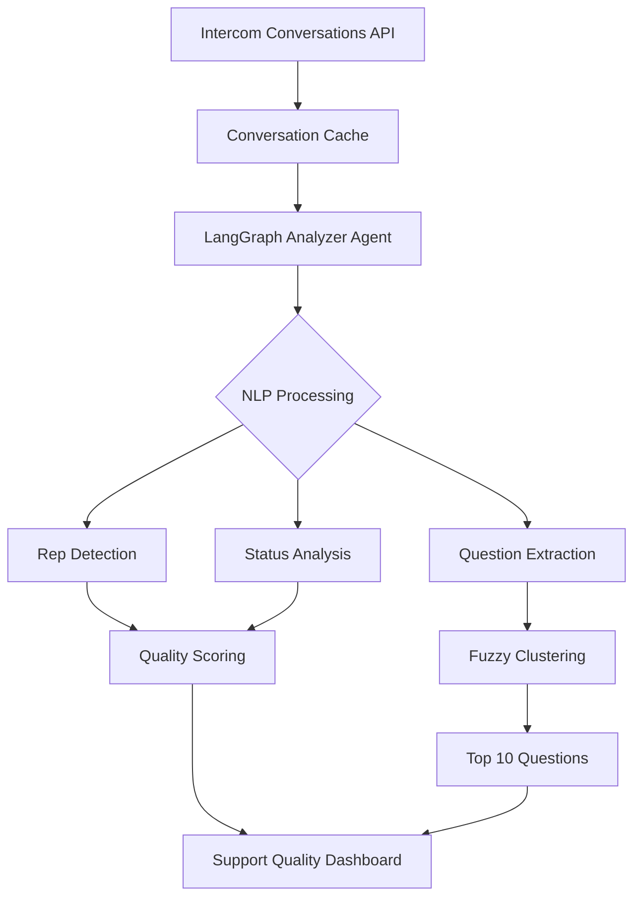

# Support Quality Analyzer - Technical Plan

**Created:** 2025-02-10
**Status:** Planning
**Priority:** High
**Estimated Effort:** 3-5 days

## 🎯 Objective

Build an AI-powered support quality analyzer that:
1. Identifies the top 10 most common customer questions (semantic clustering, not just titles)
2. Analyzes support team performance with weighted scoring by rep
3. Measures ticket resolution quality based on status and team interactions
4. Uses LangGraph agent with NLP/fuzzy matching for semantic grouping

---

## 📊 Scoring System

### Support Rep Quality Points (Applied ONCE per ticket)

| Rep | Points | Rules |
|-----|--------|-------|
| **Jon Nolen** | 5 pts | Owner - highest quality, takes precedence |
| **Mark** | 3 pts | Senior support |
| **Other Support** | 2 pts | Standard support team |
| **Users** | 0 pts | Neutral - doesn't count toward quality |

**Precedence Rules:**
- If Jon coached Mark → Points go to Jon
- If Mark was praised for solution → Points go to Mark
- Points are NOT cumulative per ticket (max 5 pts per ticket)

### Ticket Status Multipliers

| Status | Multiplier | Reasoning |
|--------|-----------|-----------|
| **Closed** | 1.0x | Full resolution |
| **Snoozed** | 0.7x | Partial/delayed resolution |
| **Escalated** | 0.5x | Dev team working, not resolved by support |
| **Open** | 0.3x | Not yet resolved |

### Final Quality Score Formula

```typescript
ticketScore = (repPoints * statusMultiplier)
```

---

## 🏗️ Architecture

### Data Flow Diagram



### Component Architecture

```
src/
├── actions/
│   └── support-quality-analyzer.ts      # LangGraph agent
├── lib/
│   ├── nlp/
│   │   ├── question-extractor.ts        # Extract initial customer question
│   │   ├── fuzzy-matcher.ts             # Semantic similarity matching
│   │   └── cluster-questions.ts         # Group similar questions
│   └── scoring/
│       ├── rep-scorer.ts                # Calculate rep quality points
│       ├── status-scorer.ts             # Status multiplier logic
│       └── ticket-scorer.ts             # Final score calculator
├── types/
│   └── support-quality.ts               # TypeScript interfaces
└── app/admin/support-quality/
    └── page.tsx                         # Dashboard UI
```

---

## 📋 JSON Data Structure

### Input: Intercom Conversation Object

```typescript
interface IntercomConversation {
  id: string;
  created_at: number;
  updated_at: number;
  state: 'open' | 'closed' | 'snoozed';
  tags?: { name: string }[]; // Check for "escalated"
  conversation_parts: {
    conversation_parts: Array<{
      id: string;
      part_type: 'comment' | 'note' | 'assignment';
      body: string;
      author: {
        id: string;
        name: string;
        email: string;
        type: 'admin' | 'user';
      };
      created_at: number;
    }>;
  };
  source: {
    body: string; // Initial customer message
    author: {
      type: 'user' | 'admin';
      name: string;
    };
  };
}
```

### Processed: Analyzed Ticket

```typescript
interface AnalyzedTicket {
  conversationId: string;
  initialQuestion: string;            // Extracted from source.body
  normalizedQuestion: string;         // Cleaned for clustering
  questionCluster?: string;           // Semantic group ID
  clusterLabel?: string;              // Human-readable cluster name

  // Rep Analysis
  primaryRep: {
    name: string;
    email: string;
    points: 2 | 3 | 5;                // Based on rep identity
  };
  repDetectionMethod: 'coached' | 'praised' | 'direct'; // How we determined primary

  // Status Analysis
  status: 'open' | 'closed' | 'snoozed';
  isEscalated: boolean;               // Check tags
  statusMultiplier: number;           // 0.3 - 1.0

  // Quality Score
  rawScore: number;                   // repPoints only
  finalScore: number;                 // repPoints * statusMultiplier

  // Metadata
  createdAt: Date;
  resolvedAt?: Date;
  resolutionTimeHours?: number;
}
```

### Output: Support Quality Report

```typescript
interface SupportQualityReport {
  generatedAt: Date;
  dateRange: {
    start: Date;
    end: Date;
  };

  // Top Questions
  topQuestions: Array<{
    rank: number;
    clusterLabel: string;
    questionExamples: string[];       // Sample questions from cluster
    frequency: number;                // How many times asked
    avgResolutionTime: number;        // Hours
    avgQualityScore: number;          // Average finalScore
    commonResponses: string[];        // Common solution patterns
  }>;

  // Rep Performance
  repPerformance: Array<{
    repName: string;
    ticketsHandled: number;
    avgQualityScore: number;
    totalPoints: number;
    closedTickets: number;
    escalatedTickets: number;
    avgResolutionTime: number;
  }>;

  // Overall Metrics
  overallMetrics: {
    totalTickets: number;
    avgQualityScore: number;
    closureRate: number;              // % closed
    escalationRate: number;           // % escalated
    avgResolutionTime: number;
  };
}
```

---

## 🧠 LangGraph Agent Design

### Agent Structure

```typescript
// src/actions/support-quality-analyzer.ts
import { StateGraph } from '@langchain/langgraph';

interface AnalyzerState {
  conversations: IntercomConversation[];
  analyzedTickets: AnalyzedTicket[];
  clusters: Map<string, AnalyzedTicket[]>;
  report: SupportQualityReport;
}

const workflow = new StateGraph<AnalyzerState>({
  channels: {
    conversations: { value: [] },
    analyzedTickets: { value: [] },
    clusters: { value: new Map() },
    report: { value: null }
  }
});

// Nodes
workflow.addNode('extractQuestions', extractQuestionsNode);
workflow.addNode('detectReps', detectRepsNode);
workflow.addNode('scoreStatus', scoreStatusNode);
workflow.addNode('clusterQuestions', clusterQuestionsNode);
workflow.addNode('generateReport', generateReportNode);

// Edges
workflow.addEdge('extractQuestions', 'detectReps');
workflow.addEdge('detectReps', 'scoreStatus');
workflow.addEdge('scoreStatus', 'clusterQuestions');
workflow.addEdge('clusterQuestions', 'generateReport');
```

### Node Implementations

#### 1. Extract Questions Node
```typescript
async function extractQuestionsNode(state: AnalyzerState) {
  const tickets = state.conversations.map(conv => ({
    conversationId: conv.id,
    initialQuestion: extractInitialQuestion(conv.source.body),
    normalizedQuestion: normalizeText(conv.source.body),
    status: conv.state,
    isEscalated: conv.tags?.some(t => t.name === 'escalated') ?? false,
    createdAt: new Date(conv.created_at * 1000)
  }));

  return { ...state, analyzedTickets: tickets };
}
```

#### 2. Detect Reps Node
```typescript
async function detectRepsNode(state: AnalyzerState) {
  const tickets = state.analyzedTickets.map(ticket => {
    const conv = state.conversations.find(c => c.id === ticket.conversationId);
    const parts = conv.conversation_parts.conversation_parts;

    // Find all admin responses
    const adminResponses = parts.filter(p =>
      p.author.type === 'admin' && p.part_type === 'comment'
    );

    // Identify primary rep using precedence rules
    const primaryRep = identifyPrimaryRep(adminResponses);

    return {
      ...ticket,
      primaryRep,
      repDetectionMethod: detectMethod(parts, primaryRep)
    };
  });

  return { ...state, analyzedTickets: tickets };
}

function identifyPrimaryRep(responses: ConversationPart[]) {
  const jonResponse = responses.find(r =>
    r.author.name === 'Jon Nolen' || r.author.email.includes('jon')
  );

  if (jonResponse) {
    return { name: 'Jon Nolen', email: jonResponse.author.email, points: 5 };
  }

  const markResponse = responses.find(r =>
    r.author.name.includes('Mark') || r.author.email.includes('mark')
  );

  if (markResponse) {
    return { name: markResponse.author.name, email: markResponse.author.email, points: 3 };
  }

  // Default to first admin response
  const firstAdmin = responses[0];
  return {
    name: firstAdmin.author.name,
    email: firstAdmin.author.email,
    points: 2
  };
}
```

#### 3. Score Status Node
```typescript
async function scoreStatusNode(state: AnalyzerState) {
  const tickets = state.analyzedTickets.map(ticket => {
    const multiplier = calculateStatusMultiplier(ticket);
    const rawScore = ticket.primaryRep.points;
    const finalScore = rawScore * multiplier;

    return {
      ...ticket,
      statusMultiplier: multiplier,
      rawScore,
      finalScore
    };
  });

  return { ...state, analyzedTickets: tickets };
}

function calculateStatusMultiplier(ticket: AnalyzedTicket): number {
  if (ticket.isEscalated) return 0.5;
  if (ticket.status === 'closed') return 1.0;
  if (ticket.status === 'snoozed') return 0.7;
  return 0.3; // open
}
```

#### 4. Cluster Questions Node (NLP)
```typescript
import { TfIdf } from 'natural';
import Fuse from 'fuse.js';

async function clusterQuestionsNode(state: AnalyzerState) {
  // Use TF-IDF for semantic similarity
  const tfidf = new TfIdf();
  state.analyzedTickets.forEach(t => tfidf.addDocument(t.normalizedQuestion));

  // Create clusters using cosine similarity
  const clusters = new Map<string, AnalyzedTicket[]>();
  const similarityThreshold = 0.7;

  state.analyzedTickets.forEach((ticket, i) => {
    let assigned = false;

    // Check against existing clusters
    for (const [clusterId, clusterTickets] of clusters) {
      const representative = clusterTickets[0];
      const similarity = calculateCosineSimilarity(
        tfidf.listTerms(i),
        tfidf.listTerms(state.analyzedTickets.indexOf(representative))
      );

      if (similarity >= similarityThreshold) {
        clusters.get(clusterId)!.push(ticket);
        ticket.questionCluster = clusterId;
        assigned = true;
        break;
      }
    }

    // Create new cluster if no match
    if (!assigned) {
      const clusterId = `cluster_${clusters.size + 1}`;
      clusters.set(clusterId, [ticket]);
      ticket.questionCluster = clusterId;
    }
  });

  // Generate cluster labels using LLM
  for (const [clusterId, tickets] of clusters) {
    const label = await generateClusterLabel(tickets.map(t => t.initialQuestion));
    tickets.forEach(t => t.clusterLabel = label);
  }

  return { ...state, clusters, analyzedTickets: state.analyzedTickets };
}
```

#### 5. Generate Report Node
```typescript
async function generateReportNode(state: AnalyzerState) {
  // Calculate top questions
  const clusterStats = Array.from(state.clusters.entries())
    .map(([clusterId, tickets]) => ({
      clusterLabel: tickets[0].clusterLabel!,
      frequency: tickets.length,
      avgResolutionTime: calculateAvgResolutionTime(tickets),
      avgQualityScore: calculateAvg(tickets.map(t => t.finalScore)),
      questionExamples: tickets.slice(0, 3).map(t => t.initialQuestion)
    }))
    .sort((a, b) => b.frequency - a.frequency)
    .slice(0, 10);

  // Calculate rep performance
  const repStats = groupByRep(state.analyzedTickets);

  const report: SupportQualityReport = {
    generatedAt: new Date(),
    dateRange: calculateDateRange(state.analyzedTickets),
    topQuestions: clusterStats,
    repPerformance: repStats,
    overallMetrics: calculateOverallMetrics(state.analyzedTickets)
  };

  return { ...state, report };
}
```

---

## 🎨 Dashboard UI

### Component Structure

```typescript
// src/app/admin/support-quality/page.tsx

export default function SupportQualityPage() {
  return (
    <div className="space-y-6">
      {/* Header */}
      <Card>
        <CardHeader>
          <CardTitle>Support Quality Analyzer</CardTitle>
        </CardHeader>
      </Card>

      {/* Overall Metrics */}
      <div className="grid grid-cols-4 gap-4">
        <MetricCard title="Avg Quality Score" value={report.overallMetrics.avgQualityScore} />
        <MetricCard title="Closure Rate" value={`${report.overallMetrics.closureRate}%`} />
        <MetricCard title="Escalation Rate" value={`${report.overallMetrics.escalationRate}%`} />
        <MetricCard title="Avg Resolution" value={`${report.overallMetrics.avgResolutionTime}h`} />
      </div>

      {/* Top 10 Questions */}
      <Card>
        <CardHeader>
          <CardTitle>Top 10 Customer Questions (Semantic Clustering)</CardTitle>
        </CardHeader>
        <CardContent>
          <TopQuestionsTable questions={report.topQuestions} />
        </CardContent>
      </Card>

      {/* Rep Performance */}
      <Card>
        <CardHeader>
          <CardTitle>Support Rep Performance</CardTitle>
        </CardHeader>
        <CardContent>
          <RepPerformanceChart data={report.repPerformance} />
        </CardContent>
      </Card>
    </div>
  );
}
```

---

## 📦 Implementation Checklist

### Phase 1: Data Structures & Types (Day 1)
- [ ] Create `src/types/support-quality.ts` with all interfaces
- [ ] Add JSON schema validation for Intercom conversations
- [ ] Create test fixtures with sample data

### Phase 2: NLP & Clustering (Day 2)
- [ ] Implement question extraction logic
- [ ] Add TF-IDF vectorization with `natural` package
- [ ] Build fuzzy matching with `fuse.js`
- [ ] Create semantic clustering algorithm
- [ ] Test clustering with sample questions

### Phase 3: Scoring System (Day 2-3)
- [ ] Implement rep detection logic
- [ ] Build precedence rules (Jon > Mark > Others)
- [ ] Add coaching/praise detection
- [ ] Create status multiplier calculator
- [ ] Test scoring with edge cases

### Phase 4: LangGraph Agent (Day 3-4)
- [ ] Set up LangGraph state machine
- [ ] Implement all 5 nodes
- [ ] Add error handling and logging
- [ ] Create agent orchestration
- [ ] Test end-to-end flow

### Phase 5: Dashboard UI (Day 4-5)
- [ ] Create support quality page route
- [ ] Build metrics cards
- [ ] Create top questions table
- [ ] Add rep performance charts
- [ ] Add date range filters

### Phase 6: Testing & Refinement (Day 5)
- [ ] Test with real Intercom data
- [ ] Validate scoring accuracy
- [ ] Refine clustering parameters
- [ ] Add caching for performance
- [ ] Write documentation

---

## 🔧 Tools & Libraries

### Required Dependencies

```json
{
  "dependencies": {
    "@langchain/langgraph": "latest",
    "@langchain/core": "latest",
    "natural": "^6.0.0",           // TF-IDF, tokenization
    "fuse.js": "^7.0.0",           // Fuzzy matching
    "compromise": "^14.0.0",       // NLP sentence parsing
    "stopword": "^2.0.0"           // Remove stop words
  }
}
```

### Existing Tools to Use
- ✅ LangGraph agent (already in project)
- ✅ Intercom API cache (already built)
- ✅ Conversation analysis actions
- ✅ TypeScript strict mode

---

## 🚀 Success Metrics

1. **Clustering Accuracy**: >80% of similar questions grouped correctly
2. **Rep Detection**: 100% accuracy for Jon/Mark identification
3. **Performance**: Analysis runs in <5 seconds for 1000 tickets
4. **Insights**: Actionable top 10 questions with resolution patterns
5. **Dashboard**: Real-time updates with <2s load time

---

## 📝 Next Steps

1. Create GitHub issue for this feature
2. Break into sub-tasks in todo list
3. Set up test data fixtures
4. Begin Phase 1 implementation
